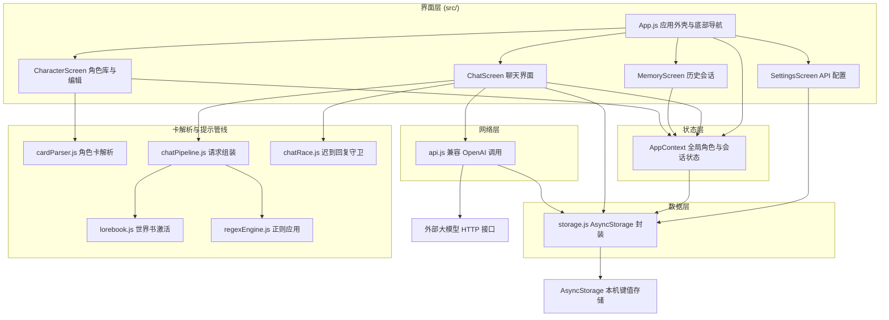
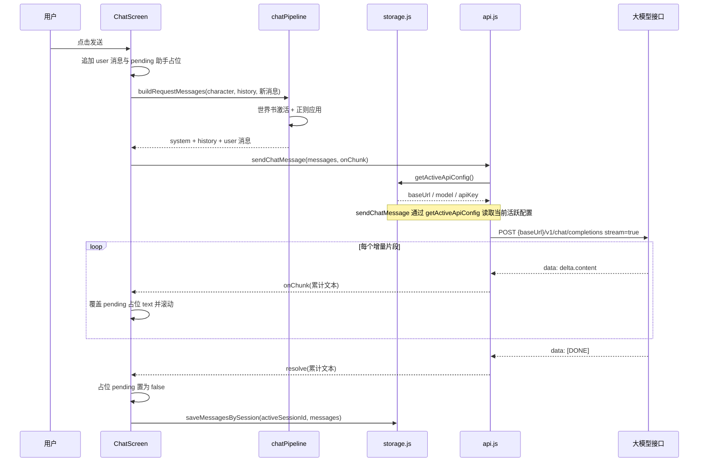
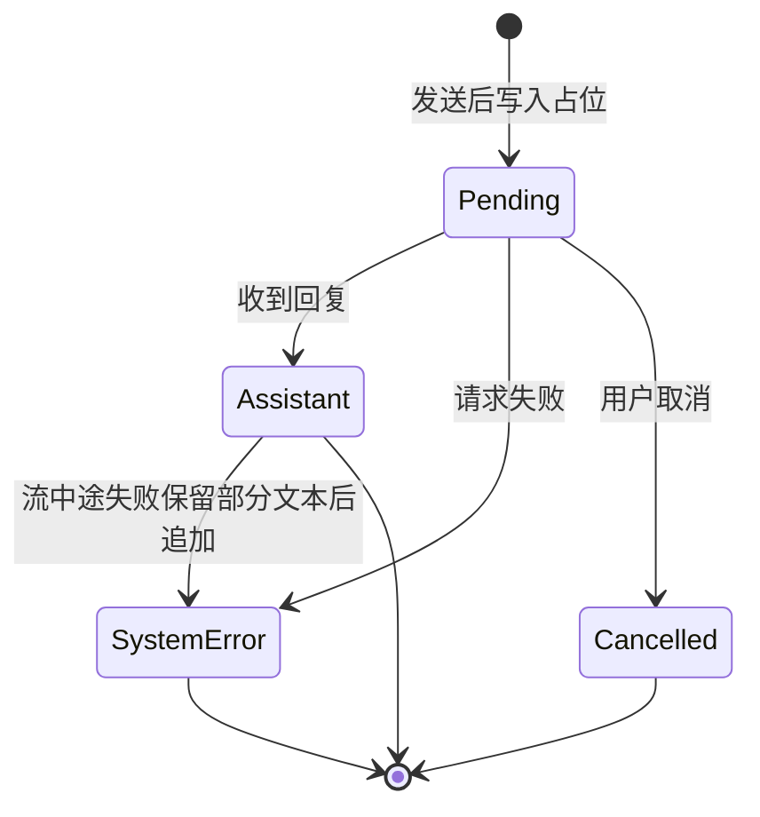

# 架构设计

## 概述

EasyChat2 是一个基于 Expo 与 React Native 构建的移动端 AI 聊天应用，面向希望在手机上使用自有大模型 API Key 进行对话的个人用户。应用兼容 OpenAI 的 Chat Completions 协议，通过一个可配置的 API 地址、模型名和密钥与任意兼容服务（如 DeepSeek、OpenAI 或自建网关）通信。

应用采用单机、无后端的形态：所有配置、角色设定与聊天记录都保存在设备本机的 `AsyncStorage` 中，不经过任何自建服务器。应用由四个底部标签页组成——聊天、记忆、角色、设置，分别负责对话、历史会话管理、角色库管理与 API 配置，并通过一个全局 `AppContext` 共享角色库、会话列表与当前选择状态。

在能力上，应用支持一个角色拥有多段对话、可陈列与切换的历史会话（记忆页支持置顶、克隆与删除）、可陈列与切换的角色库、Markdown 格式的助手回复渲染、可折叠并一键复制的系统报错气泡，以及从 PNG 或 JSON 角色卡导入人设、世界书与正则脚本。导入的世界书会在发送前按键触发注入提示词，正则脚本会分别在发送提示词与界面展示时应用。请求层内置 30 秒超时与错误格式化，报错展示前会对疑似密钥字符串做脱敏。

架构上强调几项特征：角色以「角色库 + 当前角色 id」两键持久化，旧版单角色数据在首次读取时迁移；会话以「会话列表 + 当前会话 id」持久化，消息按会话 id 隔离，旧版按角色存储的消息在启动时迁移为历史会话；角色与会话状态集中在 Context 并采用乐观写入加失败回滚，切换角色或会话时中断进行中的请求并丢弃迟到回复。运行时的 Buffer 兼容垫片与 Metro 的 `package exports` 开关共同保证 ESM 依赖 `parsecard` 能正确打包。

## 技术栈

**语言与运行时**
- JavaScript（ES2018+），JSX
- React 18.2.0
- React Native 0.73.6
- Expo SDK ~50.0.0
- Node.js 20（CI 构建环境）

**框架与库**
- 界面：`react-native` 原生组件、`react-native-safe-area-context`、`react-native-gesture-handler`
- 导航：`@react-navigation/native` + `@react-navigation/bottom-tabs`
- 富文本：`react-native-markdown-display`
- 图标资源：`react-native-vector-icons`

**数据存储**
- `@react-native-async-storage/async-storage`（设备本机键值存储）
- 无服务端数据库、无缓存层

**基础设施**
- 构建与分发：Expo、EAS Build、GitHub Actions
- 打包器：Metro（`expo/metro-config`）
- 转译：Babel（`babel-preset-expo`）

**外部服务**
- 任意兼容 OpenAI Chat Completions 的 HTTP 接口（默认预设 DeepSeek）
- 角色卡文件解析库 `parsecard`

## 项目结构

```
easychat2/
├── App.js                    # 应用入口：垫片、导航容器、全局 Provider
├── app.json                  # Expo 应用元数据与 Android 权限
├── eas.json                  # EAS Build 配置
├── metro.config.js           # Metro 打包配置（开启 package exports）
├── babel.config.js           # Babel 预设
├── package.json              # 依赖清单与 npm 脚本
├── .npmrc                    # npm 配置（legacy-peer-deps）
├── assets/                   # 图标、自适应图标与启动图
├── src/
│   ├── ChatScreen.js         # 聊天界面：角色切换、消息列表、发送、错误气泡、持久化
│   ├── MemoryScreen.js       # 记忆页：历史会话列表、置顶、克隆、删除
│   ├── SearchScreen.js       # 跨会话搜索：关键词检索历史消息并跳转定位
│   ├── ScrollScrubber.js     # 快速定位滑动条：拖动跳转会话任意位置
│   ├── CharacterScreen.js    # 角色库陈列、角色编辑与角色卡导入
│   ├── SettingsScreen.js     # API 地址 / 模型 / Key 配置
│   ├── PresetPanel.js        # 全局预设与记忆总结设置面板
│   ├── PluginPanel.js        # 插件管理面板（联网搜索等）
│   ├── api.js                # 大模型接口调用与错误格式化
│   ├── cardParser.js         # 角色卡 JSON/PNG 解析与字段标准化
│   ├── cardExporter.js       # 角色卡 V2 构造、PNG 编码与文件导出
│   ├── lorebook.js           # 世界书条目激活判定
│   ├── regexEngine.js        # 正则脚本作用范围与应用
│   ├── chatPipeline.js       # 系统提示词 + 历史 + 用户消息组装
│   ├── memorySummary.js      # 记忆总结：摘要生成、世界书写入与请求压缩
│   ├── plugins/
│   │   ├── registry.js       # 插件注册表：触发词、执行与背景资料格式化
│   │   └── webSearch.js      # 联网搜索 Provider 适配与 XHR 调用
│   ├── chatRace.js           # 切换角色时丢弃迟到回复的守卫
│   ├── secrets.js            # 共享密钥脱敏
│   ├── disclaimer.js         # 免责条款文本与弹窗组件
│   ├── storage.js            # AsyncStorage 读写封装与默认值
│   ├── polyfills.js          # Buffer 运行时兼容垫片
│   └── context/
│       ├── AppContext.js     # 全局角色库与会话状态
│       ├── characterLibrary.js # 角色库状态迁移纯函数
│       └── sessionLibrary.js # 会话状态纯函数
└── .github/workflows/        # APK 构建与 EAS 调试流水线
```

**入口点**
- `App.js` - 应用启动，注册导航与 `AppProvider`
- `package.json` 的 `main` 指向 `node_modules/expo/AppEntry.js`，由 Expo 加载 `App.js`
- `src/polyfills.js` - 必须在任何业务代码之前加载

## 子系统

### 应用外壳与导航
**目的**: 初始化运行时垫片、全局 Provider，并组织四个标签页；首次启动时经 `StartupDisclaimer` 弹出免责条款，`StartupSession` 迁移旧消息并开启新会话
**位置**: `App.js`
**关键文件**: `App.js`
**依赖**: `src/polyfills.js`、`react-native-gesture-handler`、`@react-navigation/*`、`@expo/vector-icons`、`src/context/AppContext.js`、`src/disclaimer.js`、`src/storage.js`
**被依赖**: 全体界面通过导航挂载

### 聊天界面
**目的**: 顶部展示并可切换当前角色，右上角提供「公告」入口，管理消息列表、发送请求、展示助手 Markdown 回复与系统报错气泡，并按角色持久化会话
**位置**: `src/ChatScreen.js`
**关键文件**: `src/ChatScreen.js`
**依赖**: `src/api.js`、`src/chatPipeline.js`、`src/chatRace.js`、`src/regexEngine.js`、`src/secrets.js`、`src/storage.js`、`src/disclaimer.js`、`src/context/AppContext.js`、`@expo/vector-icons`、`expo-clipboard`、`react-native-markdown-display`
**被依赖**: `App.js`

### 记忆页
**目的**: 逐行陈列历史会话，支持点击续聊、置顶、克隆与删除
**位置**: `src/MemoryScreen.js`
**关键文件**: `src/MemoryScreen.js`
**依赖**: `src/context/AppContext.js`、`@expo/vector-icons`
**被依赖**: `App.js`

### 角色管理
**目的**: 陈列角色库并切换当前角色，编辑角色核心字段（角色名/开场白/系统提示词/描述/性格/场景），新建/删除角色，从 PNG/JSON 角色卡导入标准字段、世界书与正则脚本，并把角色导出为标准 V2 卡
**位置**: `src/CharacterScreen.js`
**关键文件**: `src/CharacterScreen.js`
**依赖**: `src/cardParser.js`、`src/cardExporter.js`、`src/secrets.js`、`expo-document-picker`、`expo-file-system`、`expo-sharing`、`buffer`、`src/context/AppContext.js`
**被依赖**: `App.js`

### 卡解析与提示管线
**目的**: 解析角色卡并标准化字段，判定世界书激活，应用正则，组装最终请求消息
**位置**: `src/cardParser.js`、`src/lorebook.js`、`src/regexEngine.js`、`src/chatPipeline.js`
**关键文件**: `src/cardParser.js`、`src/chatPipeline.js`
**依赖**: `parsecard`、`buffer`
**被依赖**: `ChatScreen`、`CharacterScreen`

### API 配置界面
**目的**: 管理多套 API 配置（接口地址、模型名与密钥），支持创建、切换、编辑、删除，当前活跃配置由 `getActiveApiConfig` 读取
**位置**: `src/SettingsScreen.js`
**关键文件**: `src/SettingsScreen.js`
**依赖**: `src/storage.js`
**被依赖**: `App.js`

### 免责条款与公告
**目的**: 集中维护免责条款文本；首次启动时弹出一次并要求确认，聊天页右上角「公告」可随时再次查看
**位置**: `src/disclaimer.js`
**关键文件**: `src/disclaimer.js`
**依赖**: `react-native`
**被依赖**: `App.js`、`src/ChatScreen.js`、`src/SettingsScreen.js`

### 全局角色与会话状态
**目的**: 加载、共享并更新角色库、当前角色、会话列表与当前会话，提供切换、增删、置顶、克隆、失败回滚与加载完成标志
**位置**: `src/context/AppContext.js`、`src/context/characterLibrary.js`、`src/context/sessionLibrary.js`
**关键文件**: `src/context/AppContext.js`
**依赖**: `src/storage.js`
**被依赖**: `ChatScreen`、`CharacterScreen`、`MemoryScreen`

### 数据持久化
**目的**: 以稳定键名读写 API 配置、角色库、当前角色、会话列表、当前会话与按会话隔离的消息，并迁移旧版单角色、旧版单 API 配置与旧版按角色存储的消息，屏蔽 `AsyncStorage` 细节
**位置**: `src/storage.js`
**关键文件**: `src/storage.js`
**依赖**: `@react-native-async-storage/async-storage`
**被依赖**: `AppContext`、`ChatScreen`、`SettingsScreen`、`api.js`

### 网络请求
**目的**: 归一化接口地址、以 SSE 流式发起请求、按空闲超时中断、格式化错误响应
**位置**: `src/api.js`
**关键文件**: `src/api.js`
**依赖**: `src/storage.js`、全局 `XMLHttpRequest`
**被依赖**: `ChatScreen`

### 运行时兼容与打包
**目的**: 为 `parsecard` 提供 `Buffer` 全局与 ESM 入口解析
**位置**: `src/polyfills.js`、`metro.config.js`
**关键文件**: `src/polyfills.js`、`metro.config.js`
**依赖**: `buffer`、`expo/metro-config`
**被依赖**: 由 `App.js` 在启动时首先加载

## 图表

### 运行时组件依赖



### 消息发送时序



### 助手消息状态



## 设计决策

- **角色状态集中在 Context 并提供加载完成标志**：`AppContext` 通过 `characterRef` 与 `loadedRef` 保存最新值，避免闭包过期；未加载完成前拒绝写入，保证界面与存储一致。
- **乐观写入加失败回滚**：`updateCharacter` 先更新内存与界面状态，再落盘；落盘失败时回滚到旧值并向上抛出，由调用方决定如何提示用户，Context 不承担界面展示职责。
- **消息按会话隔离**：消息键为 `@easychat2_messages::<sessionId>`；会话元数据存于 `@easychat2_sessions`，当前会话指针存于 `@easychat2_active_session`。旧版按角色存储的 `::<characterId>` 与旧版单会话键在启动时由 `migrateLegacyMessages` 幂等迁移为 `legacy-<characterId>` 历史会话。
- **pending 消息不落盘**：`storage` 与 `ChatScreen` 都会过滤 `pending` 标记的占位消息，避免把「正在思考…」写入历史。
- **失败保留部分回复**：流式进行中若请求失败且已收到文本，`ChatScreen` 将该部分文本标记为已完成并保留，再追加一条 `system-error`，避免已展示内容被清空；无任何文本时占位直接转为报错。
- **自动滚动尊重用户**：消息列表仅在用户处于底部附近时随内容增长自动滚到底部，用户上滚查看历史时不会被流式增量反复拽回。
- **报错原文只留内存**：持久化消息中只保存脱敏后的 `detail`，未脱敏原文保存在仅会话内可见的 `errorRawRef`，防止密钥写入磁盘。
- **切换角色的竞态防护**：发送期间记录发起时的 `characterId`，若用户中途切换角色，迟到返回的回复或错误会被丢弃。
- **请求走 XHR 增量解析 SSE**：RN 的 `fetch` 不暴露 `response.body`，`api.js` 因此使用内置 `XMLHttpRequest` 的 `onprogress` 与累计 `responseText` 解析 `stream: true` 的 SSE，逐片段通过 `onChunk` 回调上抛累计文本，无需新增依赖。超时改为空闲超时，30 秒无数据才判定失败。
- **请求可取消**：`sendChatMessage` 接受 `AbortSignal`，取消时以 `AbortError` 拒绝并清理监听；`ChatScreen` 为每次发送创建 `AbortController`，在用户点击「停止」、切换角色或组件卸载时中断，已收到的部分文本按失败保留规则处理。
- **运行时垫片先行**：`Buffer` 垫片置于 `App.js` 首行导入，规避 ES 模块提升导致的求值顺序问题；Metro 全局开启 `unstable_enablePackageExports` 以解析 `parsecard` 的 `exports` 字段。
- **解析与解析库解耦**：`parsecard` 只用于 PNG `tEXt` 文本块主读取；字段映射、世界书与正则标准化全部在 `cardParser.js` 完成，避免 `parsecard` 构造时丢弃 `character_book`/`regex_scripts` 或忽略顶层字段。`iTXt` 无压缩块由本地兜底读取，压缩块因 RN 无 zlib 而跳过。
- **解析错误与无数据分离**：PNG 未找到 `chara`/`ccv3` 文本块属于「无数据」，返回 `null` 并由界面给出友好提示；文件损坏、base64 解码失败、JSON 语法错误才抛出并附带脱敏详情。解析错误经共享的 `src/secrets.js` 脱敏后才展示与记录。
- **世界书独立引擎**：`lorebook.js` 在不引入 UI 依赖的前提下实现常驻/关键词激活、次要关键词、概率与扫描深度，`chatPipeline.js` 按位置与顺序拼装系统消息或按深度插入消息。
- **正则运行时应用**：助手回复以原始文本落盘，提示词版本与展示版本在发送和渲染时分别计算（`promptOnly`/`markdownOnly` 区分），避免污染历史且保证幂等。
- **记忆总结压缩上下文**：达到阈值或手动触发时，`memorySummary` 调用 LLM 生成摘要与关键词，写入当前角色世界书（条目名 `记忆总结 N`、关键词触发、可在角色页编辑删除），并把会话 `summarizedUpTo` 单调前移；发送请求时用摘要文本替代边界之前的消息，始终保留最近若干条。总结失败时保留原状并不更新边界。
