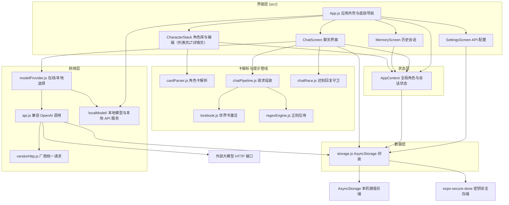
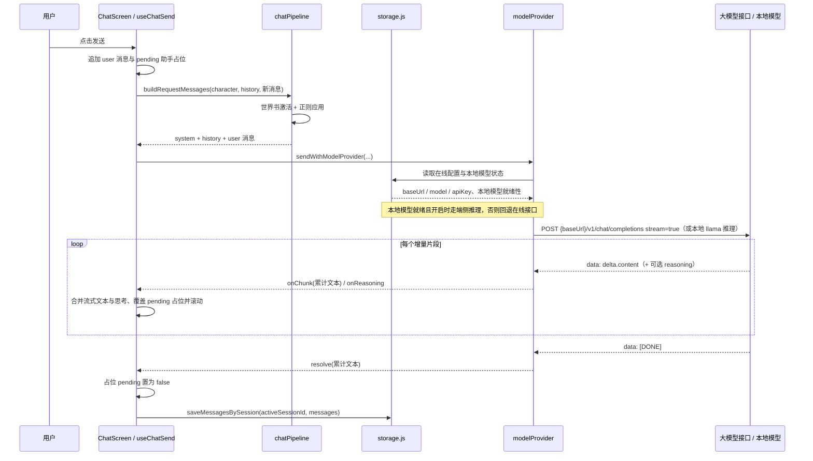
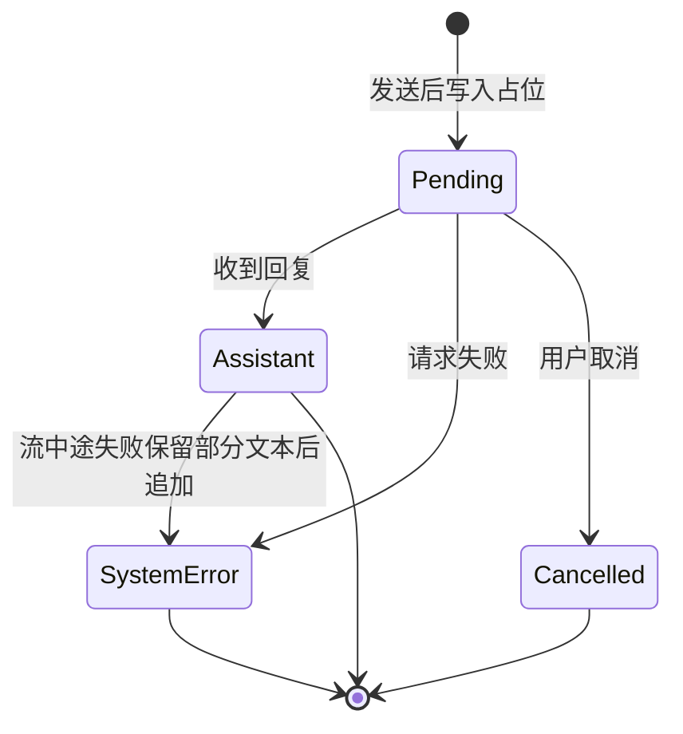

# 架构设计

## 概述

EasyChat2 是一个基于 Expo 与 React Native 构建的移动端 AI 聊天应用，面向希望在手机上使用自有大模型 API Key 进行对话的个人用户。应用兼容 OpenAI 的 Chat Completions 协议，通过一个可配置的 API 地址、模型名和密钥与任意兼容服务（如 DeepSeek、OpenAI 或自建网关）通信。

应用采用单机、无后端的形态：所有配置、角色设定与聊天记录都保存在设备本机的 `AsyncStorage` 中，不经过任何自建服务器。应用由五个底部标签页组成——聊天、记忆、角色、扩展、设置，分别负责对话、历史会话管理、角色库管理、扩展功能（内嵌小游戏与生图）与 API 配置，并通过一个全局 `AppContext` 共享角色库、会话列表与当前选择状态。

在能力上，应用支持一个角色拥有多段对话、可陈列与切换的历史会话（记忆页支持置顶、克隆与删除）、可陈列与切换的角色库、Markdown 格式的助手回复渲染、可折叠并一键复制的系统报错气泡，以及从 PNG 或 JSON 角色卡导入人设、世界书与正则脚本。导入的世界书会在发送前按键触发注入提示词，正则脚本会分别在发送提示词与界面展示时应用。请求层内置 30 秒超时与错误格式化，报错展示前会对疑似密钥字符串做脱敏。

架构上强调几项特征：角色以「角色库 + 当前角色 id」两键持久化，旧版单角色数据在首次读取时迁移；会话以「会话列表 + 当前会话 id」持久化，消息按会话 id 隔离，旧版按角色存储的消息在启动时迁移为历史会话；角色与会话状态集中在 Context 并采用乐观写入加失败回滚，切换角色或会话时中断进行中的请求并丢弃迟到回复。运行时的 Buffer 兼容垫片与 Metro 的 `package exports` 开关共同保证 ESM 依赖 `parsecard` 能正确打包。

## 技术栈

**语言与运行时**
- JavaScript（ES2018+），JSX
- React 19.1.0
- React Native 0.81.5
- Expo SDK ~54.0.0（`newArchEnabled: true`，新架构 Interop 对旧式原生模块零改造可用，已真机验证）
- Node.js 22（CI 构建环境）

**框架与库**
- 界面：`react-native` 原生组件、`react-native-safe-area-context`、`react-native-gesture-handler`
- 导航：`@react-navigation/native` + `@react-navigation/bottom-tabs`
- 富文本：`react-native-markdown-display`、`react-native-render-html`、`react-native-webview`（角色卡媒体与交互 HTML）
- 图标资源：`react-native-vector-icons`
- 图片处理：`expo-image-picker`、`expo-image-manipulator`、`expo-file-system`
- 音频：`expo-audio`（录音与云端音频播放；`expo-av` 已移除）
- 本地推理：`llama.rn@0.12.9`（可选原生依赖，Android ABI 收窄为 `arm64-v8a,x86_64`）

**数据存储**
- `@react-native-async-storage/async-storage`（设备本机键值存储）
- `expo-secure-store`（密钥安全存储，AsyncStorage 中只留引用）
- `expo-file-system`（超大角色正文文件描述符、聊天图片、备份导出）
- `expo-sqlite`（Android 旧 AsyncStorage 大行只读分块恢复）
- 无服务端数据库、无缓存层

**基础设施**
- 构建与分发：Expo、EAS Build、GitHub Actions
- 打包器：Metro（`expo/metro-config`）
- 转译：Babel（`babel-preset-expo`）
- 测试：`node --test` + `c8` 覆盖率（地板 60%，实际约 85%）

**外部服务**
- 任意兼容 OpenAI Chat Completions 的 HTTP 接口（默认预设 DeepSeek）
- 角色卡文件解析库 `parsecard`
- 声明式集成：生图（Google AI Studio / OpenRouter / Stability AI / ai.gitee / Agnes AI / OpenAI 中转站 / Local Dream 端侧）、TTS、向量记忆、语音转写、联网搜索

## 项目结构

```
easychat2/
├── App.js                    # 应用入口：垫片、导航容器、全局 Provider、主动消息与本地 API 桥
├── app.json                  # Expo 应用元数据与 Android 权限
├── eas.json                  # EAS Build 配置
├── metro.config.js           # Metro 打包配置（开启 package exports）
├── babel.config.js           # Babel 预设
├── package.json              # 依赖清单与 npm 脚本
├── .npmrc                    # npm 配置（legacy-peer-deps）
├── SMOKE_TEST.md             # 真机走查清单
├── assets/                   # 图标、自适应图标与启动图
├── plugins/                  # Expo config plugin（Kotlin 原生模块注入）
│   ├── withProactiveMessage.js   # 主动消息原生模块（加密存储 + 闹钟）
│   ├── withLocalApiServer.js     # 本地 OpenAI 兼容服务（nanohttpd + Bearer 鉴权）
│   └── withAsyncStorageDbSize.js # AsyncStorage 数据库体积探针
├── src/
│   ├── ChatScreen.js         # 聊天界面主流程：接线各 hook、渲染；约 2358 行（原 6112 行）
│   ├── chat/                 # 聊天页拆分模块
│   │   ├── useChatSend.js        # 发送/接收/流式/重生成/群聊调度（状态与副作用主 hook）
│   │   ├── useSessionMessages.js # 按会话加载消息、落盘队列、草稿、附件引用
│   │   ├── useSessionSwitch.js   # 切换角色/会话/群聊、新建会话、开场白确认
│   │   ├── useSessionGuard.js    # 会话竞态守卫：版本号、单飞锁、AbortController
│   │   ├── useChatSearch.js      # 会话内搜索状态与命中滚动定位
│   │   ├── useChatModelThinking.js # 模型切换与思考设置的弹窗状态
│   │   ├── useChatRecorder.js    # 录音生命周期（expo-audio）
│   │   ├── useChatTts.js         # 播报开关与自动播报接线
│   │   ├── useScrollScrubber.js  # 快速定位滑动条状态
│   │   ├── useChatBranches.js    # 读取当前会话分支索引（分叉点入口数据源）
│   │   ├── replyFlow.js          # 回复流纯函数：合并流式文本/思考、错误分类、重生成计划
│   │   ├── branchTree.js         # 对话分支纯逻辑：切尾段/切换计划/分组/描述符
│   │   ├── MessageList.js        # 消息列表渲染段（窗口化 + 空状态 + 加载更早 + 分叉入口）
│   │   ├── BranchForkRow.js      # 分叉点入口（可展开，切换/删除分支）
│   │   ├── ChatComposer.js / ChatTopBar.js / ChatSearchBar.js / ChatSettingsModal.js
│   │   ├── MessageBubble.js / ErrorBubble.js / ThinkingIndicator.js / VoiceBubble.js
│   │   ├── AnimatedEntry.js / MoreMenuModal.js / SwitcherModal.js / MentionPickerModal.js
│   │   ├── StickerPanelModal.js / StickerNamePromptModal.js / ModelPanelModal.js
│   │   ├── ThinkingPanelModal.js / VoiceSettingsModal.js / SelectionTextModal.js
│   │   ├── FullScreenInputModal.js / chatConstants.js / chatHelpers.js / chatStyles.js
│   │   ├── chatSearchMath.js / audioModules.js
│   │   ├── groupChat.js           # 群聊 barrel，21 个旧公开导出
│   │   ├── groupChat/             # 8 个实现模块
│   │   │   ├── constants.js / textUtils.js / profile.js / scheduler.js
│   │   │   └── opening.js / mediaPrompt.js / context.js / ensemble.js
│   │   ├── groupMentions.js / chatRace.js / messageSelection.js
│   │   ├── chatMedia.js      # 图片/表情包消息结构与模型提示
│   │   ├── attachments.js / stickerImages.js / stickerDirectives.js
│   │   │   / voiceMessages.js / speechText.js   # 附件、表情包、语音与朗读文本
│   │   ├── richHtml.js / markdownGuard.js / assistantRender.js  # 富 HTML 判定 / Markdown 限长 / 渲染配置
│   │   ├── AssistantMessageBody.js / RichHtmlMessage.js         # 助手正文与富 HTML 消息渲染
│   │   └── ScrollScrubber.js     # 快速定位滑动条：拖动跳转会话任意位置
│   ├── MemoryScreen.js       # 记忆页：历史会话列表、置顶、克隆、删除
│   ├── SearchScreen.js       # 跨会话搜索：关键词检索历史消息并跳转定位
│   ├── character/            # 角色域：CharacterStack（列表⇄详情栈）+ 列表页/详情页 + 卡解析/导出/编辑子组件
│   ├── ImageGenScreen.js     # 生图界面：服务/模型选择、图生图与结果画廊
│   ├── ExtensionScreen.js    # 扩展页：切换内嵌小游戏、生图、制卡与世界分组
│   ├── SettingsScreen.js     # API 地址 / 模型 / Key 配置
│   ├── PresetPanel.js        # 全局预设与记忆总结设置面板
│   ├── PluginPanel.js        # 插件管理面板（联网搜索等）
│   ├── BackupPanel.js        # 全量备份/恢复面板（进度与取消）
│   ├── LocalModelPanel.js    # 本地模型管理面板（多模型/参数/日志）
│   ├── ProactivePanel.js     # 主动消息设置面板（时间槽/消息类型/衔接会话）
│   ├── DiaryPanel.js         # 角色日记面板
│   ├── MapPanel.js           # 世界地图面板
│   ├── MomentsView.js        # 动态时间线
│   ├── network/              # 网络层：接口调用、厂商预设与在线/本地路由
│   │   ├── api.js                # 大模型接口调用（XHR 流式）与错误格式化
│   │   ├── apiVendors.js         # 聊天 API 厂商与协议预设
│   │   ├── vendorHttp.js         # 厂商请求统一层（地址归一化、鉴权、SSE 解析）
│   │   └── modelProvider.js      # 在线/本地 provider 选择与推理回退
│   ├── apiProtocols.js         # 协议适配 barrel，公开导出保持
│   ├── apiProtocols/           # 9 个纯函数实现模块
│   │   ├── constants.js / urls.js / multimodal.js / tools.js / messages.js
│   │   └── body.js / errors.js / stream.js / final.js
│   ├── resourceMutex.js      # 本地推理/录音等原生重负载资源互斥
│   ├── character/            # 角色卡 schema 与角色编辑
│   │   ├── cardParser.js         # 角色卡解析 barrel，公开导出保持
│   │   ├── cardParser/           # 7 个实现模块
│   │   │   ├── normalizeUtils.js / worldInfo.js / regexScripts.js / standardFields.js
│   │   │   └── normalizeCard.js / json.js / png.js
│   │   ├── cardExporter.js       # 角色卡 V2 构造、PNG 编码与文件导出
│   │   ├── cardGreetings.js      # 备用开场白导入与候选
│   │   ├── cardHelpers.js        # 角色卡字段辅助
│   │   └── editors.js / characterStyles.js
│   ├── cardForge/
│   │   ├── forge.js              # 制卡纯逻辑 barrel，31 个旧公开导出
│   │   ├── forge/                # 7 个实现模块
│   │   │   ├── shared.js / advanced.js / draft.js / state.js
│   │   │   └── prompts.js / patch.js / assist.js
│   │   └── preview.js / media.js / mediaPaths.js
│   ├── prompt/               # 提示词管线：世界书 + 正则 + 消息组装
│   │   ├── chatPipeline.js       # 系统提示词 + 历史 + 用户消息组装
│   │   ├── lorebook.js           # 世界书条目激活判定
│   │   └── regexEngine.js        # 正则脚本作用范围、应用与灾难性回溯模式拦截
│   ├── imageGen/             # 生图：声明式 Provider 与统一适配层
│   │   ├── providers.js          # 云端生图平台声明表
│   │   ├── index.js              # 统一生成入口与响应解析
│   │   ├── localDream.js         # Local Dream 端侧生图（SSE + 原始 RGB）
│   │   ├── png.js                # 纯 JS PNG 编码与 base64 解码
│   │   ├── inlineImagePrompt.js  # 内联配图位置与提示
│   │   └── imageResultFormat.js  # 生图结果扩展名/MIME 解析
│   ├── localModel/           # 本地大模型（llama.rn）
│   │   ├── modelManager.js       # 模型下载/导入/删除与文件信息
│   │   ├── modelCatalog.js       # GGUF 目录搜索（HF/魔搭）
│   │   ├── modelCompatibility.js # 量化识别与内存估算分级
│   │   ├── modelParams.js        # 推理参数持久化
│   │   ├── modelState.js         # 活动模型状态与多模态能力读取
│   │   ├── adapter.js            # llama.rn 常驻上下文适配（load/unload/推理）
│   │   ├── localApiServer.js     # 本地 OpenAI 兼容服务（JS 侧接线）
│   │   ├── thinkStream.js        # Qwen3 风格  thinking 流式切分（含只闭不开兜底）
│   │   ├── modelLogs.js          # 环形推理日志
│   │   ├── deviceMemory.js       # 设备内存探测
│   │   ├── ModelLogsModal.js / ModelSearchModal.js
│   ├── storage/              # 存储域模块（storage.js 门面下的实现）
│   │   ├── io.js                 # 读写原语、损坏备份、字节统计、createMutationQueue
│   │   ├── backupStream.js       # 备份导出分块生成器（逐块可取消）
│   │   ├── backup.js             # 备份导出/恢复编排（流式写盘）
│   │   ├── dataBackup.js         # 备份包构造/校验/导入计划的纯函数
│   │   ├── mediaProtection.js    # 媒体写入 revision 与最近 URI 保护、回收重试时点
│   │   ├── secretStore.js        # 密钥抽取到 expo-secure-store，AsyncStorage 只留引用
│   │   ├── secrets.js            # 共享密钥脱敏登记表与 maskSecrets
│   │   ├── diagnostics.js        # 本地脱敏诊断日志（无顶层 import、惰性 require）
│   │   ├── characters.js / apiConfigs.js / sessionCore.js / sessionList.js
│   │   ├── sessionMessages.js / sessionFiles.js / sessions.js / settings.js
│   │   ├── localModels.js / vector.js / stickers.js / moments.js / diary.js
│   │   ├── affinity.js / worldMap.js / globalPresets.js / personas.js / cardForge.js
│   ├── vectorMemory/         # 向量记忆：声明式 Provider、召回与作用域
│   ├── games/games.js        # 内嵌 HTML 小游戏清单
│   ├── theme/                # 五套主题语义色板与字体缩放上下文
│   ├── tts/                  # 声明式语音播报 Provider 与统一适配层
│   ├── transcription.js      # 语音转写（多厂商 + 复用聊天来源）
│   ├── moments/              # 本地好感启发式与动态触发
│   ├── memory/               # 记忆：摘要、时间分档与展示文本缓存
│   │   ├── memorySummary.js      # 摘要生成、世界书写入与请求压缩
│   │   ├── memoryBuckets.js      # 会话按时间分档折叠
│   │   └── displayTextCache.js   # 展示正则结果按消息对象缓存，减少流式重算
│   ├── proactive/            # 主动消息：队列消费、槽位设置与请求组装
│   │   ├── proactiveInbox.js     # 队列消费（JSON 契约 + 并发合并）
│   │   ├── proactiveMessage.js   # 槽位设置与原生桥（时段/消息类型/衔接会话）
│   │   └── proactiveRequest.js   # 提示词与请求组装
│   ├── plugins/
│   │   ├── providers.js      # 搜索服务声明表（地址、认证、字段映射）
│   │   ├── registry.js       # 插件注册表：触发词、执行与背景资料格式化
│   │   └── webSearch.js      # 通用请求器：构造、解析、缓存、重试与限流
│   ├── storage.js            # AsyncStorage 读写门面（转发 storage/ 各域）
│   ├── onboarding/           # 新手引导、免责条款与教程内容
│   │   ├── onboardingContent.js  # 章节数据（向导与教程共用）
│   │   ├── disclaimer.js         # 免责条款弹窗组件
│   │   ├── disclaimerContent.js  # 免责条款文本与分节
│   │   └── images.js             # 章节图片解析
│   ├── polyfills.js          # Buffer 运行时兼容垫片
│   └── context/
│       ├── AppContext.js     # 全局角色库与会话状态
│       ├── characterLibrary.js # 角色库状态迁移纯函数
│       └── sessionLibrary.js # 会话状态纯函数
└── .github/workflows/        # APK 构建、单元测试与 EAS 调试流水线
```

**入口点**
- `App.js` - 应用启动，注册导航与 `AppProvider`
- `package.json` 的 `main` 指向 `node_modules/expo/AppEntry.js`，由 Expo 加载 `App.js`
- `src/polyfills.js` - 必须在任何业务代码之前加载

## 子系统

### 应用外壳与导航
**目的**: 初始化运行时垫片、全局 Provider，并组织五个标签页；首次启动时经 `StartupFlow` 先弹免责条款、再进入新手教学向导，`StartupSession` 迁移旧消息并开启新会话
**位置**: `App.js`
**关键文件**: `App.js`
**依赖**: `src/polyfills.js`、`react-native-gesture-handler`、`@react-navigation/*`、`@expo/vector-icons`、`src/context/AppContext.js`、`src/onboarding/disclaimer.js`、`src/storage.js`
**被依赖**: 全体界面通过导航挂载

### 聊天界面
**目的**: 顶部展示并可切换当前角色，右上角提供「公告」入口，管理图片/文字/语音消息、表情包、长按多选删除、带确认的修改重发、全宽布局与大型 HTML 开场白、发送请求、展示助手 Markdown 回复与系统报错气泡，并按会话持久化
**位置**: `src/ChatScreen.js`
**关键文件**: `src/ChatScreen.js`、`src/chat/useChatSend.js`、`src/chat/useSessionMessages.js`、`src/chat/useSessionSwitch.js`、`src/chat/useSessionGuard.js`、`src/chat/MessageList.js`、`src/chat/replyFlow.js`、`src/chat/useChatSearch.js`、`src/chat/useChatModelThinking.js`、`src/chat/useChatRecorder.js`、`src/chat/useChatTts.js`、`src/chat/useScrollScrubber.js`、`src/chat/chatConstants.js`、`src/chat/chatHelpers.js`、`src/chat/chatStyles.js`、`src/chat/MessageBubble.js`、`src/chat/ErrorBubble.js`、`src/chat/ThinkingIndicator.js`
**依赖**: `src/network/api.js`、`src/network/modelProvider.js`、`src/prompt/chatPipeline.js`、`src/chat/chatRace.js`、`src/prompt/regexEngine.js`、`src/storage/secrets.js`、`src/storage.js`、`src/vectorMemory/`、`src/memory/memorySummary.js`、`src/chat/groupChat.js`、`src/chat/attachments.js`、`src/chat/voiceMessages.js`、`src/transcription.js`、`src/tts/index.js`、`src/onboarding/disclaimer.js`、`src/context/AppContext.js`、`src/chat/*`、`@expo/vector-icons`、`expo-clipboard`、`expo-audio`、`react-native-markdown-display`
**被依赖**: `App.js`
**说明**: 2026-09-27 起把常量、纯辅助函数、样式工厂与展示组件拆到 `src/chat/`（ChatScreen 6112 → 4506 行）；2026-10-02 A 线重构再把有状态逻辑按职责抽成六个模块——`useChatSend`（发送/接收/流式/重生成/群聊调度）、`useSessionMessages`（消息加载、落盘队列、草稿、附件引用）、`useSessionSwitch`（切换角色/会话/群聊、新建、开场白确认）、`useSessionGuard`（版本号与单飞锁竞态守卫）、`MessageList`（列表渲染 + 窗口化）、`replyFlow`（流式合并与错误分类纯函数），`ChatScreen.js` 收敛到约 2358 行，只保留接线与渲染。拆分遵循「回调保留在 ChatScreen、数据与时序归 hook」，行为不变；默认导出仍是 `function ChatScreen()`。

**消息列表窗口化**: `MessageList` 默认只渲染尾部窗口（`MESSAGE_WINDOW_INITIAL` = 80 条），「加载更早消息」每次放开 `MESSAGE_WINDOW_STEP` = 200 条，窗口上限即消息总数；定位/搜索跳转到窗口外消息时先按 `MESSAGE_WINDOW_STEP_SCROLL` = 400 条扩窗再重试滚动。目的是把超长会话的挂载消息数封顶，降低首次渲染与滚动开销。

**两个结构性守卫测试**: `tests/chatScreenSplit.test.mjs` 用声明顺序测试防止 hook 调用早于其依赖的 `useState`（TDZ），并用双向参数匹配测试保证每个 hook 的签名参数与调用点实参一一对应——两处都是实战中发现的 P0 缺陷，属永久回归门禁。

### 对话树 / 分支回溯
**目的**: 把「修改重发 / 重新生成 / 删除连续尾段」从「直接丢弃被撤回尾段」升级为「归档成分支」，让角色扮演用户能在多条剧情走向间来回切换。首期仅单聊。
**位置**: 纯逻辑 `src/chat/branchTree.js`；存储 `src/storage/sessionBranches.js`；UI `src/chat/BranchForkRow.js` + `src/chat/useChatBranches.js`；接线 `src/chat/useChatSend.js`、`src/ChatScreen.js`、`src/chat/MessageList.js`
**关键文件**: `src/chat/branchTree.js`、`src/storage/sessionBranches.js`、`src/chat/BranchForkRow.js`、`src/chat/useChatBranches.js`
**说明**: 活动时间线仍是 `@easychat2_messages::<sessionId>` 的扁平数组（不改读写形状，老消息缺 `branchId` 视为根分支）。撤回前用 `branchFromTail` 切出尾段、`archiveBranch` 先写条目后写索引（索引是提交点）；分叉点入口按 `forkMessageId` 分组，在对应消息之后渲染；切换用 `planCheckout` 计算「分叉点及其之前 + 分支尾段」，并把被替换掉的当前尾段也归档为新分支（来回切换不丢消息），目标分支被消费后删除。`sessionFiles.js` 媒体回收把分支条目纳入在用集合，会话删除连带清理分支键。
**测试**: `tests/branchTree.test.mjs`（纯逻辑）、`tests/sessionBranches.test.mjs`（存储生命周期）、`tests/chatBranchTreeUi.test.mjs`（UI 接线锚点）。

### 记忆页
**目的**: 逐行陈列历史会话，支持点击续聊、置顶、克隆与删除
**位置**: `src/MemoryScreen.js`
**关键文件**: `src/MemoryScreen.js`
**依赖**: `src/context/AppContext.js`、`@expo/vector-icons`
**被依赖**: `App.js`

### 角色管理
**目的**: 陈列角色库并切换当前角色，编辑角色核心字段（角色名/开场白/系统提示词/描述/性格/场景），新建/删除角色，从 PNG/JSON 角色卡导入标准字段、世界书与正则脚本，并把角色导出为标准 V2 卡
**位置**: `src/character/CharacterStack.js`（原生栈）、`src/character/CharacterLibraryScreen.js`（列表页）、`src/character/CharacterDetailScreen.js`（编辑表单）
**关键文件**: `src/character/CharacterLibraryScreen.js`、`src/character/CharacterDetailScreen.js`、`src/character/CharacterStack.js`
**依赖**: `src/character/cardParser.js`、`src/character/cardExporter.js`、`src/storage/secrets.js`、`expo-document-picker`、`expo-file-system`、`expo-sqlite`、`expo-sharing`、`buffer`、`src/context/AppContext.js`
**被依赖**: `App.js`

### 卡解析与提示管线
**目的**: 解析角色卡并标准化字段，判定世界书激活，应用正则，组装最终请求消息
**位置**: `src/character/cardParser.js`、`src/prompt/lorebook.js`、`src/prompt/regexEngine.js`、`src/prompt/chatPipeline.js`
**关键文件**: `src/character/cardParser.js`、`src/prompt/chatPipeline.js`
**依赖**: `parsecard`、`buffer`
**被依赖**: `ChatScreen`、`CharacterLibraryScreen`、`CharacterDetailScreen`

**拆分结构**（四处 barrel 的既有公开导出保持）：
- `src/character/cardParser.js` 转发 `cardParser/` 的 7 个模块：`normalizeUtils`（取值工具）、`worldInfo`（世界书归一）、`regexScripts`（正则归一）、`standardFields`（标准字段与系统提示）、`normalizeCard`（整卡归一）、`json`（JSON 清洗/解析）、`png`（PNG 读取）。内部主链为 `png → json → normalizeCard → standardFields/worldInfo/regexScripts → normalizeUtils`；`parsecard`/`buffer` 位于 `png.js`，`normalizeCard.js` 另依赖角色预设、AIGC 标识与 i18n。
- `src/chat/groupChat.js` 转发 `groupChat/` 的 8 个模块及既有 `groupMentions.js`，保持 21 个公开符号。`constants`/`textUtils` 为基础，`profile` 管成员简介，`scheduler` 管发言调度，`opening` 管开场，后三者依赖 `network/api.js`；`mediaPrompt` 复用 `chatMedia.js`/`prompt/regexEngine.js`，供 `context` 与 `ensemble` 共用。`context` 组装历史/群聊情境并调用 `prompt/chatPipeline.js`，`ensemble` 组装群像提示并解析/合并回复段。
- `src/cardForge/forge.js` 转发 `forge/` 的 7 个模块，保持 31 个公开符号。`shared` 提供字段/标签/限额与文本工具，`advanced` 清洗高级条目，`draft` 做草稿与角色转换，`state` 管问答/记录，`prompts` 构造生成/编辑提示，`patch` 解析模型 JSON 并合并草稿，`assist` 管字段/标签/条目辅助生成。依赖限定在该目录内部：`state → draft`、`prompts → state/draft`、`patch → advanced/draft`，各层复用 `shared`；`advanced` 为内部实现。
- `src/apiProtocols.js` 转发 `apiProtocols/` 的 9 个纯函数模块：`constants`（协议标识）、`urls`（URL/鉴权头）、`multimodal`（多模态块）、`tools`（工具转换）、`messages`（消息转换）、`body`（请求体）、`errors`（错误解析）、`stream`（流式解析）、`final`（非流式解析）。主要依赖为 `body → messages/tools`、`messages → multimodal`、`final → stream → errors`；传输仍由 `src/network/api.js` 承担。

### 设置界面（API 配置 / 人设 / 外观 / 对话配图 / 生成参数 / 向量记忆）
**目的**: 集中管理 API 来源（接口地址、模型列表与密钥）、用户人设、外观、对话配图、生成参数与向量记忆，支持创建、折叠选择、切换、编辑、删除；当前来源由 `getActiveApiConfig` 读取、当前模型由 `getActiveModel` 读取
**位置**: `src/SettingsScreen.js`
**关键文件**: `src/SettingsScreen.js`、`src/ui/Collapsible.js`
**依赖**: `src/storage.js`、`src/ui`、`src/imageGen`
**被依赖**: `App.js`
**说明**: 为减少一屏选项密度，大量区块改用 `CollapsibleSelect`（折叠选择：先显示当前项，点开才列候选）与 `CollapsibleSection`（折叠分组：点击标题展开，右侧可显示摘要）。API 配置 / 用户人设 / 生图服务 / 向量配置均为「一个选项一个编辑界面」；外观与生成参数整卡折叠；生图服务与「扩展 → 生图」共用 `@easychat2_image_gen`；向量记忆为多配置模型（`@easychat2_vector_memory_configs`，旧单配置键自动迁移）。

### 生图模块
**目的**: 以声明式 Provider 描述各生图平台并统一适配调用，支持文生图与图生图；提供设置面板（地址、密钥、模型、额外参数）、连通性检测与结果画廊；内置 Local Dream 端侧生图（无网可用）
**位置**: `src/imageGen/providers.js`、`src/imageGen/index.js`、`src/imageGen/localDream.js`、`src/imageGen/png.js`、`src/ImageGenScreen.js`
**关键文件**: `src/imageGen/index.js`、`src/imageGen/localDream.js`、`src/ImageGenScreen.js`
**依赖**: `expo-document-picker`、`expo-file-system`、`expo-clipboard`、`expo-sharing`、`src/storage.js`、`buffer`（PNG 编码）
**被依赖**: `src/ExtensionScreen.js`、`src/SettingsScreen.js`（对话配图就地编辑同一份 `@easychat2_image_gen`）、`src/ChatScreen.js`（自动配图）
**说明**: 云端平台走声明式 `IMAGE_PROVIDERS` 表（含 OpenAI 兼容中转站，支持 `multipart` 图生图）。`local-dream` 为端侧 provider：请求 `POST http://127.0.0.1:8081/generate`（用户需先在本机 Local Dream App 内加载模型，服务才监听），响应为 SSE，最终事件携带 **base64 原始 RGB 像素（3 通道，非 PNG）**，由 `png.js` 纯 JS 编码为 PNG；`/tokenize` 用于提示词长度预检。该 provider 与 A1111 协议不兼容，故单独实现而非复用通用适配层。`png.js` 提供 `encodePngFromRgb` / `encodePngBase64FromRgb` / `decodeBase64ToBytes`，是零依赖的 PNG 编码器（CRC32 + zlib stored 块）。

### 本地模型（llama.rn）
**目的**: 在设备上运行 GGUF 大模型，作为在线 API 的可选替代；提供模型下载/导入/删除、参数、内存估算与兼容分级、运行日志，并对外暴露一个本地 OpenAI 兼容 HTTP 服务
**位置**: `src/localModel/`、`src/network/modelProvider.js`、`src/resourceMutex.js`、`src/LocalModelPanel.js`、`plugins/withLocalApiServer.js`、`plugins/proactiveMessage/`（Kotlin）
**关键文件**: `src/localModel/modelManager.js`、`src/localModel/adapter.js`、`src/localModel/runtime.js`、`src/localModel/downloadQueue.js`、`src/localModel/localApiServer.js`、`src/localModel/thinkStream.js`、`src/network/modelProvider.js`
**依赖**: `llama.rn@0.12.9`（可选原生依赖）、`expo-file-system`、`buffer`、`react-native`（NativeModules/EventEmitter）
**被依赖**: `src/ChatScreen.js`、`src/SettingsScreen.js`、`src/ExtensionScreen.js`
**说明**:
- **推理侧常驻上下文**：`adapter.js` 维护单个常驻 llama 上下文（load/unload），多模态经 `initMultimodal`；`resourceMutex` 保证本地推理、录音等原生重负载不并发持有资源。
- **单一事实源（v5 Stage A）**：`@easychat2_local_model` 设置键只含 `{ enabled, enableMediaInput, activeModelId, apiServer, schema: 2, updatedAt }`；单模型的路径/体积/参数只存在于条目键。旧结构一次性迁移（写条目 + 清空 legacy 字段 + 盖 schema:2），读路径统一走 `getActiveLocalModel()`，不再镜像。
- **运行态广播（v5 Stage A）**：`adapter.js` 在 load/unload 出入口向 `runtime.js`（模块单例 `idle→loading→ready→error` + 订阅）发事件，供聊天层状态条与模型中心运行卡消费；推理/裁剪/think 流路径不变。
- **下载即任务（v5 Stage B）**：`downloadQueue.js` 是模块级持久化串行队列（`@easychat2_download_queue`）——入队即返回、同时只跑一个、出队先做磁盘预检（`getFreeDiskStorageBytes`，不足直接失败并指路清理）、官方源失败自动改写 hf-mirror 续试。断点续传降级为「断点重下」：重启后残留的 `running` 任务在水合时降为 `pending` 重下；不做真后台/锁屏续传（Expo 体系成本不成比例），UI 文案如实提示保持前台。
- **一处管理，处处切换（v5 Stage C）**：聊天层 `EngineStatusBar`（+ `useLocalEngineStatus` + 纯 `engineStatus.js`）常驻显示引擎 `idle/loading/ready/error` 与 10 秒本地→在线回退警告，数据源同为 `runtime.js`；聊天模型选择器 `chat/ModelPanelModal.js` 瘦身为纯切换器（选用/取消选用），加载/卸载/删除/参数统一收进模型中心（`LocalModelPanel.js` + `panel/EngineCard.js` 运行状态卡）。参数弹窗新增三个预设（聊天/写作/代码）与 contextSize 内存影响即时提示。
- **在线/本地回退**：`modelProvider.js` 的 `canUseLocalModel` / `sendWithModelProvider` 决定走本地还是在线；模型未就绪、未装适配器或推理失败时自动回退在线 API，用户无感。
- **思考流切分**：`thinkStream.js` 处理 Qwen3 风格的 ` thinking…</think>` 流式切分，含「只出现闭合标签、无开启标签」的兜底（`createThinkSplitter` 增量喂入、返回 `{ reasoning, text }` 分段）——修复前该形态会把整段思考内容当正文显示。
- **本地 API 服务**：HTTP 层在 Kotlin（nanohttpd），推理经 `LocalApiServer:onRequest` 事件回 JS，复用同一常驻上下文；**Bearer 鉴权强制开启**——apiKey 留空时由 `generateLocalApiKey()` 自动生成，校验用 `MessageDigest.isEqual` 常量时间比较，空 key 一律拒绝（401）。`App.js` 的 `LocalApiServerBridge` 负责接线，并退后台/卸载时停服。v5 Stage D：`/v1/models` 返回全部已安装条目（JS 启动时下发 `modelsJson`）；`stream:true` 走真 chunked SSE（`PipedOutputStream` + `respondStream`，逐 token 回写 OpenAI `chat.completion.chunk`），原生无 `respondStream` 时降级整段回包。
- **构建约束**：Android ABI 必须为 `arm64-v8a,x86_64`（`llama.rn` 只提供 64 位预编译库），由 `expo-build-properties` 强制；`expo prebuild` 会改写 `app.json`/`package.json`，提交前须回退非预期改动。

### 语音消息与转写
**目的**: 录音 → 转写 → 语音气泡回放闭环；角色可按卡选择回复形态（纯文字 / 文字+语音 / 纯语音），失败降级为纯文字
**位置**: `src/chat/useChatRecorder.js`、`src/chat/VoiceBubble.js`、`src/chat/VoiceSettingsModal.js`、`src/chat/voiceMessages.js`、`src/transcription.js`、`src/TranscriptionPanel.js`、`src/chat/speechText.js`、`src/tts/`
**关键文件**: `src/chat/voiceMessages.js`、`src/transcription.js`、`src/tts/index.js`
**依赖**: `expo-audio`（录音与播放）、`expo-media-library`/`expo-document-picker`（按需）、`src/storage.js`、`src/storage/secretStore.js`
**被依赖**: `src/ChatScreen.js`、`src/SettingsScreen.js`
**说明**: 录音走 `expo-audio`（非 spec 原写的 expo-av），时长上下限 0.5s ~ 60s，结束时落盘 `voice/`。转写支持复用当前聊天来源或独立配置（`@easychat2_transcription`），失败有可见反馈与占位回退。`supportsAudio` 能力标记决定角色卡 `voiceDisplay` 三档（text / voice-text / voice）。TTS 播报为独立子系统（`@easychat2_tts`，九家云端引擎 + 系统引擎），播放经 `createAudioPlayer`。

### 主动消息
**目的**: 由原生闹钟在设定时段触发角色主动发消息，支持消息类型（默认 / 关心心情 / 问好 / 自定义）与「衔接对话」（续写指定历史会话）；点击通知跳转到含新消息的那段会话
**位置**: `src/proactive/proactiveMessage.js`、`src/proactive/proactiveInbox.js`、`src/proactive/proactiveRequest.js`、`src/ProactivePanel.js`、`plugins/withProactiveMessage.js`、`plugins/proactiveMessage/`（Kotlin）
**关键文件**: `src/proactive/proactiveInbox.js`、`plugins/withProactiveMessage.js`
**依赖**: `react-native`（NativeModules/DeviceEventEmitter/AppState）、`expo-notifications`、`src/storage.js`、`src/network/api.js`
**被依赖**: `App.js`（`StartupSession` 消费 + 前台消费）、`src/ExtensionScreen.js`
**说明**: 原生侧用 `EncryptedSharedPreferences` 保存槽位与待写队列，闹钟按 1-4 权限申请。**两个已验证的契约要点**：① `consumePendingMessages` 返回 **JSON 字符串**而非数组——新架构 Interop 下 `WritableArray<WritableMap>` 到 JS 的 `Array.isArray` 不成立会导致静默丢消息，`proactiveInbox.js` 的 `normalizePendingMessages` 兼容数组/字符串/类数组三种形态；② 冷启动时多个消费入口并发，`ingestPending` 用 **in-flight Promise 合并**避免先完成方 ack 清空导致另一方取空，并把 `roleId → sessionId` 缓存进 `targetSessionRef` 供 `openRole` 回退。

### 全量备份与恢复
**目的**: 导出/恢复应用数据与媒体（avatars/stickers/chat-images/voice/characters/card-forge），支持合并与覆盖两种恢复模式，导出可取消并显示进度
**位置**: `src/storage/dataBackup.js`、`src/storage/backup.js`、`src/storage/backupStream.js`、`src/BackupPanel.js`
**关键文件**: `src/storage/backup.js`、`src/storage/backupStream.js`
**依赖**: `@react-native-async-storage/async-storage`、`expo-file-system`、`expo-sharing`、`expo-document-picker`
**被依赖**: `src/SettingsScreen.js`
**说明**: 备份包为 `schemaVersion: 1` 的 JSON，整包上限 `BACKUP_MAX_BYTES`（2GB）。**导出走流式写盘**：`backupStream.js` 的 `createBackupChunkGenerator(payload)` 产出分块字符串（单块 `BACKUP_CHUNK_CHARS` = 256 KiB），其拼接结果与 `JSON.stringify(payload)` 逐字节等价（含 `undefined`/函数/`Symbol` 属性省略与数组 `undefined` 转 `null` 语义），`writeBackupStream` 用 `FileHandle.writeBytes` 顺序写入并在每块间检查 `signal`，取消时清理半成品文件；进度区分 `packing`（条目数）与 `writing`（MB）两阶段。导出时 API Key、secure-store 引用与其他密钥字段一律置空，恢复后需重填。

### 密钥安全存储
**目的**: 含密钥的配置在落盘前把 `apiKey` 等字段抽到系统安全存储，AsyncStorage 中只留引用，避免明文密钥留在普通键值库
**位置**: `src/storage/secretStore.js`、`src/storage/io.js` 的 `setJsonWithSecrets` / `readJsonWithSecrets` / `readJsonStatusWithSecrets`
**关键文件**: `src/storage/secretStore.js`
**依赖**: `expo-secure-store`
**被依赖**: `src/storage.js` 中所有含密钥的配置域（API 配置 / 向量记忆 / 生图 / TTS / 插件 / 转写）
**说明**: 密钥 id 由「存储键命名空间 + 字段路径」确定性推导（数组优先用条目自身 `id`），重复保存覆盖同一条、不产生孤儿。旧明文数据读取原样返回、下次保存自动转引用；SecureStore 不可用或写入失败时透明降级为明文，不丢密钥、不阻断保存。

### 扩展页与小游戏
**目的**: 在底部导航提供「扩展」入口，以分段控件切换内嵌小游戏与生图界面；小游戏为纯前端 HTML，经 `WebView` 在应用内运行、无需联网
**位置**: `src/ExtensionScreen.js`、`src/games/games.js`
**关键文件**: `src/ExtensionScreen.js`、`src/games/games.js`
**依赖**: `react-native-webview`、`src/ImageGenScreen.js`
**被依赖**: `App.js`

### 外观主题与字体
**目的**: 提供五套预设主题与六档字体大小，全局即时生效并持久化；各屏样式由 `createStyles(theme, fonts)` 按语义令牌生成
**位置**: `src/theme/themes.js`、`src/theme/ThemeContext.js`
**关键文件**: `src/theme/ThemeContext.js`
**依赖**: `src/storage.js`
**被依赖**: `App.js` 与全部界面屏

### 语音播报
**目的**: 以声明式 Provider 描述系统引擎与九家云端 TTS，统一请求、令牌兑换与音频播放，支持随回复自动播报与手动重播
**位置**: `src/tts/providers.js`、`src/tts/index.js`、`src/TtsPanel.js`
**关键文件**: `src/tts/index.js`
**依赖**: `expo-speech`、`expo-audio`、`src/storage.js`
**被依赖**: `src/ChatScreen.js`、`src/SettingsScreen.js`

### 动态
**目的**: 基于本地关键词启发式评估好感与对话轮次，在重要节点生成角色动态；动态保存发送者身份快照，角色改名或删除后保持历史名称；提供全局时间线与点赞、评论、删除；同一栋房子的其他角色会对动态自动点赞、评论
**位置**: `src/moments/affinity.js`、`src/moments/moments.js`、`src/moments/housemateReactions.js`、`src/moments/runHousemateReactions.js`、`src/MomentsView.js`
**关键文件**: `src/moments/moments.js`、`src/moments/runHousemateReactions.js`
**依赖**: `src/storage.js`、`src/network/api.js`、`src/worldMap/map.js`
**被依赖**: `src/ChatScreen.js`、`src/ExtensionScreen.js`、`src/SettingsScreen.js`

### 世界地图
**目的**: 40×40 网格上为自己与角色安家；自己固定住 000 号房，其余按 001… 编号；每人最多拥有 1 栋房子、每个角色最多住 1 栋（可同时拥有自己的房并住在别人家）；同一栋房子的角色在动态联动里互相点赞、评论
**位置**: `src/worldMap/map.js`、`src/MapPanel.js`
**关键文件**: `src/worldMap/map.js`
**依赖**: `src/storage.js`、`src/ui`
**被依赖**: `src/ExtensionScreen.js`（世界 → 地图）、`src/moments/runHousemateReactions.js`

### 免责条款与公告
**目的**: 集中维护免责条款文本；首次启动时弹出一次并要求确认，聊天页右上角「公告」可随时再次查看
**位置**: `src/onboarding/disclaimer.js`
**关键文件**: `src/onboarding/disclaimer.js`
**依赖**: `react-native`
**被依赖**: `App.js`、`src/ChatScreen.js`、`src/SettingsScreen.js`

### 全局角色与会话状态
**目的**: 加载、共享并更新角色库、当前角色、会话列表与当前会话，提供切换、增删、置顶、克隆、失败回滚与加载完成标志
**位置**: `src/context/AppContext.js`、`src/context/characterLibrary.js`、`src/context/sessionLibrary.js`
**关键文件**: `src/context/AppContext.js`
**依赖**: `src/storage.js`
**被依赖**: `ChatScreen`、`CharacterLibraryScreen`、`CharacterDetailScreen`、`MemoryScreen`

### 数据持久化
**目的**: 以稳定键名读写 API 配置、角色库、当前角色、会话列表、当前会话与按会话隔离的消息，并迁移旧版单角色、旧版单 API 配置与旧版按角色存储的消息；聊天图片文件保存在文档目录，消息删除后按所有会话引用安全回收，屏蔽 `AsyncStorage` 细节
**位置**: `src/storage.js`
**关键文件**: `src/storage.js`
**依赖**: `@react-native-async-storage/async-storage`
**被依赖**: `AppContext`、`ChatScreen`、`SettingsScreen`、`api.js`

### 网络请求
**目的**: 归一化接口地址、以 SSE 流式发起请求、按空闲超时中断、格式化错误响应
**位置**: `src/network/api.js`
**关键文件**: `src/network/api.js`
**依赖**: `src/storage.js`、全局 `XMLHttpRequest`
**被依赖**: `ChatScreen`

### 运行时兼容与打包
**目的**: 为 `parsecard` 提供 `Buffer` 全局与 ESM 入口解析
**位置**: `src/polyfills.js`、`metro.config.js`
**关键文件**: `src/polyfills.js`、`metro.config.js`
**依赖**: `buffer`、`expo/metro-config`
**被依赖**: 由 `App.js` 在启动时首先加载

## 图表

### 运行时组件依赖


```mermaid
flowchart TB
    subgraph UI["界面层 (src/)"]
        App["App.js 应用外壳与底部导航"]
        Chat["ChatScreen 聊天界面"]
        Memory["MemoryScreen 历史会话"]
        Character["CharacterStack 角色库与编辑（列表页⇄详情页）"]
        Settings["SettingsScreen API 配置"]
    end
    subgraph STATE["状态层"]
        Context["AppContext 全局角色与会话状态"]
    end
    subgraph DATA["数据层"]
        Storage["storage.js AsyncStorage 封装"]
    end
    subgraph PIPE["卡解析与提示管线"]
        Parser["cardParser.js 角色卡解析"]
        Lore["lorebook.js 世界书激活"]
        Regex["regexEngine.js 正则应用"]
        Pipeline["chatPipeline.js 请求组装"]
        Race["chatRace.js 迟到回复守卫"]
    end
    subgraph NET["网络层"]
        Api["api.js 兼容 OpenAI 调用"]
        Vendor["vendorHttp.js 厂商统一请求"]
        Provider["modelProvider.js 在线/本地选择"]
        LocalApi["localModel/ 本地模型与本地 API 服务"]
    end
    Device["AsyncStorage 本机键值存储"]
    Secure["expo-secure-store 密钥安全存储"]
    LLM["外部大模型 HTTP 接口"]

    App --> Chat
    App --> Memory
    App --> Character
    App --> Settings
    App --> Context
    App --> LocalApi
    Chat --> Context
    Memory --> Context
    Character --> Context
    Settings --> Storage
    Context --> Storage
    Chat --> Storage
    Chat --> Pipeline
    Character --> Parser
    Pipeline --> Lore
    Pipeline --> Regex
    Chat --> Provider
    Provider --> Api
    Provider --> LocalApi
    Api --> Vendor
    Chat --> Race
    Api --> Storage
    Storage --> Device
    Storage --> Secure
    Api --> LLM
```

### 消息发送时序


```mermaid
sequenceDiagram
    participant U as 用户
    participant C as ChatScreen / useChatSend
    participant P as chatPipeline
    participant S as storage.js
    participant A as modelProvider
    participant L as 大模型接口 / 本地模型

    U->>C: 点击发送
    C->>C: 追加 user 消息与 pending 助手占位
    C->>P: buildRequestMessages(character, history, 新消息)
    P->>P: 世界书激活 + 正则应用
    P-->>C: system + history + user 消息
    C->>A: sendWithModelProvider(...)
    A->>S: 读取在线配置与本地模型状态
    S-->>A: baseUrl / model / apiKey、本地模型就绪性
    note over A,S: 本地模型就绪且开启时走端侧推理，否则回退在线接口
    A->>L: POST {baseUrl}/v1/chat/completions stream=true（或本地 llama 推理）
    loop 每个增量片段
        L-->>A: data: delta.content（+ 可选 reasoning）
        A-->>C: onChunk(累计文本) / onReasoning
        C->>C: 合并流式文本与思考、覆盖 pending 占位并滚动
    end
    L-->>A: data: [DONE]
    A-->>C: resolve(累计文本)
    C->>C: 占位 pending 置为 false
    C->>S: saveMessagesBySession(activeSessionId, messages)
```

### 助手消息状态


```mermaid
stateDiagram-v2
    [*] --> Pending: 发送后写入占位
    Pending --> Assistant: 收到回复
    Pending --> SystemError: 请求失败
    Pending --> Cancelled: 用户取消
    Assistant --> SystemError: 流中途失败保留部分文本后追加
    Assistant --> [*]
    Cancelled --> [*]
    SystemError --> [*]
```

## 设计决策

- **角色状态集中在 Context 并提供加载完成标志**：`AppContext` 通过 `characterRef` 与 `loadedRef` 保存最新值，避免闭包过期；未加载完成前拒绝写入，保证界面与存储一致。
- **乐观写入加失败回滚**：`updateCharacter` 先更新内存与界面状态，再落盘；落盘失败时回滚到旧值并向上抛出，由调用方决定如何提示用户，Context 不承担界面展示职责。
- **消息按会话隔离**：消息键为 `@easychat2_messages::<sessionId>`；会话元数据存于 `@easychat2_sessions`，当前会话指针存于 `@easychat2_active_session`。旧版按角色存储的 `::<characterId>` 与旧版单会话键在启动时由 `migrateLegacyMessages` 幂等迁移为 `legacy-<characterId>` 历史会话。
- **向量记忆按角色聚合单聊**：向量索引键为 `@easychat2_vector_index::<characterId>`，只在单聊写入；检索读取角色级长期记忆，`sessionId` 用于来源追踪和删除清理。片段去重包含 `sessionId`，索引更新、按会话批量删除和按消息删除均经过角色级队列。启动对账清理群聊误写与已删除会话片段，保留无会话归属的旧角色级条目。
- **图片与异步请求有提交边界**：头像、背景和导入图片使用会话令牌；选择器返回、复制完成、保存成功后分别校验并清理临时文件。生图、制卡和动态回复请求支持取消，迟到结果不会写回界面或存储。
- **pending 消息不落盘**：`storage` 与 `ChatScreen` 都会过滤 `pending` 标记的占位消息，避免把「正在思考…」写入历史。
- **失败保留部分回复**：流式进行中若请求失败且已收到文本，`ChatScreen` 将该部分文本标记为已完成并保留，再追加一条 `system-error`，避免已展示内容被清空；无任何文本时占位直接转为报错。
- **自动滚动尊重用户**：消息列表仅在用户处于底部附近时随内容增长自动滚到底部，用户上滚查看历史时不会被流式增量反复拽回。
- **报错原文只留内存**：持久化消息中只保存脱敏后的 `detail`，未脱敏原文保存在仅会话内可见的 `errorRawRef`，防止密钥写入磁盘。
- **切换角色的竞态防护**：发送期间记录发起时的 `characterId`、会话 `id` 与版本号，若用户中途切换角色/会话，迟到返回的回复或错误会被丢弃；发送、重新生成和异步附件读取共用单飞锁。
- **修改重发先确认**：用户点击「修改重发」后先确认，确认后撤回目标用户消息及其后续回复，并把原文字回填输入框；取消确认保持会话不变。
- **大型 HTML 使用本地文件源**：超过内联阈值的完整富 HTML 文档先写入应用缓存文件，再由 WebView 加载，并注入 CSP、滚动约束和动态高度上限，降低 Android Binder 与 WebView 内存峰值。
- **聊天图片按引用回收**：图片文件只保存于文档目录，AsyncStorage 保存 URI；消息或会话删除后扫描所有会话消息与待发送附件引用，保留克隆共享文件，清理无引用文件。
- **请求走 XHR 增量解析 SSE**：RN 的 `fetch` 不暴露 `response.body`，`api.js` 因此使用内置 `XMLHttpRequest` 的 `onprogress` 与累计 `responseText` 解析 `stream: true` 的 SSE，逐片段通过 `onChunk` 回调上抛累计文本，无需新增依赖。超时改为空闲超时，30 秒无数据才判定失败。
- **请求可取消**：`sendChatMessage` 接受 `AbortSignal`，取消时以 `AbortError` 拒绝并清理监听；`ChatScreen` 为每次发送创建 `AbortController`，在用户点击「停止」、切换角色或组件卸载时中断，已收到的部分文本按失败保留规则处理。
- **运行时垫片先行**：`Buffer` 垫片置于 `App.js` 首行导入，规避 ES 模块提升导致的求值顺序问题；Metro 全局开启 `unstable_enablePackageExports` 以解析 `parsecard` 的 `exports` 字段。
- **解析与解析库解耦**：`parsecard` 只用于 PNG `tEXt` 文本块主读取；字段映射、世界书与正则标准化全部在 `src/character/cardParser/` 实现、由 `cardParser.js` 转发，避免 `parsecard` 构造时丢弃 `character_book`/`regex_scripts` 或忽略顶层字段。`iTXt` 无压缩块由本地兜底读取，压缩块因 RN 无 zlib 而跳过。
- **解析错误与无数据分离**：PNG 未找到 `chara`/`ccv3` 文本块属于「无数据」，返回 `null` 并由界面给出友好提示；文件损坏、base64 解码失败、JSON 语法错误才抛出并附带脱敏详情。解析错误经共享的 `src/storage/secrets.js` 脱敏后才展示与记录。
- **世界书独立引擎**：`lorebook.js` 在不引入 UI 依赖的前提下实现常驻/关键词激活、次要关键词、概率与扫描深度，`chatPipeline.js` 按位置与顺序拼装系统消息或按深度插入消息。
- **正则运行时应用**：助手回复以原始文本落盘，提示词版本与展示版本在发送和渲染时分别计算（`promptOnly`/`markdownOnly` 区分），避免污染历史且保证幂等。
- **记忆总结压缩上下文**：独立的记忆总结设置达到可总结消息阈值时自动执行；手动触发先确认，并包含边界后的全部消息，不受阈值限制。`memorySummary` 把已有记忆注入提示词的 `<memories>` 区块，调用 LLM 提取**新增记忆行**（每行 `- ` 开头，关键词用占位）。仅当角色只有一个单聊会话时默认写入当前角色世界书（条目名 `记忆总结 N`、关键词触发、可在角色页编辑删除）；出现 ≥ 2 个单聊会话后改为写入会话级总结，避免世界书全局生效导致的跨会话串味（世界书注入还会剔除记忆条目，记忆只经 `[记忆摘要]` 注入）。只有实际生成非空记忆时才把会话 `summarizedUpTo` 单调前移；无新增记忆或总结失败时保留原状。发送请求时用记忆文本替代边界之前的消息，始终保留最近若干条。
- **聊天页按职责拆分 hook，ChatScreen 只留接线**：A 线重构把有状态逻辑外提到 `src/chat/` 的六个模块，回调与状态由 ChatScreen 注入。这样每个 hook 可被独立阅读与测试，同时 `ChatScreen.js` 从 4506 行降到约 2358 行。拆分确立两条硬约束：**hook 数据与时序归各自模块、跨模块回调保留在 ChatScreen**；以及 **`src/chat/` 下可测模块不得触碰 expo/RN 依赖**（否则 Node 测试无法加载），需要外部能力时以参数注入（如 `replyFlow.classifyReplyError` 接收 `isConfigChangedError`/`isCanceledError`）。
- **消息列表窗口化以尾部为准**：超长会话只挂载尾部 N 条（`MESSAGE_WINDOW_INITIAL` = 80，「加载更早消息」每次放开 `MESSAGE_WINDOW_STEP` = 200，窗口上限为消息总数），这样常驻的 `onLayout` 记录与渲染节点数不随会话长度线性增长；而定位类操作（搜索跳转、引用跳转、`scrollToMessage`）在目标落在窗口外时先扩窗再重试滚动，保证功能不回退。
- **结构性守卫测试防的是「拆分引入的接线错误」**：`tests/chatScreenSplit.test.mjs` 的声明顺序测试抓 TDZ（hook 调用早于依赖的 `useState`），双向参数匹配测试抓「hook 签名新增参数但调用点没传」。两者都来自实战 P0（前者挂载即崩、后者每次发送必崩），因此固化为永久门禁而非一次性修复。
- **本地模型是可选依赖，永远可回退**：`llama.rn` 未安装、模型未下载、未就绪或推理出错时，`modelProvider` 静默回退在线 API。原生 ABI 收窄为 `arm64-v8a,x86_64` 是硬约束（上游只提供 64 位预编译库），本地 API 服务强制 Bearer 鉴权且空 key 自动生成，避免局域网内裸暴露推理接口。
- **备份导出分块生成，拼接等价于整包 stringify**：`backupStream.js` 的生成器把整包字符串切成固定大小块（保留 Unicode 码点边界），既避免一次性构造巨大字符串的峰值内存，也让写入过程可在块间取消；`JSON.stringify` 的省略与 `null` 转换语义在生成器中显式复刻，保证与旧实现产物逐字节一致——这样恢复端的校验规则无需改动。
