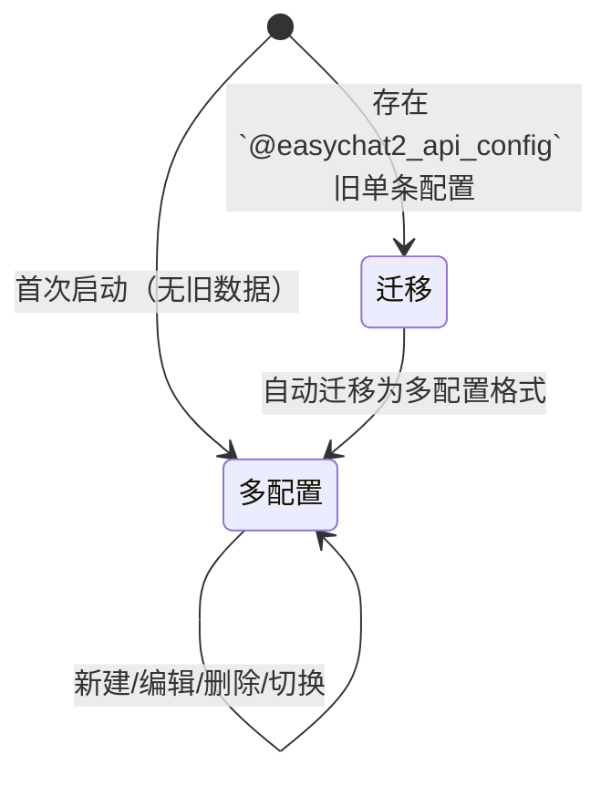

# API 配置

API 配置（API Config）是连接外部大模型服务的凭据与目标信息，决定请求发往何处、使用哪个模型，以及以何种身份鉴权。

## 什么是 API 配置？

每组 API 配置由三部分组成：接口地址、模型与密钥。一个来源可保存多个模型并指定其中一个为当前模型；应用支持多套来源，用户可以创建、切换和管理，当前来源与当前模型在发送请求时被使用。配置保存在设备本机，`api.js` 只读取当前活跃配置与当前模型。

**关键特征**:
- 多套配置保存在 `AsyncStorage` 的 `@easychat2_api_configs` 键（对象 `{ configs, activeId }`）
- 旧版单条配置 `@easychat2_api_config` 在首次读取时自动迁移为多配置格式
- 旧版 `model` 字段自动迁移为 `models: [model]` 与 `activeModel: model`
- 每个来源带能力标记：是否支持思考、是否支持识图
- 支持思考的来源可声明思考参数名与格式，聊天页的思考开关据此注入请求参数
- 未填写密钥时，发送消息会直接抛出提示，不发起网络请求
- 地址支持根地址、`/v1` 结尾与完整 `/v1/chat/completions` 三种写法
- 使用 `http://` 明文地址保存前会弹出安全确认；保存前还会确认模型能力

## 代码位置

| 方面 | 位置 |
|------|------|
| 类型/默认值 | `src/storage.js` 的 `DEFAULT_API_CONFIG` |
| 读写 | `src/storage.js` 的 `getApiConfigs` / `saveApiConfigs` / `getActiveApiConfig` / `getActiveModel` |
| 消费方 | `src/api.js` 的 `sendChatMessage`（通过 `getActiveApiConfig` 与 `getActiveModel`） |
| 界面 | `src/SettingsScreen.js`（模型列表与能力确认）、`src/ChatScreen.js`（模型切换面板） |
| 持久化 | `@easychat2_api_configs` 键（旧键 `@easychat2_api_config` 用于迁移） |

## 结构

```javascript
{
  id: 'cfg-xxxxx',
  name: '默认配置',
  baseUrl: 'https://api.deepseek.com',
  apiKey: '<API_KEY>',
  models: ['deepseek-chat', 'deepseek-reasoner'],
  activeModel: 'deepseek-chat',
  supportsThinking: false,
  supportsVision: false
}
```

### 关键字段

| 字段 | 类型 | 描述 | 约束 |
|------|------|------|------|
| `id` | `string` | 唯一标识 | 创建时自动生成，加载时保证唯一 |
| `name` | `string` | 显示名称 | 保存时去除首尾空白，缺省按序号生成 |
| `baseUrl` | `string` | 接口地址 | 保存时去除首尾空白 |
| `apiKey` | `string` | 密钥 | 保存时去除首尾空白；仅存本机，不得提交到仓库 |
| `models` | `string[]` | 模型列表 | 始终非空；为空时回退默认模型 |
| `activeModel` | `string` | 当前模型 | 必须属于 `models`，否则回退列表首项 |
| `supportsThinking` | `boolean` | 是否支持思考 | 保存前确认，缺省 `false` |
| `supportsVision` | `boolean` | 是否支持识图 | 保存前确认，缺省 `false` |
| `thinking` | `{ field, format }` | 思考参数声明 | `format` 为 `effort` / `boolean` / `object`；缺省 `reasoning_effort` + `effort` |

## 不变量

1. **至少有一套配置**: 存储与读取都保证返回至少一条配置，当所有配置被删除或被清空时自动重建一个默认配置。
2. **密钥非空才能请求**: `sendChatMessage` 在 `config.apiKey` 为空时抛出 `请先在"设置"里填写 API Key。`
3. **配置读取始终完整**: `getActiveApiConfig` 返回的活跃配置必含全部字段，缺字段自动回退默认值。
4. **模型列表非空且当前模型有效**: `models` 为空时回退默认模型；`activeModel` 不在列表中时回退列表首项。
5. **地址会被归一化**: 无论用户填写哪种形式，最终都会得到以 `/chat/completions` 结尾的地址。
6. **明文地址需用户确认**: 匹配 `/^http:\/\//i` 时，保存前必须经过确认弹窗；保存前还会确认思考与识图能力。

## 生命周期



### 状态描述

| 状态 | 描述 | 允许的转换 |
|------|------|-----------|
| 默认配置 | 未存储时使用 DeepSeek 默认地址与模型，密钥为空 | → 多配置 |
| 迁移 | 旧版单条配置存在时自动转为多配置格式 | → 多配置 |
| 多配置 | 用户可管理多组配置，切换当前使用 | → 多配置 |

## 关系

| 关联概念 | 关系 | 描述 |
|---------|------|------|
| [消息会话](./消息会话.md) | 被依赖 | 会话消息的生成依赖有效配置 |
| [角色](./角色.md) | 并列 | 角色决定请求内容，配置决定请求目标 |
