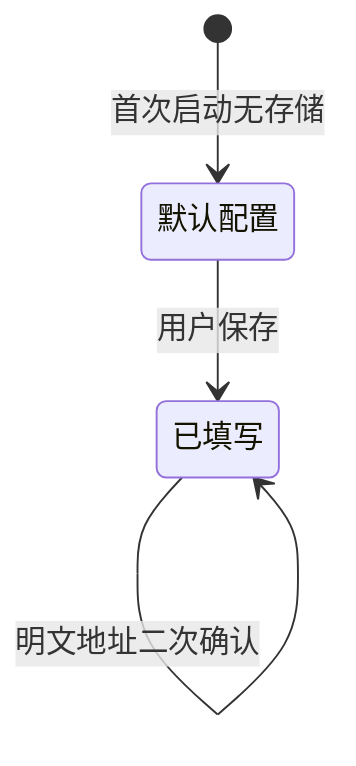

# API 配置

API 配置（API Config）是连接外部大模型服务的凭据与目标信息，决定请求发往何处、使用哪个模型，以及以何种身份鉴权。

## 什么是 API 配置？

API 配置由三部分组成：接口地址、模型名与密钥。应用不内置任何服务端，全部请求由用户在设置页填写的配置驱动。配置保存在设备本机，发送请求时由 `api.js` 读取。

**关键特征**:
- 保存在 `AsyncStorage` 的 `@easychat2_api_config` 键
- 未填写密钥时，发送消息会直接抛出提示，不发起网络请求
- 地址支持根地址、`/v1` 结尾与完整 `/v1/chat/completions` 三种写法
- 使用 `http://` 明文地址保存前会弹出安全确认

## 代码位置

| 方面 | 位置 |
|------|------|
| 类型/默认值 | `src/storage.js` 的 `DEFAULT_API_CONFIG` |
| 读写 | `src/storage.js` 的 `getApiConfig` / `saveApiConfig` |
| 消费方 | `src/api.js` 的 `sendChatMessage` |
| 界面 | `src/SettingsScreen.js` |
| 持久化 | `@easychat2_api_config` 键 |

## 结构

```javascript
{
  baseUrl: 'https://api.deepseek.com',
  model: 'deepseek-chat',
  apiKey: '<API_KEY>'
}
```

### 关键字段

| 字段 | 类型 | 描述 | 约束 |
|------|------|------|------|
| `baseUrl` | `string` | 接口地址 | 保存时去除首尾空白 |
| `model` | `string` | 模型名 | 保存时去除首尾空白，读取时回退 `deepseek-chat` |
| `apiKey` | `string` | 密钥 | 保存时去除首尾空白；仅存本机，不得提交到仓库 |

## 不变量

1. **密钥非空才能请求**: `sendChatMessage` 在 `config.apiKey` 为空时抛出 `请先在“设置”里填写 API Key。`
2. **配置读取始终完整**: `getApiConfig` 将读取结果与默认值合并，缺字段自动回退。
3. **地址会被归一化**: 无论用户填写哪种形式，最终都会得到以 `/chat/completions` 结尾的地址。
4. **明文地址需用户确认**: 匹配 `/^http:\/\//i` 时，保存前必须经过确认弹窗。

## 生命周期



### 状态描述

| 状态 | 描述 | 允许的转换 |
|------|------|-----------|
| 默认配置 | 未存储时使用 DeepSeek 默认地址与模型，密钥为空 | → 已填写 |
| 已填写 | 用户已保存自定义配置 | → 已填写 |

## 关系

| 关联概念 | 关系 | 描述 |
|---------|------|------|
| [消息会话](./消息会话.md) | 被依赖 | 会话消息的生成依赖有效配置 |
| [角色](./角色.md) | 并列 | 角色决定请求内容，配置决定请求目标 |
