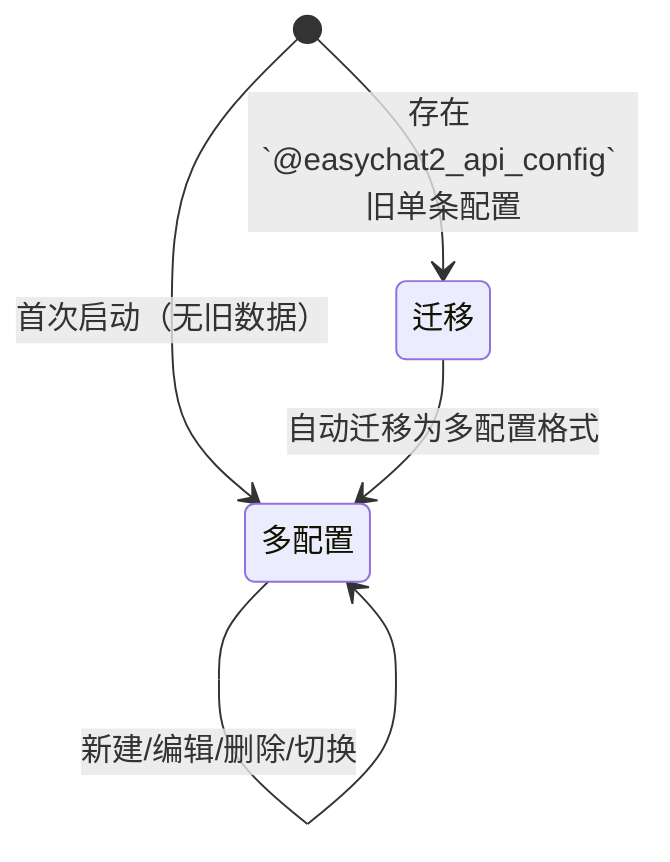

# API 配置

API 配置（API Config）是连接外部大模型服务的凭据与目标信息，决定请求发往何处、使用哪个模型，以及以何种身份鉴权。

## 什么是 API 配置？

每组 API 配置由三部分组成：接口地址、模型与密钥。一个来源可保存多个模型并指定其中一个为当前模型；应用支持多套来源，用户可以创建、切换和管理，当前来源与当前模型在发送请求时被使用。配置保存在设备本机，`api.js` 只读取当前活跃配置与当前模型。

**关键特征**:
- 多套配置保存在 `AsyncStorage` 的 `@easychat2_api_configs` 键（对象 `{ configs, activeId }`）
- 旧版单条配置 `@easychat2_api_config` 在首次读取时自动迁移为多配置格式
- 旧版 `model` 字段自动迁移为 `models: [model]` 与 `activeModel: model`
- **能力按「模型」一份**（`config.modelCapabilities[模型名]`）：是否支持思考/识图/视频/语音识别，同一配置下不同模型各有一套
- 支持思考的模型可声明思考参数（字段名 + 取值格式），聊天页的思考开关据此注入请求参数
- 每个模型带「自定义参数」总开关（`customParams`，默认关闭）：关闭时思考字段名、上下文窗口、输出长度一律按默认值发送；开启后才逐项自定义
- 上下文窗口（`contextWindow`，默认 200000）供工作区面板的上下文占用显示与 80% 自动压缩；输出长度（`maxOutput`，默认 32000）是单次回复的最大生成 tokens
- 未填写密钥时，发送消息会直接抛出提示，不发起网络请求
- 地址支持根地址、`/v1` 结尾与完整 `/v1/chat/completions` 三种写法
- 使用 `http://` 明文地址保存前会弹出安全确认；保存前还会确认模型能力

## 代码位置

| 方面 | 位置 |
|------|------|
| 类型/默认值 | `src/storage.js` 的 `DEFAULT_API_CONFIG` |
| 读写 | `src/storage.js` 的 `getApiConfigs` / `saveApiConfigs` / `getActiveApiConfig` / `getActiveModel` |
| 消费方 | `src/network/api.js` 的 `sendChatMessage`（通过 `getActiveApiConfig` 与 `getActiveModel`） |
| 界面 | `src/SettingsScreen.js`（模型列表与能力确认）、`src/ChatScreen.js`（模型切换面板） |
| 持久化 | `@easychat2_api_configs` 键（旧键 `@easychat2_api_config` 用于迁移） |

## 结构

```javascript
{
  id: 'cfg-xxxxx',
  name: '默认配置',
  baseUrl: 'https://api.deepseek.com',
  apiKey: '<API_KEY>',
  models: ['deepseek-chat', 'deepseek-reasoner'],
  activeModel: 'deepseek-chat',
  supportsThinking: false,
  supportsVision: false
}
```

### 关键字段

| 字段 | 类型 | 描述 | 约束 |
|------|------|------|------|
| `id` | `string` | 唯一标识 | 创建时自动生成，加载时保证唯一 |
| `name` | `string` | 显示名称 | 保存时去除首尾空白，缺省按序号生成 |
| `baseUrl` | `string` | 接口地址 | 保存时去除首尾空白 |
| `apiKey` | `string` | 密钥 | 保存时去除首尾空白；仅存本机，不得提交到仓库 |
| `models` | `string[]` | 模型列表 | 始终非空；为空时回退默认模型 |
| `activeModel` | `string` | 当前模型 | 必须属于 `models`，否则回退列表首项 |
| `fallbackModels` | `string[]` | 降级模型（P0-7）：主模型 429/5xx/超时/断网时按序换用 | 最多 3 个、去重保序；字符串形态在落盘时归一为数组；空数组 = 不降级 |
| `promptCacheTtl` | `string` | Anthropic 提示缓存 TTL（P1-1） | `off` / `5m`（缺省）/ `1h`；只对 anthropic 生效（其它协议是自动前缀缓存），切协议来回切不丢该选择 |
| `supportsThinking` | `boolean` | 是否支持思考 | 保存前确认，缺省 `false` |
| `supportsVision` | `boolean` | 是否支持识图 | 保存前确认，缺省 `false` |
| `thinking` | `{ field, format }` | 思考参数声明（**旧配置级字段，仅迁移来源**） | `format` 为 `effort` / `boolean` / `object`；缺省 `reasoning_effort` + `effort` |
| `modelCapabilities` | `{ [模型名]: 能力条目 }` | 每模型一套能力 | 只保留 `models` 内的模型；无条目 = 未确认 = 全不支持 |
| `…[模型名].customParams` | `boolean` | 自定义参数总开关 | 默认 `false`（新模型）；关闭时下列高级项一律回落默认 |
| `…[模型名].contextWindow` | `number` | 上下文窗口（tokens） | `0` = 未声明（用默认 200000） |
| `…[模型名].maxOutput` | `number` | 单次回复最大输出（tokens） | `0` = 未声明（自定义开启时按默认 32000 发送） |
| `…[模型名].thinkingField` / `.thinkingFormat` | `string` | 思考参数声明 | 面板里用预设列表选择（`reasoning_effort` / `thinking` / `enable_thinking` / `reasoning`），选「自定义」才手输 |

## 不变量

1. **至少有一套配置**: 存储与读取都保证返回至少一条配置，当所有配置被删除或被清空时自动重建一个默认配置。
2. **密钥非空才能请求**: `sendChatMessage` 在 `config.apiKey` 为空时抛出 `请先在"设置"里填写 API Key。`
3. **配置读取始终完整**: `getActiveApiConfig` 返回的活跃配置必含全部字段，缺字段自动回退默认值。
4. **模型列表非空且当前模型有效**: `models` 为空时回退默认模型；`activeModel` 不在列表中时回退列表首项。
5. **地址会被归一化**: 无论用户填写哪种形式，最终都会得到以 `/chat/completions` 结尾的地址。
6. **明文地址需用户确认**: 匹配 `/^http:\/\//i` 时，保存前必须经过确认弹窗；保存前还会确认思考与识图能力。
7. **自定义参数开关决定高级项是否生效**: `customParams !== true` 时，`thinkingField` / `thinkingFormat` / `contextWindow` / `maxOutput` 一律回落默认 —— `capabilitiesForModel` 返回**生效值**（消费点无需各自判断开关），`rawCapabilityForModel` 返回**原始值**（能力面板回填用，关掉开关也记得上次填的）。旧数据里已填过这些高级项的条目在归一化时迁移为 `true`，不会被静默忽略。
8. **降级链只换「这次用哪个模型」**: `fallbackModels` 不参与配置指纹（改降级链不会丢弃在途回复），也不写会话/记忆；流式已产出内容后一律不降级，且换模型必须经 `onModelFallback` 告知宿主（不得静默换模型）。
8. **输出长度只在自定义开启时介入请求**: 关闭时不发 `max_tokens`（保持全局采样/服务端默认），避免给不支持大输出的模型悄悄带上 32000 而报错；开启时留空按 `DEFAULT_MAX_OUTPUT_TOKENS`（32000）发送。

## 生命周期


```mermaid
stateDiagram-v2
    [*] --> 多配置: 首次启动（无旧数据）
    [*] --> 迁移: 存在 `@easychat2_api_config` 旧单条配置
    迁移 --> 多配置: 自动迁移为多配置格式
    多配置 --> 多配置: 新建/编辑/删除/切换
```

### 状态描述

| 状态 | 描述 | 允许的转换 |
|------|------|-----------|
| 默认配置 | 未存储时使用 DeepSeek 默认地址与模型，密钥为空 | → 多配置 |
| 迁移 | 旧版单条配置存在时自动转为多配置格式 | → 多配置 |
| 多配置 | 用户可管理多组配置，切换当前使用 | → 多配置 |

## 关系

| 关联概念 | 关系 | 描述 |
|---------|------|------|
| [消息会话](./消息会话.md) | 被依赖 | 会话消息的生成依赖有效配置 |
| [角色](./角色.md) | 并列 | 角色决定请求内容，配置决定请求目标 |
