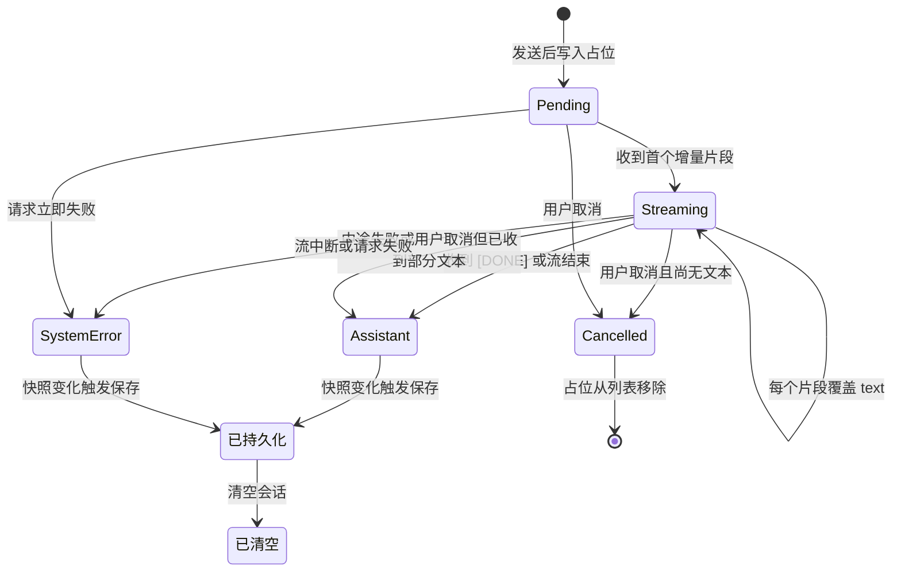
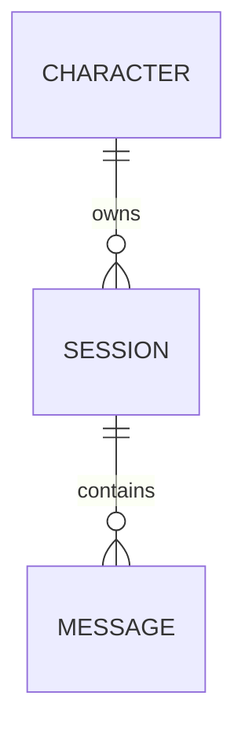

# 消息会话

消息会话（Message Session）是某个角色名下一段按时间排列的消息列表，是聊天界面的核心数据与持久化对象。

## 什么是消息会话？

消息会话代表一个角色的一段对话历史。每条消息有角色（用户、助手或系统报错）与文本内容，助手消息还可能是等待回复中的占位。会话以会话 `id` 为维度隔离，一个角色可拥有多段会话，切换会话即加载对应消息数组。

**关键特征**:
- 会话以会话 `id` 为维度存储，键为 `@easychat2_messages::<sessionId>`
- 会话元数据存于 `@easychat2_sessions`，当前会话指针存于 `@easychat2_active_session`
- 每个会话记录角色 `id`、最后一条可读消息摘要、置顶标记与创建/更新时间
- 仅持久化非 `pending` 消息
- 读取时过滤 `pending` 与非法项
- 系统报错消息只持久化脱敏后的 `detail`
- 助手回复通过 SSE 增量实时渲染，流结束后才落盘

## 会话与消息

一个角色可拥有多段会话。会话元数据（`Session`）保存归属角色、摘要、置顶与时间，消息数组按 `sessionId` 独立存储。切换会话即加载对应消息数组；`startNewSession` 在冷启动时清理无消息会话并新建空会话，`cloneSession` 复制消息并重新生成消息 `id`，`deleteSession` 删除当前会话时新建空会话。排序为置顶优先、其次 `updatedAt` 降序。

## 群聊会话

会话有 `type`（`single` | `group`）。群聊会话的 `members` 为多个角色 `id`，`characterId` 为空，`name` 为群名。群聊消息的助手条目带 `speakerId` 与 `speakerName`，界面据此展示发言者头像与名字；`groupChat` 会为历史助手消息加上 `发言者：` 前缀供模型区分。群聊同样纳入记忆页，支持置顶、克隆与删除，克隆保留 `type` 与 `members`。

## 界面接入

记忆页（`MemoryScreen`）陈列全部摘要非空的会话，支持置顶、克隆与删除；点击会话会切换当前角色与会话并进入聊天页。聊天页按 `activeSessionId` 读写消息，切换角色时通过 `ensureCharacterSession` 进入该角色最近的会话，冷启动由 `App.js` 调用 `migrateLegacyMessages` 迁移旧数据并 `startNewSession` 开启新会话。旧键 `@easychat2_messages::<characterId>` 与 `@easychat2_messages` 只用于迁移读取。

## 代码位置

| 方面 | 位置 |
|------|------|
| 类型/存储 | `src/storage.js` 的 `getSessions` / `saveSessions` / `getMessagesBySession` / `saveMessagesBySession` |
| 会话操作 | `src/storage.js` 的 `startNewSession` / `cloneSession` / `deleteSession` / `migrateLegacyMessages` |
| 会话纯函数 | `src/context/sessionLibrary.js` |
| 界面与状态 | `src/ChatScreen.js`（旧接口过渡中） |
| 消息角色常量 | `ChatScreen.js` 的 `USER_ID` / `ASSISTANT_ID` / `SYSTEM_ERROR_ID` |
| 持久化 | `@easychat2_messages::<sessionId>`（旧数据 `::<characterId>` 仅迁移读取） |

## 结构

```javascript
{
  id: '1723456789012-assistant',
  role: 'assistant',        // 'user' | 'assistant' | 'system-error'
  text: '你好，有什么可以帮你？',
  detail: undefined,        // 仅 system-error 使用，已脱敏
  pending: false            // 占位消息为 true，不落盘
}
```

### 关键字段

| 字段 | 类型 | 描述 | 约束 |
|------|------|------|------|
| `id` | `string` | 消息标识 | 形如 `<时间戳>-user` / `<时间戳>-assistant` |
| `role` | `string` | 消息角色 | `user`、`assistant`、`system-error` 之一 |
| `text` | `string` | 展示文本 | 用户消息与助手回复直接展示；错误消息为概括文案 |
| `detail` | `string` | 错误详情 | 仅 `system-error`，写入前经脱敏 |
| `pending` | `boolean` | 等待占位标记 | 为真时不参与持久化 |

## 不变量

1. **每次发送恰好产生一条用户消息和一条助手占位**: 两者使用同一时间戳前缀。
2. **占位有确定归宿**: 成功后转为助手回复；失败时若已收到部分文本，则保留该文本为助手回复并追加一条 `system-error`，否则占位直接转为 `system-error`。
3. **持久化内容不含明文密钥**: `SaveMessages` 与 `ChatScreen` 均过滤 `pending`，且错误详情已脱敏。
4. **会话与角色一一对应**: 消息列表只在当前 `characterId` 下加载与保存。
5. **主动取消不留报错**: 用户停止生成时保留已收到的部分文本（如有），无文本则移除占位，均不产生 `system-error`。

## 生命周期



### 状态描述

| 状态 | 描述 | 允许的转换 |
|------|------|-----------|
| 等待中 | `pending = true` 的助手占位，显示「正在思考…」 | → 流式接收中、已取消、系统报错 |
| 流式接收中 | `pending` 仍为真，`text` 随增量片段实时覆盖，`onContentSizeChange` 在用户接近底部时自动滚动 | → 助手回复、已取消、系统报错 |
| 助手回复 | 正常回复文本，可能为 Markdown；中途失败或取消时保留已收到的部分文本 | → 已持久化 |
| 系统报错 | `role = system-error`，可展开与复制；中途失败时追加在保留的助手回复之后 | → 已持久化 |
| 已取消 | 用户主动停止且无部分文本，占位被移除，不产生报错 | （终态） |
| 已清空 | 消息数组为空 | （终态，可继续发送新消息） |

## 关系



| 关联概念 | 关系 | 描述 |
|---------|------|------|
| [角色](./角色.md) | 拥有 | 一个角色可拥有多段会话 |
| [角色库](./角色库.md) | 间接关联 | 切换角色即切换其当前会话 |
| [系统报错消息](./系统报错消息.md) | 包含 | 报错是消息的一种特殊角色 |
| [API配置](./API配置.md) | 依赖 | 会话的生成依赖有效配置 |
