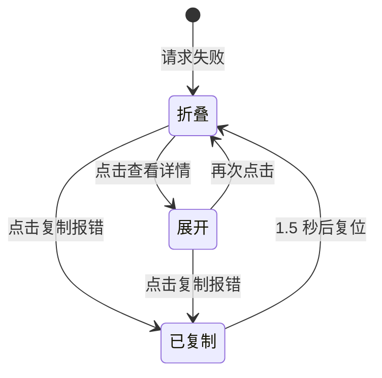

# 系统报错消息

系统报错消息（System Error Message）是请求失败时插入聊天列表的特殊消息，用于在不打断对话的前提下展示可折叠、可复制的诊断信息。

## 什么是系统报错消息？

系统报错消息以 `role = system-error` 出现。失败且尚无任何回复文本时，它替换原本的助手占位；失败但已收到部分流式文本时，占位保留为助手回复，报错消息追加在其后。它对外只显示概括文案与「系统报错」标签，展开后显示脱敏详情，并提供复制按钮。未脱敏的原始错误只保留在会话内存中，用于复制诊断。

**关键特征**:
- 紧凑、与聊天中的助手消息区分
- 原文与展示分离：`detail` 落盘且已脱敏，原文仅存内存 `errorRawRef`
- 复制动作使用未脱敏原文，便于提交问题
- `id` 为该次发送的助手占位 `id` 加后缀 `-error`

## 代码位置

| 方面 | 位置 |
|------|------|
| 展示组件 | `src/ChatScreen.js` 的 `ErrorBubble` |
| 脱敏 | `src/ChatScreen.js` 的 `maskSecrets` 与 `SECRET_PATTERN` |
| 构造原文 | `src/ChatScreen.js` 的 `buildErrorRawText` 与 `getHttpStatus` |
| 原文缓存 | `ChatScreen` 的 `errorRawRef` |
| 持久化字段 | 消息的 `detail` |

## 结构

```javascript
{
  id: '1723456789012-assistant-error',
  role: 'system-error',
  text: '请求失败，点击查看详情',
  detail: '请求失败（HTTP 401）\nHTTP 状态码: 401'
}
```

### 关键字段

| 字段 | 类型 | 描述 | 约束 |
|------|------|------|------|
| `role` | `string` | 固定为 `system-error` | 决定使用 `ErrorBubble` 渲染 |
| `text` | `string` | 折叠时的概括文案 | 不包含敏感信息 |
| `detail` | `string` | 展开时展示的诊断文本 | 写入前经 `maskSecrets` 脱敏 |

## 不变量

1. **落盘内容必已脱敏**: `detail` 在构造时即经过 `maskSecrets`。
2. **原文不落盘**: 未脱敏原文只存入 `errorRawRef.current[id]`，不进入消息对象。
3. **复制优先使用原文**: `onCopy` 依次取 `rawError`、`detail`、`text`。
4. **切换角色清理缓存**: `characterId` 变化时清空 `errorRawRef`。
5. **迟到错误不串会话**: 仅当发起时的 `characterId` 仍是当前角色时才写入。

## 生命周期



### 状态描述

| 状态 | 描述 | 允许的转换 |
|------|------|-----------|
| 折叠 | 显示标签与概括文案 | → 展开、已复制 |
| 展开 | 显示脱敏详情 | → 折叠、已复制 |
| 已复制 | 复制按钮显示「已复制」 | → 折叠（延时复位） |

## 关系

| 关联概念 | 关系 | 描述 |
|---------|------|------|
| [消息会话](./消息会话.md) | 属于 | 报错是会话中的一种消息角色 |
| [API配置](./API配置.md) | 由之触发 | 配置错误或调用失败会产生报错 |
