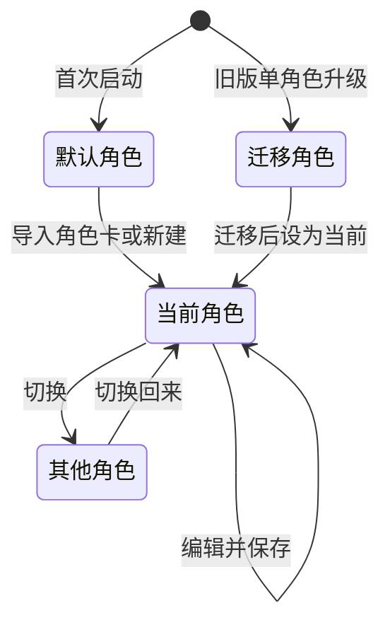
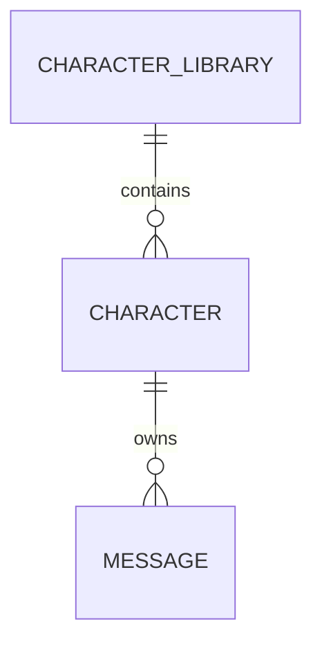

# 角色

角色（Character）是一套「人格」设定，决定发送给模型的名字与系统提示词，同时作为聊天记录的隔离维度。所有角色共同保存在[角色库](./角色库.md)中，应用持有唯一一个「当前角色」。

## 什么是角色？

角色代表一个可与用户对话的 AI 人格。每个角色包含名称、人设与可选的角色卡扩展字段，聊天时组合为 `system` 消息发送给模型。每个角色拥有独立的聊天记录，切换当前角色即切换会话。

**关键特征**:
- 单机持久化，作为数组元素保存在 `AsyncStorage` 的 `@easychat2_characters` 键
- 在当前角色库中拥有唯一 `id`
- 当前角色由 `@easychat2_active_character` 指定，同一时刻只有一个
- 由 `AppContext` 统一管理，编辑或切换后聊天页立即生效
- 角色 `id` 决定消息存储键，新角色等于开启新会话
- `lastUsedAt` 记录最近一次成为当前角色的时间，决定列表排序

## 代码位置

| 方面 | 位置 |
|------|------|
| 类型/默认值 | `src/storage.js` 的 `DEFAULT_CHARACTER` |
| 角色库读写 | `src/storage.js` 的 `getCharacterLibrary` / `upsertCharacter` / `deleteCharacter` |
| 状态管理 | `src/context/AppContext.js` |
| 状态迁移纯函数 | `src/context/characterLibrary.js` |
| 编辑与列表界面 | `src/CharacterScreen.js` |
| 消费方 | `src/ChatScreen.js` 的 `onSend` 与顶部切换入口 |
| 持久化 | `@easychat2_characters`、`@easychat2_active_character` |

## 结构

```javascript
{
  id: 'default',
  name: 'EasyChat2 助手',
  systemPrompt: '你是 EasyChat2 的智能助手，回答简洁清晰。',
  systemPromptComposed: '',
  description: '',
  personality: '',
  scenario: '',
  firstMes: '',
  mesExample: '',
  creatorNotes: '',
  postHistoryInstructions: '',
  tags: [],
  worldInfo: [],
  regexScripts: [],
  lastUsedAt: 0
}
```

### 关键字段

| 字段 | 类型 | 描述 | 约束 |
|------|------|------|------|
| `id` | `string` | 角色标识 | 默认角色为 `default`；导入卡为 `card-<base36 时间戳>`；库内唯一 |
| `name` | `string` | 角色名 | 保存时为空则回退为 `EasyChat2 助手` |
| `systemPrompt` | `string` | 人设 / 系统提示词的原始文本 | 保存时为空则回退为默认提示词；界面输入框绑定此字段 |
| `systemPromptComposed` | `string` | 由核心字段合成的最终系统提示词 | 保存/导入时用 `buildSystemPrompt` 生成；聊天优先使用，为空则回退 `systemPrompt` |
| `description` / `personality` / `scenario` / `firstMes` / `mesExample` / `creatorNotes` / `postHistoryInstructions` | `string` | 角色资料；前 5 项参与 `systemPromptComposed` 合成或开场注入，其余用于展示 | 缺失为空串 |
| `tags` | `string[]` | 角色卡标签 | 缺失为 `[]` |
| `worldInfo` | `WorldInfoEntry[]` | 随角色保存的世界书 | 缺失为 `[]`，发送时按键激活并注入提示词 |
| `regexScripts` | `RegexScript[]` | 随角色保存的正则脚本 | 缺失为 `[]`，发送与展示时按作用范围应用 |
| `lastUsedAt` | `number` | 最近一次成为当前角色的时间戳（毫秒） | 缺失为 `0` |

## 不变量

1. **角色必然有 `id`**: 读取角色时补全缺失的 `id`，默认为 `default`。
2. **默认角色使用固定 `id`**: 便于读取旧版 `@easychat2_messages` 数据，且不可删除。
3. **聊天页的系统提示词必非空**: 发送时优先取 `systemPromptComposed`，再取 `systemPrompt`，均为空则回退默认文案。
4. **合成提示词在保存/导入时刷新**: 编辑 `description`/`personality`/`scenario` 后保存即写入 `systemPromptComposed`，从而对模型生效。
5. **开场白仅首次注入**: 某角色会话为空且 `firstMes` 非空时，以固定 `id` 的助手消息插入一次，随后落盘。
6. **更新前必须加载完成**: `updateCharacter` 在 `loadedRef` 为假时抛出异常。
7. **角色库常含默认角色**: 读取后角色库必然包含 `default`，当前角色在其内解析。

## 生命周期



### 状态描述

| 状态 | 描述 | 允许的转换 |
|------|------|-----------|
| 默认角色 | `id = default`，内置名称与人设 | → 当前角色 |
| 迁移角色 | 由旧版单角色键迁移进库，`id` 保持不变 | → 当前角色 |
| 当前角色 | 由 `@easychat2_active_character` 指定的角色 | → 编辑、切换 |
| 其他角色 | 库中存在但非当前的角色 | → 当前角色 |

## 关系



| 关联概念 | 关系 | 描述 |
|---------|------|------|
| [角色库](./角色库.md) | 属于 | 角色作为集合元素保存在角色库中 |
| [消息会话](./消息会话.md) | 拥有 | 一个角色拥有一组独立消息，存储键以角色 `id` 区分 |
| [角色卡](./角色卡.md) | 可由之创建 | 导入角色卡会向角色库新增一个带新 `id` 的角色 |
| [世界书](./世界书.md) | 拥有 | 角色携带世界书，发送时按键注入 |
| [正则脚本](./正则脚本.md) | 拥有 | 角色携带正则脚本，发送与展示时应用 |
| [API配置](./API配置.md) | 无直接关系 | 角色只影响请求内容，不影响接口地址与密钥 |