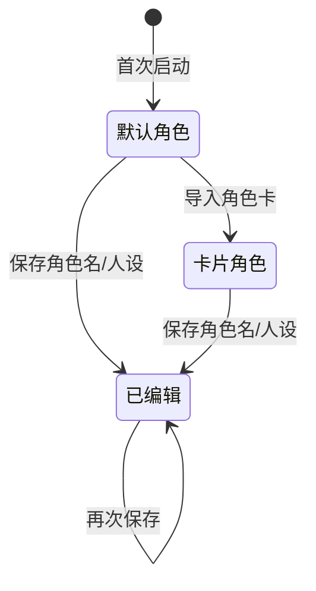
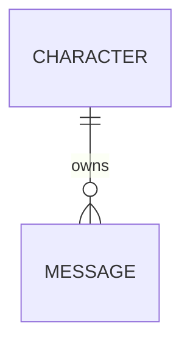

# 角色

角色（Character）是当前对话的「人格」设定，决定发送给模型的名字与系统提示词，同时作为聊天记录的隔离维度。

## 什么是角色？

角色代表正在与用户对话的 AI 人格。每个角色包含一个名称与一段人设（系统提示词），聊天时两者会被组合为 `system` 消息发送给模型。角色拥有独立的聊天记录，切换角色即切换会话。

**关键特征**:
- 单机持久化，保存在 `AsyncStorage` 的 `@easychat2_character` 键
- 全局唯一，同一时刻应用只持有一个「当前角色」
- 由 `AppContext` 统一管理，编辑后聊天页立即生效
- 角色 `id` 决定消息存储键，创建新角色等于开启新会话

## 代码位置

| 方面 | 位置 |
|------|------|
| 类型/默认值 | `src/storage.js` 的 `DEFAULT_CHARACTER` |
| 状态管理 | `src/context/AppContext.js` |
| 编辑界面 | `src/CharacterScreen.js` |
| 消费方 | `src/ChatScreen.js` 的 `onSend` |
| 持久化 | `@easychat2_character` 键 |

## 结构

```javascript
{
  id: 'default',
  name: 'EasyChat2 助手',
  systemPrompt: '你是 EasyChat2 的智能助手，回答简洁清晰。'
}
```

### 关键字段

| 字段 | 类型 | 描述 | 约束 |
|------|------|------|------|
| `id` | `string` | 角色标识 | 默认角色为 `default`；导入卡为 `card-<base36 时间戳>`；编辑时保留原值 |
| `name` | `string` | 角色名 | 保存时为空则回退为 `EasyChat2 助手` |
| `systemPrompt` | `string` | 人设/系统提示词 | 保存时为空则回退为默认提示词 |

## 不变量

1. **角色必然有 `id`**: `getCharacter` 会补全缺失的 `id`，默认为 `default`。
2. **默认角色使用固定 `id`**: 以便读取旧版 `@easychat2_messages` 数据。
3. **聊天页的系统提示词必非空**: 发送时若 `systemPrompt` 为空会回退默认文案。
4. **更新前必须加载完成**: `updateCharacter` 在 `loadedRef` 为假时抛出异常。

## 生命周期



### 状态描述

| 状态 | 描述 | 允许的转换 |
|------|------|-----------|
| 默认角色 | `id = default`，内置名称与人设 | → 已编辑、卡片角色 |
| 卡片角色 | 由角色卡导入，`id = card-...` | → 已编辑 |
| 已编辑 | 用户修改过名称或人设，`id` 不变 | → 已编辑 |

## 关系



| 关联概念 | 关系 | 描述 |
|---------|------|------|
| [消息会话](./消息会话.md) | 拥有 | 一个角色拥有一组独立消息，存储键以角色 `id` 区分 |
| [角色卡](./角色卡.md) | 可由之创建 | 导入角色卡会生成一个带新 `id` 的角色 |
| [API配置](./API配置.md) | 无直接关系 | 角色只影响请求内容，不影响接口地址与密钥 |
