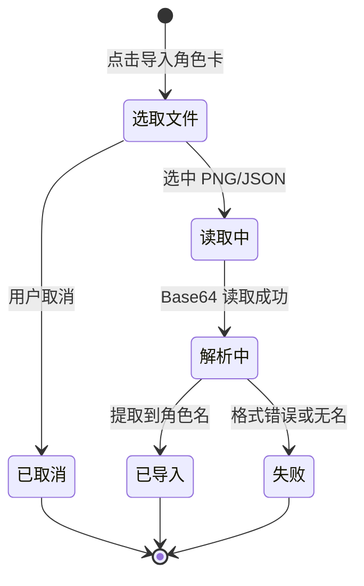

# 角色卡

角色卡（Character Card）是 SillyTavern 生态中使用的一种角色描述文件，包含角色名与人设描述。EasyChat2 支持导入 PNG 或 JSON 格式的角色卡，快速创建带人设的角色。

## 什么是角色卡？

角色卡是社区通行的人物设定交换格式：PNG 格式将 JSON 数据嵌入图片的元数据块，JSON 格式则直接暴露结构化字段。应用使用 `parsecard` 库解析两种格式，并只提取角色名与人设描述两项，映射为应用内的角色。

**关键特征**:
- 支持 `image/png` 与 `application/json` 两种类型
- PNG 通过文件头魔数识别，JSON 通过扩展名与 MIME 识别
- 只提取名称与描述，开场白、示例对话等字段被忽略
- 导入会生成新角色 `id`，从而开启一条独立会话

## 代码位置

| 方面 | 位置 |
|------|------|
| 解析与映射 | `src/CharacterScreen.js` 的 `parsePngCard` / `parseJsonCard` / `extractCardFields` |
| 文件选取 | `src/CharacterScreen.js` 的 `importCard` |
| 第三方解析 | `parsecard` 的 `CharacterCard` |
| Buffer 兼容 | `src/polyfills.js` 与 `src/CharacterScreen.js` |

## 结构

角色卡字段到应用角色的映射：

| 角色卡字段 | 应用字段 | 说明 |
|-----------|---------|------|
| `card.name` / `card.data.name` | `name` | 缺失则视为解析失败 |
| `card.description` / `card.data.description` | `systemPrompt` | 缺失时写入空串，不再沿用旧人设 |

生成的角色的 `id` 为 `card-<Date.now().toString(36)>`。

## 不变量

1. **名称必填**: 解析结果无 `name` 时提示「角色卡解析失败，请确认文件格式是否正确」。
2. **导入不复用旧人设**: `description` 缺失时 `systemPrompt` 为空串，避免继承上一个角色。
3. **导入期间按钮锁定**: `importing` 为真时禁用按钮并显示「导入中...」。
4. **文件读取失败与解析失败区分**: 前者提示「文件读取错误，请重试」，后者提示解析失败。

## 生命周期

### 状态描述

| 状态 | 描述 | 允许的转换 |
|------|------|-----------|
| 选取文件 | 调起系统文件选择器 | → 已取消、读取中 |
| 读取中 | 通过 `expo-file-system` 读为 Base64 并转 Buffer | → 解析中、失败 |
| 解析中 | 按格式调用 `parsePngCard` 或 `parseJsonCard` | → 已导入、失败 |
| 已导入 | 生成新角色并写入存储 | （终态） |
| 失败 | 弹出对应错误提示 | （终态） |

## 关系

| 关联概念 | 关系 | 描述 |
|---------|------|------|
| [角色](./角色.md) | 创建 | 导入角色卡生成一个新角色 |
| [消息会话](./消息会话.md) | 间接拥有 | 新角色 `id` 带来独立会话 |
