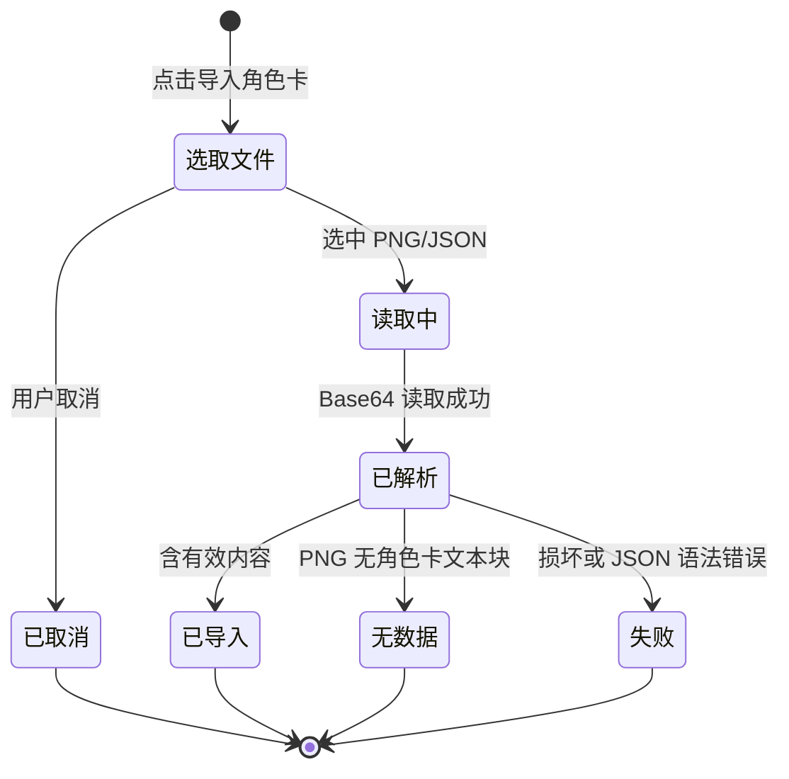

# 角色卡

角色卡（Character Card）是通行的人物设定交换文件，包含角色名、人设、开场白、世界书与正则脚本等数据。EasyChat2 支持导入 PNG 或 JSON 格式的角色卡快速创建角色，也支持把角色导出为标准 V2 卡用于备份或分享。

## 什么是角色卡？

PNG 格式把 JSON 以 base64 编码写入图片的文本元数据块，JSON 格式直接暴露结构化字段。应用在 `src/cardParser.js` 中自行完成字段提取与标准化，覆盖两类结构的差异：

- **标准结构（V2/V3）**：标准字段位于 `data` 包装内，世界书位于 `data.character_book.entries`，正则位于 `data.extensions.regex_scripts`
- **扁平结构**：标准字段位于顶层，世界书位于顶层 `worldInfo`，正则位于顶层 `regexScripts`

PNG 文本块优先交给 `parsecard` 的 `readJsonFromPNG` 读取；若其返回空（例如 `iTXt` 块），再用本地的无压缩 `iTXt` 兜底读取。`zTXt` 与压缩 `iTXt` 需要 zlib，RN 环境不支持，直接跳过。

**关键特征**:
- 支持 `image/png` 与 `application/json`；PNG 以文件头魔数识别，JSON 以扩展名与 MIME 识别
- 提取名称、描述、性格、场景、开场白、对话示例、作者注释、系统提示词、历史后指令与标签
- 提取世界书与正则脚本并补充默认值，避免渲染报错
- 导入生成新角色 `id`，该角色可拥有多段会话
- 角色正文超过 512 KiB 时写入应用文件目录，AsyncStorage 仅保存描述符，避免 Android 单值与数据库容量限制
- 落库失败时保留开场白选择窗口与草稿，可修正存储空间后重试
- 支持导出 `chara_card_v2` 卡（同时写入 V2 `data` 与 V1 平铺字段），PNG 与 JSON 两种格式

## 代码位置

| 方面 | 位置 |
|------|------|
| 解析与标准化 | `src/cardParser.js` |
| 文件选取与落库 | `src/CharacterScreen.js` 的 `importCard` / `confirmImport`；大角色正文由 `src/storage.js` 写入 `characters/` 文件 |
| 导出构造与编码 | `src/cardExporter.js`（`buildCardV2` / `cardToJson` / `cardToPng` / `exportCardFile`） |
| 导出入口与分享 | `src/CharacterScreen.js` 的 `onExport` / `runExport`（`expo-sharing`） |
| PNG 主读取 | `parsecard` 的 `readJsonFromPNG` |
| PNG iTXt 兜底 | `src/cardParser.js` 的 `readFallbackJsonFromPng` |
| 提示词组装 | `src/cardParser.js` 的 `buildSystemPrompt` |
| Buffer 兼容 | `src/polyfills.js` 与 `src/cardParser.js` |

## 结构与默认值

角色卡标准字段到应用角色的映射：

| 角色卡字段（含别名） | 应用字段 | 缺失默认值 |
|----------------------|---------|-----------|
| `name` / `data.name` | `name` | 无内容时无法导入 |
| `description` | `description` | 空串 |
| `personality` | `personality` | 空串 |
| `scenario` | `scenario` | 空串 |
| `first_mes` / `firstMes` | `firstMes` | 空串 |
| `mes_example` / `example_dialogue` | `mesExample` | 空串 |
| `creator_notes` / `creator_comment` | `creatorNotes` | 空串 |
| `system_prompt` | `systemPrompt`（经 `buildSystemPrompt` 组装） | 空串 |
| `post_history_instructions` | `postHistoryInstructions` | 空串 |
| `tags` / `data.tags` | `tags` | `[]` |
| `worldInfo` / `character_book` | `worldInfo` | `[]` |
| `regexScripts` / `extensions.regex_scripts` | `regexScripts` | `[]` |

世界书与正则条目在 `src/cardParser.js` 中逐字段补默认值，例如正则 `placement` 缺省为 `[1, 2]`、`flags` 缺省为 `g`，世界书 `constant` 缺省为 `false`、`order` 缺省为 `100`、`depth` 缺省为 `4`。

`systemPrompt` 由描述、性格、场景、系统提示、历史后指令五段按存在的部分拼接，每段带 `[标签]` 前缀。

生成的角色的 `id` 为 `card-<Date.now().toString(36)>`。

## 导出

角色页「导出角色卡」入口提供 PNG 与 JSON 两种格式。`buildCardV2` 反向构造 `chara_card_v2`（`spec_version: 2.0`），把字段同时写入 `data` 与 V1 平铺键，世界书写入 `data.character_book.entries`、正则写入 `data.extensions.regex_scripts`。

PNG 导出在 `IHDR` 之后、`IDAT` 之前插入关键字为 `chara` 的 `tEXt` 块，值为卡 JSON 的 base64。角色有头像时直接复用头像 PNG 字节，没有头像或头像不可读时用 `createPlaceholderPng` 生成占位 PNG；RN 环境无 zlib，占位 PNG 使用 deflate stored 块并自实现 CRC32 与 Adler32。导出文件写入缓存目录后经 `expo-sharing` 调起系统分享，分享不可用时提示文件路径。未保存的编辑不会进入导出内容。

## 不变量

1. **PNG 无数据与格式错误区分处理**: PNG 未找到 `chara`/`ccv3` 文本块时提示「该图片不包含角色卡数据，请上传角色卡 JSON 文件或含数据的 PNG 图片。」；文件损坏、base64 解码失败、JSON 语法错误才提示「角色卡解析失败」并附带脱敏后的错误详情。
2. **空值兜底**: 世界书与正则条目字段经标准化补默认值后才写入角色，界面渲染不依赖原始字段是否存在。
3. **无内容拒绝**: 名称、人设、世界书、正则、开场白等全部为空时不导入。
4. **导入覆盖旧扩展数据**: 每次导入都用新解析出的 `worldInfo`/`regexScripts` 覆盖旧值（无则为空数组）。
5. **导入期间按钮锁定**: `importing` 为真时禁用按钮并显示「导入中...」。
6. **文件读取失败与解析失败区分**: 前者提示「文件读取错误，请重试」，后者提示解析失败详情。
7. **错误详情脱敏**: 解析错误经 `maskSecrets` 处理后才展示与记录，避免密钥外泄。
8. **导入失败可重试**: 解析成功但落库失败时保留开场白弹窗与编辑结果；角色库恢复阻断或存储空间不足时明确提示。

## 生命周期

### 状态描述

| 状态 | 描述 | 允许的转换 |
|------|------|-----------|
| 选取文件 | 调起系统文件选择器 | → 已取消、读取中 |
| 读取中 | 通过 `expo-file-system` 读为 Base64 并转 Buffer | → 已解析、失败 |
| 已解析 | `parseCardFromPng` / `parseCardFromJson` 标准化 | → 已导入、无数据、失败 |
| 已导入 | 生成新角色并写入存储 | （终态） |
| 无数据 | 弹出 PNG 无数据提示 | （终态） |
| 失败 | 弹出解析失败详情 | （终态） |

## 关系

| 关联概念 | 关系 | 描述 |
|---------|------|------|
| [角色](./角色.md) | 创建 | 导入角色卡生成一个新角色 |
| [世界书](./世界书.md) | 携带 | 角色卡可内嵌世界书条目 |
| [正则脚本](./正则脚本.md) | 携带 | 角色卡可内嵌正则脚本 |
| [消息会话](./消息会话.md) | 间接拥有 | 新角色 `id` 带来独立会话 |
