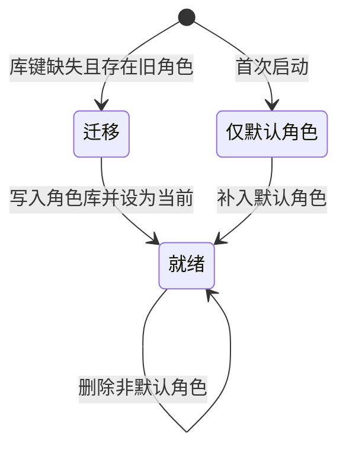
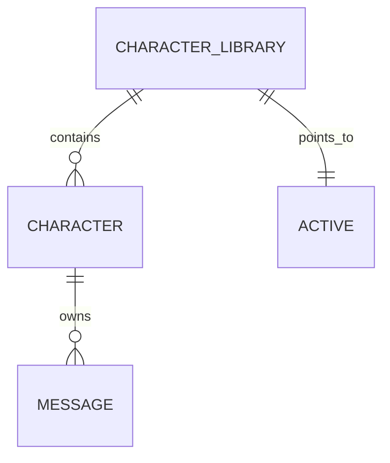

# 角色库

角色库（Character Library）是应用持久化的全部角色集合。应用在角色库中持有唯一一个「当前角色」，聊天页与角色页都基于角色库切换会话。

## 什么是角色库？

角色库把早期的「单角色」模型升级为可陈列、可切换的集合。每个角色拥有独立 `id` 与独立消息会话；应用另存一个当前角色 `id`，用于解析正在对话的角色。切换当前角色即切换聊天会话。

**关键特征**:
- 以数组形式保存在 `AsyncStorage` 的 `@easychat2_characters` 键
- 当前角色 `id` 保存在 `@easychat2_active_character` 键
- 角色库在读取后必然包含 `id = default` 的默认角色
- 列表按最近使用时间（`lastUsedAt`）降序排列，并列时按 `id` 升序
- 旧版单角色键 `@easychat2_character` 仅用于一次性迁移

## 代码位置

| 方面 | 位置 |
|------|------|
| 类型/读写 | `src/storage.js` 的 `getCharacterLibrary` / `saveCharacterLibrary` / `upsertCharacter` / `deleteCharacter` |
| 状态与切换 | `src/context/AppContext.js` |
| 状态迁移纯函数 | `src/context/characterLibrary.js` |
| 角色页陈列 | `src/CharacterScreen.js` |
| 聊天页切换入口 | `src/ChatScreen.js` |
| 持久化 | `@easychat2_characters`、`@easychat2_active_character` |

## 结构

```javascript
// Character[]
[
  { id: 'default', name: 'EasyChat2 助手', lastUsedAt: 0, /* ...其余角色字段 */ },
  { id: 'card-abc123', name: '导入角色', lastUsedAt: 1723456789012, /* ... */ }
]
```

## 不变量

1. **默认角色常存**: 读取后的角色库必然包含 `id = default` 的角色。
2. **当前角色可解析**: 当前角色 `id` 不在库中时回退默认角色，并修正持久化的当前 `id`。
3. **消息与角色关联**: 删除角色时由用户选择仅保留角色，或一并清理关联单聊、群聊、消息、摘要与动态；默认角色不进入删除集合。
4. **库键缺失才迁移**: 迁移仅在 `@easychat2_characters` 缺失时读取旧键，旧键数据保留。
5. **损坏回退**: 角色库解析失败时回退为仅含默认角色的库。
6. **排序确定**: `lastUsedAt` 降序、并列按 `id` 升序。

## 生命周期



## 关系



| 关联概念 | 关系 | 描述 |
|---------|------|------|
| [角色](./角色.md) | 包含 | 角色库由多个角色组成 |
| [消息会话](./消息会话.md) | 间接拥有 | 每个角色拥有独立会话 |
| [角色卡](./角色卡.md) | 来源 | 导入角色卡会向角色库新增角色 |