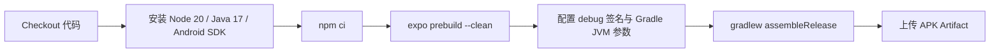

# 构建与配置

构建与配置模块负责应用的打包、原生工程生成、运行时兼容垫片与 CI 流水线。

## 结构

```
easychat2/
├── app.json                  # Expo 应用元数据与 Android 配置
├── assets/                   # icon.png / adaptive-icon.png / splash.png（1024×1024，深底 #1a1a2e + 主色 #6c63ff 聊天气泡）
├── eas.json                  # EAS Build profile
├── metro.config.js           # Metro 打包配置
├── babel.config.js           # Babel 预设
├── package.json              # 依赖与 npm 脚本
├── .npmrc                    # npm 配置
├── src/polyfills.js          # 运行时 Buffer 垫片
└── .github/workflows/
    ├── build-apk-github.yml  # 无需 EAS 的 release APK 构建
    ├── build-apk.yml         # EAS 云构建
    └── eas-build-debug.yml   # EAS 构建日志诊断
```

## 关键文件

| 文件 | 目的 |
|------|------|
| `app.json` | 声明应用名、包名 `com.pppxxxy.easychat2`、暗色主题、Android 读媒体权限、EAS projectId，并通过 `withAsyncStorageDbSize` 将 Android AsyncStorage 数据库上限设为 1024 MiB；`icon` / `splash` / `android.adaptiveIcon` 指向 `assets/` 下的 1024×1024 资源，自适应图标前景主体位于中央 66% 安全区、背景色 `#1a1a2e` |
| `metro.config.js` | 开启 `unstable_enablePackageExports`，解析 `parsecard` 的 ESM `exports` |
| `babel.config.js` | 使用 `babel-preset-expo` |
| `src/polyfills.js` | 在无 `global.Buffer` 时注入 `buffer` 的 `Buffer`，供 `parsecard` 使用 |
| `.github/workflows/build-apk-github.yml` | 在 GitHub runner 上 prebuild + Gradle 打 release APK |
| `.github/workflows/build-apk.yml` | 通过 EAS 云构建，需要 `EXPO_TOKEN` |
| `.github/workflows/eas-build-debug.yml` | 拉取指定 EAS 构建日志并抽取错误上下文 |

## 依赖

**本模块依赖**:
- `expo`、`expo/metro-config`
- `buffer` - 运行时垫片来源
- GitHub Actions、EAS

**原生模块**:
- `react-native-webview@13.6.4` - 扩展页运行内嵌 HTML 小游戏；SDK 50 兼容版本，由 `expo install` 选定；升级或改动后须重新验证 Metro 打包，必要时走 `expo prebuild`
- `expo-sqlite@~13.4.0` - Android 读取旧 AsyncStorage 超大 SQLite 行的只读恢复依赖；需随原生构建重新 prebuild
- `expo-speech@~11.7.0`、`expo-av@~13.10.6` - 语音播报；二者在被 `require` 时**同步调用** `requireNativeModule('ExpoSpeech' / 'ExponentAV')`，因此**禁止在模块顶层 require**，必须延迟到首次实际播报时加载（见 `src/tts/index.js` 的 `getSpeechModule` / `getAudioModule`），否则启动阶段会因原生模块初始化失败而白屏闪退

**依赖本模块的**:
- 整个应用：垫片必须在 `App.js` 首行加载，否则 `parsecard` 解析会失败

## 规范

### 运行时垫片顺序

`src/polyfills.js` 必须是 `App.js` 的第一个导入：

```javascript
import './src/polyfills';
import 'react-native-gesture-handler';
```

垫片通过 `if (typeof global.Buffer === 'undefined')` 判断，避免覆盖已存在的实现。

### Metro 配置

```javascript
config.resolver.unstable_enablePackageExports = true;
config.resolver.unstable_conditionNames = ['require', 'import', 'react-native', 'browser', 'default'];
```

> 该开关对所有依赖全局生效。升级或新增依赖后需重新验证打包结果。

### npm 脚本

```bash
npm run start        # 启动 Expo 开发服务器
npm run android      # 在 Android 打开
npm run web          # Web 目标
npm run build:apk    # EAS 预览 APK
npm run prebuild     # expo prebuild --clean
```

## 构建流程



## 修改构建配置

1. 更改应用包名或版本：编辑 `app.json`
2. 更改构建类型：编辑 `eas.json` 的 `preview` profile
3. 新增原生依赖：确认是否需要 `expo prebuild`，并在 CI 中保留该步骤

**检查清单**:
- [ ] 垫片仍为 `App.js` 首个导入
- [ ] `metro.config.js` 的 exports 开关未被移除
- [ ] lockfile 与 `package.json` 同步
- [ ] 新增原生依赖后重新执行 `expo prebuild --clean`，确认 AsyncStorage 容量属性生效
- [ ] 未在配置中硬编码任何密钥
