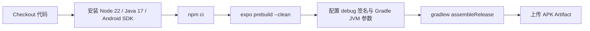

# 构建与配置

构建与配置模块负责应用的打包、原生工程生成、运行时兼容垫片与 CI 流水线。

## 结构

```
easychat2/
├── app.json                  # Expo 应用元数据与 Android 配置（newArchEnabled: true）
├── assets/                   # icon.png / adaptive-icon.png / splash.png（1024×1024，蓝色 #118afd 底 + 默认助手角色）；
│                             # easychat-assistant-avatar.jpg / -bg.jpg 为默认角色内置头像与背景，启动时落盘到 avatars/
├── eas.json                  # EAS Build profile
├── metro.config.js           # Metro 打包配置
├── babel.config.js           # Babel 预设
├── package.json              # 依赖与 npm 脚本
├── .npmrc                    # npm 配置
├── plugins/                  # Expo config plugin（Kotlin 原生模块注入）
│   ├── withProactiveMessage.js   # 主动消息（加密存储 + 闹钟 + 通知跳转）
│   ├── withLocalApiServer.js     # 本地 OpenAI 兼容服务（nanohttpd + Bearer 鉴权）
│   ├── withAsyncStorageDbSize.js # AsyncStorage 数据库体积上限
│   ├── proactiveMessage/         # 上述插件的 Kotlin 源码与模板
│   └── localApiServer/
├── src/polyfills.js          # 运行时 Buffer 垫片
└── .github/workflows/
    ├── build-apk-github.yml  # 无需 EAS 的 release APK 构建
    ├── build-apk.yml         # EAS 云构建
    ├── unit-tests.yml        # 单测门禁
    └── eas-build-debug.yml   # EAS 构建日志诊断
```

## 关键文件

| 文件 | 目的 |
|------|------|
| `app.json` | 声明应用名、包名 `com.pppxxxy.easychat2`、暗色主题、Android 权限与 `expo-image-picker` 图片用途文案、EAS projectId、`newArchEnabled: true`，并通过 `withAsyncStorageDbSize` 将 Android AsyncStorage 数据库上限设为 1024 MiB；插件链含 `withProactiveMessage`（主动消息原生模块）、`withLocalApiServer`（本地 API 服务）、`expo-secure-store`、`expo-build-properties`（ABI 收窄）、`llama.rn`、`expo-audio`（录音权限）；`icon` / `splash` / `android.adaptiveIcon` 指向 `assets/` 下的 1024×1024 资源，自适应图标前景为全出血蓝底图、背景色 `#118afd` 与图标一致 |
| `metro.config.js` | 开启 `unstable_enablePackageExports`，解析 `parsecard` 的 ESM `exports` |
| `babel.config.js` | 使用 `babel-preset-expo` |
| `src/polyfills.js` | 在无 `global.Buffer` 时注入 `buffer` 的 `Buffer`，供 `parsecard` 与 PNG 编码（`imageGen/png.js`）使用 |
| `.github/workflows/build-apk-github.yml` | 在 GitHub runner 上 prebuild + Gradle 打 release APK（含 Kotlin 原生模块编译验证） |
| `.github/workflows/build-apk.yml` | 通过 EAS 云构建，需要 `EXPO_TOKEN` |
| `.github/workflows/unit-tests.yml` | 单测门禁（`npm test`） |
| `.github/workflows/eas-build-debug.yml` | 拉取指定 EAS 构建日志并抽取错误上下文 |

## 依赖

**本模块依赖**:
- `expo`、`expo/metro-config`
- `buffer` - 运行时垫片来源
- GitHub Actions、EAS

**原生模块**:
- `react-native-webview@13.15.0` - 扩展页运行内嵌 HTML 小游戏与富 HTML 消息；升级或改动后须重新验证 Metro 打包，必要时走 `expo prebuild`
- `expo-image-picker@~17.0.11`、`expo-image-manipulator@~14.0.8` - 系统图片选择与表情包缩放；升级后需重新验证权限、prebuild 与 Metro 打包
- `expo-sqlite@~16.0.10` - Android 读取旧 AsyncStorage 超大 SQLite 行的只读恢复依赖；需随原生构建重新 prebuild
- `expo-secure-store@~15.0.8` - 密钥安全存储（AsyncStorage 只留引用），见 `src/storage/secretStore.js`
- `expo-speech@~14.0.8`、`expo-audio@~1.1.1` - 语音播报与录音/播放；二者在被 `require` 时**同步调用** `requireNativeModule('ExpoSpeech' / 'ExpoAudio')`，因此**禁止在模块顶层 require**，必须延迟到首次实际使用时加载（见 `src/tts/index.js` 的 `getSpeechModule` / `getAudioModule` 与 `src/chat/audioModules.js`），否则启动阶段会因原生模块初始化失败而白屏闪退。`expo-audio` 取代 SDK 54 已弃用的 `expo-av`：app.json 插件配置 `recordAudioAndroid:true` + `microphonePermission` 用于语音消息录音
- `llama.rn@0.12.9` - 本地大模型（可选原生依赖）；插件选项 `enableOpenCLAndHexagon:false`、`forceCxx20:true`；Android ABI 必须收窄为 `arm64-v8a,x86_64`（上游只提供 64 位预编译库），由 `expo-build-properties` 的 `android.buildArchs` 强制
- `expo-build-properties@~1.0.10` - 强制 ABI 等原生构建属性

**Kotlin 原生插件（`plugins/`）**:
- `withProactiveMessage.js` + `plugins/proactiveMessage/` - 主动消息原生模块：`EncryptedSharedPreferences` 保存槽位与待写队列、闹钟调度、通知点击跳转；JS 侧经 `src/proactive/proactiveInbox.js` 消费
- `withLocalApiServer.js` + `plugins/localApiServer/` - 本地 OpenAI 兼容服务：nanohttpd HTTP 层 + Bearer 鉴权（`MessageDigest.isEqual` 常量时间比较、空 key 自动生成且拒绝空值），推理经事件回 JS 复用常驻上下文
- `withAsyncStorageDbSize.js` - 把 Android AsyncStorage 数据库上限设为 1024 MiB

**测试与门禁**:
- `npm test`（`node --test`）：当前 **863/863**
- `npm run test:coverage`（`c8`）：地板 60%，实际约 **85%**（2026-10-02：84.96%）
- `npm run lint`（eslint，覆盖 `App.js src plugins tests`）：必须零输出
- 原生 Kotlin 无法在本地沙箱编译，只能在 CI/用户本机 Gradle 构建；静态兜底为「大括号平衡 + 顶层声明不重复」的插件测试

**依赖本模块的**:
- 整个应用：垫片必须在 `App.js` 首行加载，否则 `parsecard` 解析会失败

## 规范

### 运行时垫片顺序

`src/polyfills.js` 必须是 `App.js` 的第一个导入：

```javascript
import './src/polyfills';
import 'react-native-gesture-handler';
```

垫片通过 `if (typeof global.Buffer === 'undefined')` 判断，避免覆盖已存在的实现。

### Metro 配置

```javascript
config.resolver.unstable_enablePackageExports = true;
config.resolver.unstable_conditionNames = ['require', 'import', 'react-native', 'browser', 'default'];
```

> 该开关对所有依赖全局生效。升级或新增依赖后需重新验证打包结果。

### npm 脚本

```bash
npm run start        # 启动 Expo 开发服务器
npm run android      # 在 Android 打开
npm run web          # Web 目标
npm run build:apk    # EAS 预览 APK
npm run prebuild     # expo prebuild --clean
npm test             # Node 单元与回归测试
```

## 构建流程


```mermaid
flowchart LR
    Checkout["Checkout 代码"] --> Node["安装 Node 22 / Java 17 / Android SDK"]
    Node --> CI["npm ci"]
    CI --> Prebuild["expo prebuild --clean"]
    Prebuild --> Sign["配置 debug 签名与 Gradle JVM 参数"]
    Sign --> Gradle["gradlew assembleRelease"]
    Gradle --> Artifact["上传 APK Artifact"]
```

## 修改构建配置

1. 更改应用包名或版本：编辑 `app.json`
2. 更改构建类型：编辑 `eas.json` 的 `preview` profile
3. 新增原生依赖：确认是否需要 `expo prebuild`，并在 CI 中保留该步骤

**检查清单**:
- [ ] 垫片仍为 `App.js` 首个导入
- [ ] `metro.config.js` 的 exports 开关未被移除
- [ ] lockfile 与 `package.json` 同步
- [ ] 新增原生依赖后重新执行 `expo prebuild --clean`，确认 AsyncStorage 容量属性生效
- [ ] 未在配置中硬编码任何密钥
