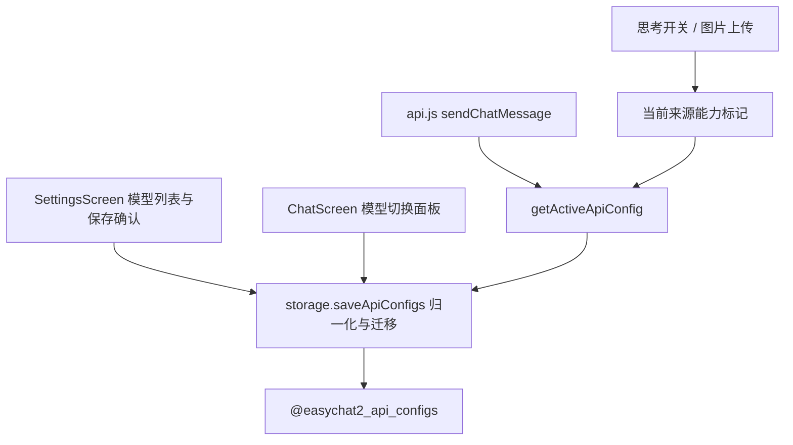

# API 来源多模型与能力标记 技术设计

Feature Name: api-multi-model
Updated: 2026-09-18

## 描述

把 `ApiConfig` 从「一条配置一个模型」扩展为「一个来源多个模型」，并增加能力标记。聊天页新增模型切换面板；设置页保存前确认思考与识图能力。

## 架构



## 组件与接口

### `src/storage.js`

- `normalizeApiConfig` 扩展为：`{ id, name, baseUrl, apiKey, models, activeModel, supportsThinking, supportsVision }`；旧 `model` 迁移为 `models: [model]` 与 `activeModel: model`。
- `getActiveApiConfig()` 返回含 `activeModel` 与能力标记的配置。
- 新增 `getActiveModel()`（可选）：返回当前模型名，供 `api.js` 直接使用。

### `src/api.js`

- `sendChatMessage` 使用 `config.activeModel || config.model`；请求体可选加入思考参数（详见 `thinking-toggle` 规格）。

### `src/SettingsScreen.js`

- 配置编辑区把单个模型输入改为「模型列表」：可新增、删除、选中为当前模型。
- 保存前弹出确认：`Alert.alert('确认模型能力', ..., [{ 不支持, 支持思考 }, { 支持识图 }])`，或一个带两个开关的确认弹窗。
- 保存时写入 `supportsThinking` / `supportsVision`。

### `src/ChatScreen.js`

- 顶部栏新增「模型」入口，打开两级面板：先来源、后模型；选择后调用 `saveApiConfigs` 更新当前模型并刷新当前配置。

## 数据模型

```text
@easychat2_api_configs -> {
  configs: [{
    id, name, baseUrl, apiKey,
    models: [string],
    activeModel: string,
    supportsThinking: boolean,
    supportsVision: boolean
  }],
  activeId: string
}
```

迁移：旧 `{ model }` → `models: [model]`、`activeModel: model`；`models` 为空时回退 `[DEFAULT_API_CONFIG.model]`。

## 正确性属性

1. 迁移幂等：重复读取不改变已迁移结果。
2. `models` 始终非空，`activeModel` 始终属于 `models`。
3. 删除当前模型后 `activeModel` 回退为列表首项。
4. 密钥不进入聊天消息与提示词。
5. 切换来源后，聊天页模型面板与请求使用同一来源的当前模型。

## 错误处理

- 保存失败：`Alert` 提示并回滚界面状态。
- 模型列表为空：阻止保存并提示至少保留一个模型。
- 旧数据格式异常：回退默认来源，不阻塞应用启动。

## 测试策略

- storage 脚本：旧配置迁移、模型增删、当前模型回退、能力字段默认值。
- 界面脚本：模型面板两级选择、保存确认写入能力。
- 打包验证：`npx expo export --platform android`。

## 分期

1. `ApiConfig` 扩展与迁移、`api.js` 取当前模型。
2. 设置页模型列表与保存确认。
3. 聊天页模型切换面板。
4. 回归与打包验证。

## 参考

[^1]: (src/storage.js#L257) - 现有 API 配置归一化
[^2]: (src/api.js#L58) - 请求使用 model
[^3]: (src/SettingsScreen.js#L373) - 现有模型选择
