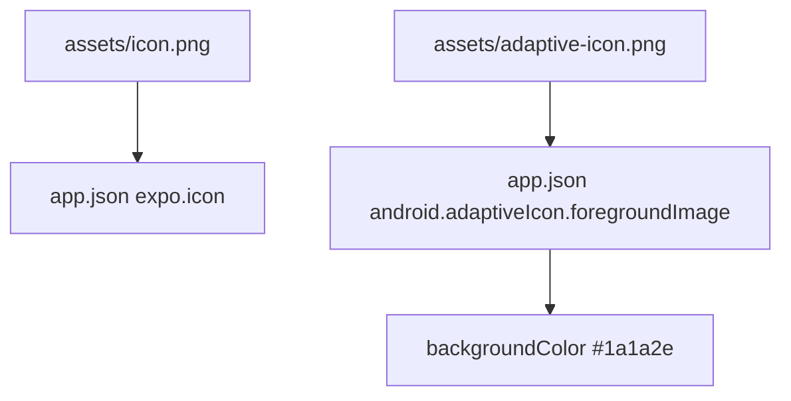

# 应用图标替换 技术设计

Feature Name: app-icon
Updated: 2026-09-18

## 描述

替换 `assets/icon.png`、`assets/adaptive-icon.png` 与可选 `assets/splash.png`，保持 `app.json` 中的路径引用不变，因此无需修改构建配置。

## 架构

## 组件与接口

### `assets/`

| 文件 | 规格 |
|------|------|
| `icon.png` | 1024×1024，正方形，四周留安全边距 |
| `adaptive-icon.png` | 1024×1024，前景主体位于中间 66% 安全区 |
| `splash.png` | 可选，与图标风格一致 |

### `app.json`

- 保持 `expo.icon`、`expo.android.adaptiveIcon.foregroundImage` 与 `backgroundColor` 字段；如需调整背景色，同步改为语义主色（如 `#6c63ff` 或保持 `#1a1a2e`）。

### 资产生成方式

- 使用 `image_generate_text_to_image` 生成一张 1024×1024 应用图标（简约、深色底 `#1a1a2e`、主色 `#6c63ff`、主体为聊天气泡或闪电等辨识度高的符号，四周留安全边距），保存为 `assets/icon.png`。
- 由同一素材适配导出 `assets/adaptive-icon.png`（前景主体置于中间 66% 安全区）。
- 如需，同步更新 `assets/splash.png` 以保持风格一致。

## 数据模型

无。

## 正确性属性

1. 图标为正方形且主体在安全区内。
2. 自适应图标前景在圆形与方形遮罩下均不被裁切。
3. `app.json` 路径有效，构建不报缺失资源。
4. 图标在深色/浅色桌面均可辨识。

## 错误处理

- 图标缺失：构建阶段报错，需保证资源存在。

## 测试策略

- 构建验证：`npx expo export --platform android` 通过（不校验图标内容）与 APK 流程人工确认。
- 手动验证：安装后查看桌面图标与启动画面。

## 参考

[^1]: (app.json) - 图标字段
[^2]: (.monkeycode/docs/模块/构建与配置.md) - 构建流程
