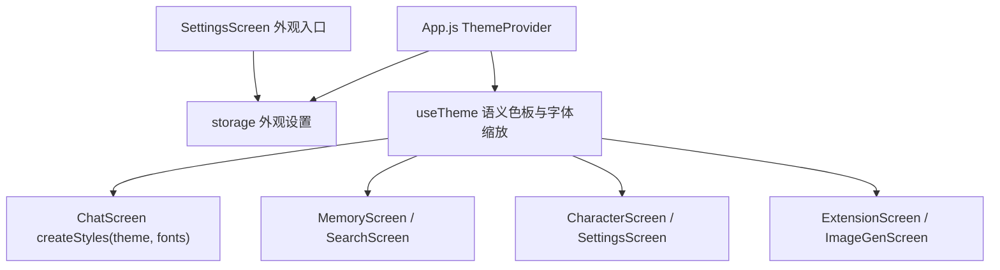

# 外观主题与字体大小 技术设计

Feature Name: appearance-themes
Updated: 2026-09-18

## 描述

引入全局外观设置：五套预设主题与六档字体大小。通过 `ThemeProvider` 提供语义色板与字体缩放，各屏 StyleSheet 由静态对象改为 `createStyles(theme, fonts)` 工厂，按语义令牌取色。设置持久化在 `@easychat2_appearance`。

## 架构



## 组件与接口

### `src/theme/themes.js`（新增）

语义令牌（每套主题一份）：

```text
{
  id, label,
  colors: {
    background,        // 页面背景
    surface,           // 卡片与输入框
    surfaceAlt,        // 次级表面
    surfaceBorder,     // 边框
    primary,           // 主色
    primaryMuted,      // 主色弱化（图标、次按钮）
    primaryContrast,   // 主色上的文字
    text,              // 主文本
    textMuted,         // 次要文本
    textFaint,         // 弱提示文本
    danger,            // 危险与错误
    overlay,           // 遮罩
  }
}
```

内置五套：

| id | label | background | surface | primary |
|----|-------|-----------|---------|---------|
| `dark` | 深色 | `#1a1a2e` | `#2d2d44` | `#6c63ff` |
| `light` | 浅色 | `#f5f5fa` | `#ffffff` | `#5b54e8` |
| `blue` | 蓝色 | `#0f1b2d` | `#1b2f4a` | `#3b82f6` |
| `pink` | 粉红色 | `#2a1620` | `#3d2233` | `#f472b6` |
| `crimson` | 深红色 | `#260f13` | `#3a1a20` | `#e04a5f` |

- `dark` 的取值与当前硬编码配色对齐，保证默认外观与现状一致。

### `src/theme/ThemeContext.js`（新增）

- `ThemeProvider`：加载 `@easychat2_appearance`，提供 `{ theme, themes, fontScale, fontOptions, setTheme, setFontScale, loaded }`。
- `useTheme()`：返回上述上下文；未包裹时回退默认主题，便于脚本测试。

### 字体缩放

六个档位与系数：

| id | label | scale |
|----|-------|-------|
| `default` | 默认 | 1.0 |
| `system` | 跟随系统 | 取 `PixelRatio.getFontScale()` |
| `small` | 小 | 0.9 |
| `medium` | 中 | 1.1 |
| `large` | 大 | 1.25 |
| `xlarge` | 特大 | 1.4 |

- 提供 `scaled(size)` 辅助：`Math.round(size * scale)`。
- 不使用全局 `Text.defaultProps.allowFontScaling` 覆盖，避免与「跟随系统」语义冲突；由各屏在样式中显式调用 `scaled`。

### `src/storage.js`

- 新增 `getAppearanceSettings()` / `saveAppearanceSettings(settings)`，键 `@easychat2_appearance`：

```text
{ themeId: 'dark' | 'light' | 'blue' | 'pink' | 'crimson', fontScaleId: 'default' | ... }
```

- 读取时校验非法值并回退默认。

### 各屏迁移策略

按屏分步迁移，每屏一个可验证单元：

```text
1. src/theme/ 与 ThemeProvider 接入 App.js（其余不变）
2. ChatScreen（含 MessageBubble、ErrorBubble、各 Modal）
3. MemoryScreen、SearchScreen、ScrollScrubber
4. CharacterScreen（含世界书与正则 Modal）
5. SettingsScreen、PluginPanel、PresetPanel、TtsPanel
6. ExtensionScreen、ImageGenScreen、games 页面外观（WebView 内保持自身配色）
7. disclaimer.js
```

- 每屏把 `const styles = StyleSheet.create({...})` 改为 `const createStyles = (theme, fonts) => StyleSheet.create({...})`，组件内 `const styles = useMemo(() => createStyles(theme, fonts), [theme, fonts])`。
- 颜色替换为语义令牌；`#fff` 与 `#ffffff` 按用途分别映射到 `text` 或 `primaryContrast`。
- 硬编码字号替换为 `fonts.scaled(n)`。
- `games.js` 内嵌 HTML 使用自身配色，不随应用主题变化。

## 数据模型

```text
@easychat2_appearance -> { themeId: string, fontScaleId: string }
```

## 正确性属性

1. 默认值（`dark` + `default`）下界面与当前版本视觉一致。
2. 主题切换即时生效，无需重启。
3. 非法 `themeId` 与 `fontScaleId` 回退默认且不报错。
4. 主题与字体设置持久化，冷启动恢复。
5. 语义令牌覆盖所有页面，不残留页面级硬编码主题色。

## 错误处理

- 读取失败：回退默认主题与默认字体，静默处理。
- 写入失败：`Alert` 提示「保存失败」。

## 测试策略

- 脚本：五套主题令牌完整性（每个令牌存在且为合法色值）；字体档位系数表；`getAppearanceSettings` 对非法值的回退。
- 脚本：`scaled` 取整与边界。
- 静态检查：迁移后用正则确认目标文件不再出现默认主题硬编码色值。
- 打包验证与手动逐屏验证五套主题。

## 参考

[^1]: (src/ChatScreen.js) - 颜色与字号硬编码分布
[^2]: (src/context/AppContext.js) - 全局 Context 先例
