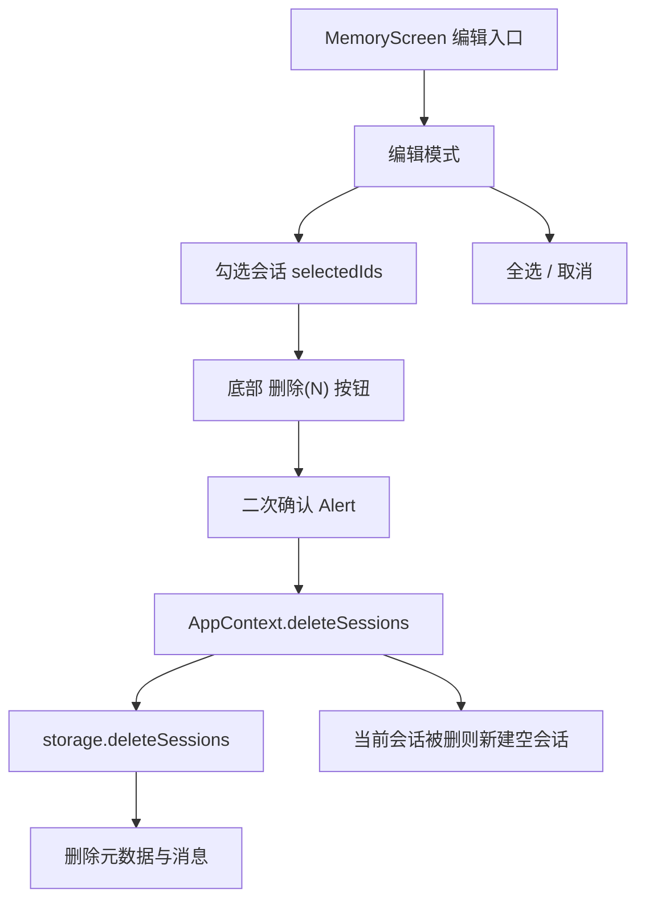

# 多选批量删除会话 技术设计

Feature Name: batch-delete
Updated: 2026-09-18

## 描述

在记忆页新增编辑模式，支持勾选多个会话并批量删除。复用 `conversation-memory` 的会话模型与 `MemoryScreen`，新增批量删除的 storage、context 与 UI 状态。

## 架构

## 组件与接口

### `src/storage.js`

新增 `deleteSessions(sessionIds)`：一次性移除多个会话的元数据与消息（批量 `AsyncStorage.removeItem`），删除当前会话时由调用方处理新建。

### `src/context/AppContext.js`

新增 `deleteSessions(ids)`：沿用 `characterRef`/`loadedRef` 模式，先校验加载完成，调用 storage 批量删除，成功后刷新 `sessions`；若 `ids` 包含当前会话，先 `startNewSession` 再删除，保证 `activeSessionId` 始终有效。失败时回滚状态并抛出，由 `MemoryScreen` 捕获后 `Alert`。

### `src/MemoryScreen.js`

- 顶部新增「编辑」入口，进入编辑模式时替换为「完成」。
- 行右侧渲染勾选框；底部固定操作条显示「删除（N）」与「全选」。
- 删除确认走 `Alert.alert` 二次确认；失败恢复选择状态。

## 数据模型

无新增存储键；复用会话模型（见 `conversation-memory`）。

## 正确性属性

1. 批量删除后，`sessions` 与各会话消息在存储中同时移除。
2. 删除当前会话后，`activeSessionId` 始终指向存在的空会话。
3. 失败时不产生部分删除。
4. `pending` 消息不落盘，删除逻辑不受影响。

## 错误处理

- 批量删除失败：提示「删除失败」，保持原列表与勾选状态。
- 空列表：不显示编辑入口。

## 测试策略

- storage 专项：批量删除元数据与消息、删除当前会话后新建。
- MemoryScreen 渲染脚本：编辑模式、全选、计数、删除确认、空状态。
- AppContext 脚本：批量删除回滚、当前会话保护。

## 分期

1. storage 与 context 批量删除接口。
2. MemoryScreen 编辑模式与操作条。
3. 二次确认与失败回滚。

## 参考

[^1]: (src/storage.js#L220) - 现有单会话删除
[^2]: (src/context/AppContext.js) - 会话状态
[^3]: (src/MemoryScreen.js) - 记忆页（conversation-memory 规格新增）