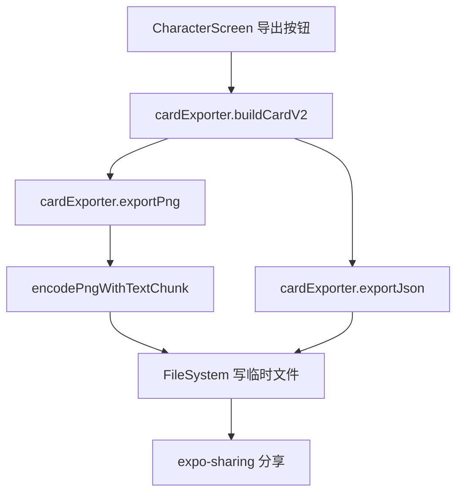

# 角色卡导出 技术设计

Feature Name: character-card-export
Updated: 2026-09-18

## 描述

新增 `cardExporter` 模块，反向构造角色卡 V2，编码为 JSON 与 PNG，经 `expo-sharing` 分享。

## 架构



## 组件与接口

- `src/cardExporter.js`（新增）：
  - `buildCardV2(character)`：返回 `{ spec, spec_version, data, ...v1Fields }`。
  - `cardToJson(character)`：返回格式化 JSON 字符串。
  - `cardToPng(character, avatarBytes)`：返回 PNG 二进制。
  - `exportCardFile(character, format)`：写入缓存目录并返回文件 uri。
- `src/CharacterScreen.js`：导出按钮、格式选择、`Sharing.shareAsync`。
- `package.json`：新增 `expo-sharing`。

## 数据模型

```text
data: {
  name, description, personality, scenario, first_mes, mes_example,
  creator_notes, system_prompt, post_history_instructions, tags,
  character_book: { entries: [...] },
  extensions: { regex_scripts: [...] }
}
```

- `character_book.entries` 由 `worldInfo` 映射：keys、content、enabled、insertion_order、position、case_sensitive、selective、extensions。
- `regex_scripts` 由 `regexScripts` 映射：id、scriptName、findRegex、replaceString、placement、disabled、markdownOnly、promptOnly。

## PNG 编码

React Native 无 Node `zlib`，采用最小 PNG：

1. 签名 `89 50 4E 47 0D 0A 1A 0A`。
2. `IHDR`：宽、高、位深 8、颜色类型 2（RGB）。
3. `tEXt`：关键字 `chara`，值 base64 JSON，位于 `IDAT` 之前或之后。
4. `IDAT`：使用 deflate stored 块，自实现 Adler32 与 CRC32。
5. `IEND`。

有头像时直接读取头像 PNG 字节，在 `IDAT` 前插入 `tEXt` 块并重算后续块偏移，避免重新编码像素。

## 正确性属性

1. 导出再经现有导入流程解析后，字段与原角色一致。
2. PNG 各块长度、CRC 正确，可被标准解码器打开。
3. `chara` 文本块 base64 可解码为合法 JSON。
4. 无头像时占位 PNG 仍包含完整卡数据。

## 错误处理

- 头像读取失败：回退生成占位 PNG。
- PNG 注入失败：回退为 JSON 导出并提示。
- 分享不可用时：提示文件已生成并给出路径。

## 测试策略

- Node 脚本验证 `buildCardV2` 往返与 `character_book`、`regex_scripts` 映射。
- Node 脚本解析生成的 PNG，校验块结构、CRC 与 `chara` 数据。
- Android 导出验证打包与分享调用。

## 分期

1. `buildCardV2` 与 JSON 导出。
2. PNG 编码与头像注入。
3. 分享接线、依赖验证与回归。

## 参考

[^1]: (src/cardParser.js#L373) - 导入字段映射
[^2]: (src/cardParser.js#L496) - 现有 PNG 读取实现