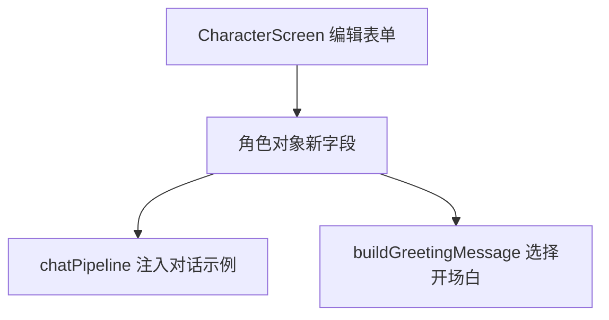

# 角色编辑扩展 技术设计

Feature Name: character-edit-fields
Updated: 2026-09-18

## 描述

扩展角色对象与编辑表单，新增 `alternateGreetings`、`exampleDialogue`；对话示例注入系统提示词。

## 架构



## 组件与接口

### 数据模型

```text
character.alternateGreetings?: string[]     // 备用开场白
character.exampleDialogue?: string          // 对话示例（多行）
```

### `src/CharacterScreen.js`

- 新增表单区块：
  - 「备用开场白」：列表式多条编辑，支持增删。
  - 「对话示例」：多行输入。
- 保存时写入角色对象，空值存空字符串或空数组。

### `src/chatPipeline.js`

- `buildRequestMessages` 在系统提示词追加段落规则中，新增「对话示例」段：

```text
[对话示例]
<exampleDialogue>
```

- 仅在 `exampleDialogue` 非空时追加，位置排在 `[用户设定]` 之后、`[记忆摘要]` 之前。

### 角色卡

- `cardExporter` / `cardParser` 的字段映射同步新增字段（导出写入，导入读取并回退空值）。

## 正确性属性

1. 旧角色缺字段时读取与请求组装正常。
2. 对话示例为空不注入。
3. 角色卡往返导出导入保留新字段。

## 错误处理

- 文案占位缺失：回退默认模板。

## 测试策略

- 脚本：`buildRequestMessages` 含/不含 `exampleDialogue` 的输出对比。
- 脚本：角色卡往返字段保留。
- 打包验证。

## 参考

[^1]: (src/CharacterScreen.js) - 编辑表单
[^2]: (src/chatPipeline.js) - 提示词组装
[^3]: (src/cardExporter.js)、`src/cardParser.js` - 角色卡字段
