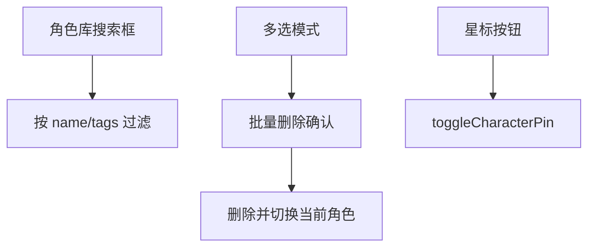

# 角色库增强 技术设计

Feature Name: character-library-plus
Updated: 2026-09-18

## 描述

在 `CharacterScreen` 内增加搜索、标签、多选与全选删除，置顶改用星标图标，并把全局预设入口移到编辑区底部。角色对象新增可选 `pinned` 与 `tags` 字段。

## 架构



## 组件与接口

### 数据模型

```text
character.pinned?: boolean
character.tags?: string[]
```

- 读取时缺省为 `pinned: false`、`tags: []`，旧角色平滑兼容。

### `src/context/AppContext.js`

- 新增 `pinCharacter(id)`：切换 `pinned` 并持久化；列表排序中置顶优先。
- 新增 `deleteCharacters(ids)`：批量删除；若包含当前角色，自动切换到剩余第一个；至少保留一个。

### `src/CharacterScreen.js`

- 搜索：新增 `query` state，过滤条件为 `name.includes(query) || tags.some(tag => tag.includes(query))`。
- 标签编辑：在编辑表单新增标签输入（回车或按钮添加，点击标签删除）。
- 卡片展示：名称行右侧展示星标按钮，卡片下方展示标签 chip 行。
- 多选模式：顶部「编辑」切换；每张卡出现勾选框；底部操作条含「全选」「删除（n）」。
- 删除确认：
  - 多选（n > 1）：`Alert` 二次确认并显示数量。
  - 全选：红色警告弹窗，要求输入「删除」后再执行。
- 全局预设入口：移动到世界书与正则编辑区之后。

### 排序

- `sortCharacters` 或既有排序逻辑中，`pinned` 优先于最近使用时间。

## 正确性属性

1. 旧角色无 `pinned`/`tags` 字段时读取与渲染正常。
2. 搜索同时匹配名称与标签，清空后恢复完整列表。
3. 全选删除必须输入确认文字才执行。
4. 删除当前角色后会话切换到剩余角色。
5. 至少保留一个角色。
6. 预设入口位置变化不改变其行为。

## 错误处理

- 删除失败：提示且不改变列表。
- 标签输入空字符串：忽略。

## 测试策略

- 脚本：搜索过滤（名称/标签/无匹配）、置顶排序、批量删除保留至少一个、删除当前角色后的切换。
- 打包验证与手动验证。

## 参考

[^1]: (src/CharacterScreen.js) - 角色列表与编辑表单
[^2]: (src/context/AppContext.js) - 角色状态与持久化
[^3]: (src/PresetPanel.js) - 复用的预设面板
