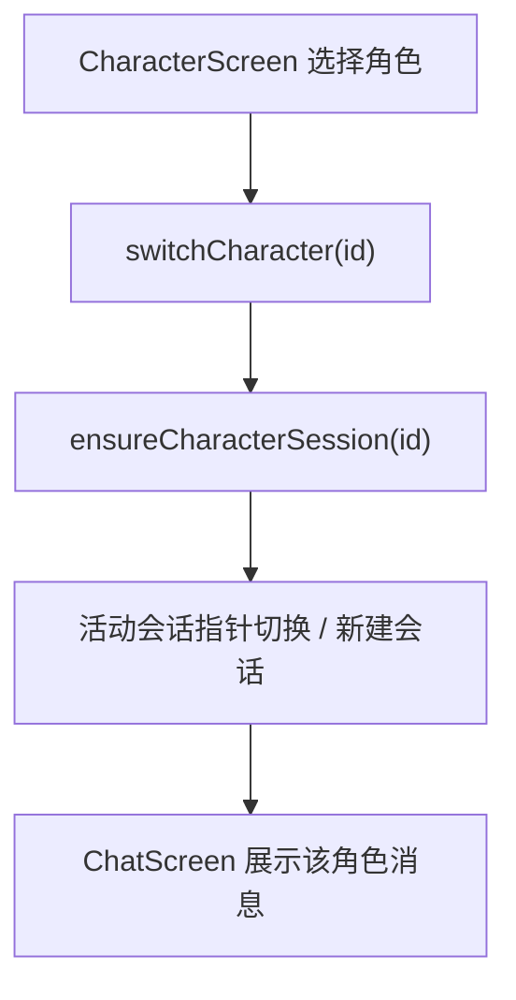

# 切换角色后会话不同步 技术设计

Feature Name: character-switch-session
Updated: 2026-09-18

## 描述

`CharacterScreen` 切换角色时只调用 `switchCharacter(id)`，未同步切换会话指针；`ChatScreen` 的 `onSwitch` 则是 `switchCharacter(id).then(() => ensureCharacterSession(id))`。因此从角色页切换后，当前会话仍指向旧角色的会话，导致聊天页显示旧消息、仅头像名称变化。

## 架构



## 组件与接口

### `src/CharacterScreen.js`

- 角色选择处理（约第 773 行）改为：

```text
switchCharacter(id)
  .then(() => ensureCharacterSession(id))
  .catch(() => Alert.alert('切换失败', '请检查存储空间或权限。'))
```

- `useApp()` 解构新增 `ensureCharacterSession`。

### `src/context/AppContext.js`

- 复用既有 `switchCharacter` 与 `ensureCharacterSession`，不新增状态。
- `ensureCharacterSession` 已处理三种情况：已有会话则切换指针、无会话则 `startNewSession` 并刷新。

### 一致性保障

- `ChatScreen` 的 `activeCharacterIdRef` 与 `sessionVersionRef` 守卫已存在，切换后迟到回复会被丢弃。
- 记忆页通过 `switchSession` 恢复会话时，应同时确保所属角色为当前角色：`switchSession` 后若 `session.characterId !== activeId`，先 `switchCharacter(session.characterId)`。

## 数据模型

无变化。

## 正确性属性

1. 角色页切换角色后，活动会话必属于该角色。
2. 目标角色无会话时自动创建空会话。
3. 切换后聊天页消息与顶部栏角色一致。
4. 切换过程中进行中的请求迟到回复被丢弃。
5. 从记忆页恢复会话时角色同步切换。

## 错误处理

- `switchCharacter` 或 `ensureCharacterSession` 失败：提示「切换失败」并保持原状态（`switchCharacter` 已有回滚）。
- 角色尚未加载完成：抛出既有错误，由调用方提示。

## 测试策略

- 脚本：`ensureCharacterSession` 在「已有该角色会话」「无该角色会话」「已是当前会话」三种输入下的活动指针结果。
- 脚本：多角色切换后活动会话 `characterId` 始终等于当前角色。
- 手动验证：角色页切换 → 聊天页内容与头像一致；删除旧会话后切换。
- 打包验证。

## 参考

[^1]: (src/CharacterScreen.js#L773) - 缺陷位置
[^2]: (src/context/AppContext.js#L148) - `switchCharacter`
[^3]: (src/context/AppContext.js#L261) - `ensureCharacterSession`
[^4]: (src/ChatScreen.js) - 既有 `onSwitch` 正确写法
