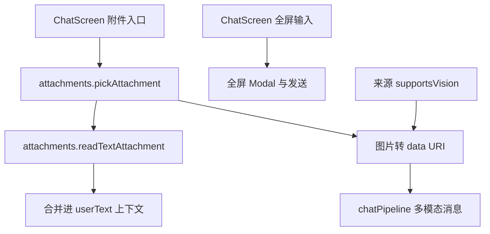

# 聊天附件与全屏输入 技术设计

Feature Name: chat-attachments
Updated: 2026-09-18

## 描述

为聊天输入增加附件（纯文本类文档与图片）与全屏输入。文本附件在发送时并入用户消息上下文；图片在来源支持识图时以多模态形式发送。

## 架构



## 组件与接口

### `src/attachments.js`（新增）

- `TEXT_EXTENSIONS`：文本类扩展名集合。
- `isTextLike(name, mime)` / `isImage(name, mime)`。
- `pickAttachment()`：`DocumentPicker` 选取单个文件，返回 `{ uri, name, mime, size }`。
- `readTextAttachment(uri, maxBytes?)`：读取为 UTF-8 文本，超限抛错。
- `readImageDataUri(uri, mime)`：读取为 Base64 并拼成 `data:` URI。

### `src/ChatScreen.js`

- 输入栏左侧新增附件按钮，弹出「选择文档 / 选择图片」。
- 已选附件以可移除的标签展示（名称、图片缩略图）。
- 发送时把文本附件内容追加到用户消息上下文；图片在发送请求中以多模态数组传递（需当前来源 `supportsVision`）。
- 输入栏最右新增全屏按钮，打开全屏 Modal（多行输入、发送、右上角关闭）。

### `src/chatPipeline.js`

- `buildRequestMessages` 支持图片：当传入 `images` 时，把最后一条用户消息的 `content` 构造为 `[{ type: 'text', text }, { type: 'image_url', image_url: { url } }]`。

## 数据模型

```text
消息: { id, role, text, attachments?: [{ name, kind: 'text'|'image', uri? }], pending? }
文本附件内容不单独持久化，发送时读取并展平进 userText 上下文
```

## 正确性属性

1. 仅文本类扩展名可读取；图片仅在 `supportsVision` 为真时发送。
2. 单个文本附件有大小上限，超限不发送并提示。
3. 附件读取失败不影响发送其余内容。
4. 全屏输入退出后文本保留。
5. `pending` 消息仍不落盘。

## 错误处理

- 文件读取失败：提示「文件读取失败，请重试」。
- 不支持的扩展名：提示不支持的类型。
- 图片但来源不支持识图：提示并阻止发送图片。
- 超限：提示文件过大。

## 测试策略

- 脚本：扩展名判定、文本读取、data URI 构造、多模态消息组装。
- 界面脚本：附件标签与移除、全屏输入开关与发送。
- 打包验证。

## 分期

1. `attachments` 模块与文本附件。
2. 图片多模态与 `chatPipeline` 支持。
3. 全屏输入。
4. 回归与打包验证。

## 参考

[^1]: (src/ChatScreen.js) - 输入栏
[^2]: (src/chatPipeline.js#L50) - 请求组装
[^3]: (expo-document-picker / expo-file-system) - 已有依赖
