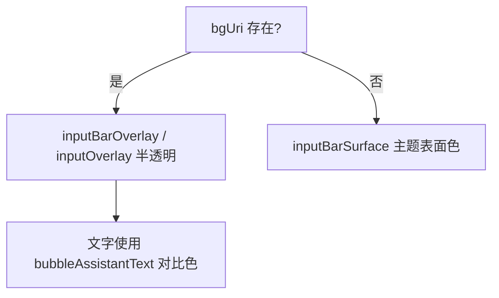

# 聊天底部控件透明化 技术设计

Feature Name: chat-bubble-transparency
Updated: 2026-09-18

## 描述

降低聊天页底部输入栏、附件栏、引用栏与消息操作按钮的背景不透明度，使角色背景图更可见。已有 `bgUri` 分支（`inputBarOverlay`），本次进一步降低其不透明度并让内层输入框同步半透明。

## 架构

## 组件与接口

### `src/ChatScreen.js` 样式调整

| 样式 | 现值 | 目标 |
|------|------|------|
| `inputBarOverlay` | `rgba(20,20,34,0.42)` | `rgba(20,20,34,0.26)` |
| `inputOverlay` | `rgba(45,45,68,0.42)` | `rgba(45,45,68,0.28)` |
| `messageActionButton`（有背景图时） | 不透明 `surface` | 半透明 + 边框 |

- 新增 `messageActionButtonOverlay`：`backgroundColor: 'rgba(45,45,68,0.30)'`、`borderWidth: 1`、`borderColor: theme.colors.surfaceBorder`。
- 消息操作行渲染时按 `bgUri` 选择基础或半透明样式。
- 输入文字、占位符与图标保持主题语义色，确保半透明下对比度足够。

### 无背景图

- 保持 `inputBarSurface` 使用 `theme.colors.background`，不做透明处理，避免纯色背景上出现脏色。

## 正确性属性

1. 有背景图时底部控件半透明且文字可读。
2. 无背景图时维持现有纯色样式。
3. 主题切换后透明层与语义色仍协调。
4. 输入框聚焦态边框仍可见。

## 错误处理

无网络与存储依赖。

## 测试策略

- 静态检查：`inputBarOverlay` 与 `inputOverlay` 的不透明度低于调整前。
- 手动验证：设置背景图后查看输入栏与操作行；切换浅色主题检查可读性。
- 打包验证。

## 参考

[^1]: (src/ChatScreen.js#L3168) - 底部样式
[^2]: (.monkeycode/specs/2026-09-18-chat-bubble-transparency/requirements.md) - 需求来源
