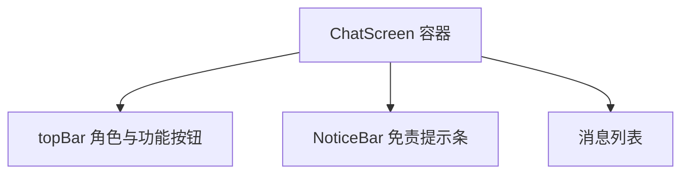

# 聊天页免责提示 技术设计

Feature Name: chat-disclaimer-notice
Updated: 2026-09-18

## 描述

在 `ChatScreen` 顶部栏（`topBar`）与消息列表之间插入一行常驻提示条，展示固定文案「AI 生成可能有误，仅供参考」。提示条为纯展示组件，无状态、无持久化、无网络。

## 架构

## 组件与接口

### `src/ChatScreen.js`

- 在 `topBar` 之后新增一行 `View`，内含固定文本，样式弱化处理。
- 文案以模块级常量 `AI_DISCLAIMER_TEXT = 'AI 生成可能有误，仅供参考'` 定义，便于统一修改。
- 组件为无状态展示，不接入 `AppContext`，不新增存储键。

新增样式（`StyleSheet.create` 内）：

| 样式名 | 关键属性 |
|--------|----------|
| `aiNoticeBar` | `paddingHorizontal: 16`、`paddingBottom: 6`、`alignItems: 'center'` |
| `aiNoticeText` | `color: '#8a8aa3'`、`fontSize: 11`、`opacity: 0.7`、`textAlign: 'center'` |

## 数据模型

无新增持久化数据。

## 正确性属性

1. 提示条只在聊天页渲染，其他标签页不引入该组件。
2. 提示条位于 `topBar` 之下、消息列表之上，不随消息滚动。
3. 切换角色或会话不卸载提示条。

## 错误处理

无网络与存储依赖，无错误分支。

## 测试策略

- 界面脚本：断言 `ChatScreen` 渲染文本包含免责文案。
- 打包验证：`npx expo export --platform android` 成功。
- 手动验证：`npm run start` 打开聊天页确认位置与弱化程度。

## 参考

[^1]: (src/ChatScreen.js#L1482) - `topBar` 结构，提示条插入点
