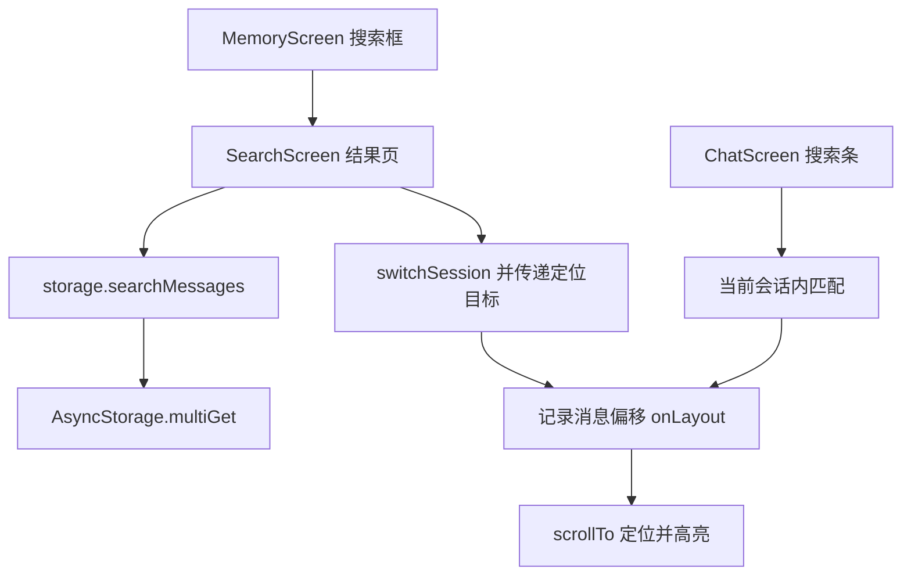

# 聊天记录搜索 技术设计

Feature Name: chat-search
Updated: 2026-09-18

## 描述

新增跨会话搜索与当前会话内搜索。跨会话搜索在记忆页发起并进入独立结果页，点击结果切换到对应会话并定位高亮；会话内搜索在聊天页内导航匹配项。

## 架构



## 组件与接口

- `src/storage.js`：新增 `searchMessages(keyword)`，批量读取全部会话与消息，返回命中列表。
- `src/SearchScreen.js`（新增）：独立结果页，展示命中片段、角色名、会话名与时间，处理点击跳转。
- `src/MemoryScreen.js`：顶部搜索入口，跳转结果页。
- `src/ChatScreen.js`：顶部栏搜索与定位图标、搜索条、匹配导航、高亮、定位目标处理。
- 定位目标通过 `AppContext` 的 `pendingTarget`（`{ sessionId, messageId }`）传递，进入会话后消费并清空。

## 数据模型

```text
命中项: { sessionId, characterId, messageId, role, text, updatedAt }
```

无新增持久化；`session.updatedAt` 用于结果排序。

## 正确性属性

1. 结果按 `updatedAt` 从新到旧排列。
2. 定位失败时回退到会话底部。
3. 空关键词不触发搜索。
4. 高亮只影响渲染，不修改消息文本。
5. 跨会话跳转同时切换当前角色与当前会话。

## 错误处理

- 消息读取失败：提示「搜索失败」，保留原列表。
- 定位消息不存在：回退到会话底部。

## 测试策略

- 匹配与排序脚本：中文子串、大小写不敏感、空关键词。
- 跨会话读取脚本：多会话 `multiGet` 结果合并。
- 渲染脚本：结果页条目、聊天页搜索条、上一个/下一个导航。
- Android 导出验证。

## 分期

1. `searchMessages` 与结果页。
2. 跨会话跳转、定位与高亮。
3. 聊天页内搜索与导航。

## 参考

[^1]: (src/ChatScreen.js#L913) - 消息列表 ScrollView
[^2]: (src/storage.js#L345) - 现有消息读取
[^3]: (src/MemoryScreen.js) - 记忆页（会话记忆规格新增）