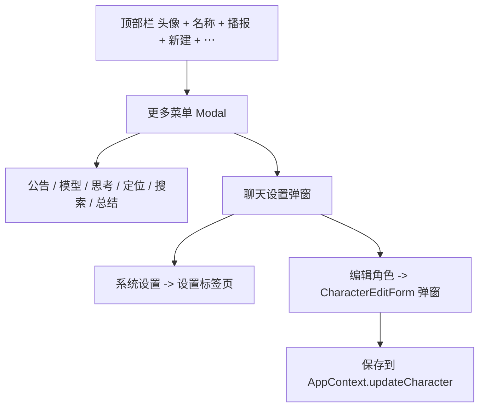

# 聊天页顶部折叠与聊天设置 技术设计

Feature Name: chat-toolbar-overflow
Updated: 2026-09-18

## 描述

把聊天页顶部栏的次要入口收敛进单个「⋯」菜单，并在菜单中新增「设置」打开聊天设置弹窗；聊天设置内的「编辑角色」在聊天页就地弹出角色编辑弹窗。为保证与角色页字段一致，将角色编辑表单抽为可复用组件 `CharacterEditForm`，供角色页与聊天页共用。

## 架构

## 组件与接口

### 顶部栏布局

| 元素 | 位置 | 说明 |
|------|------|------|
| 角色头像 + 名称 | 左 | 点击切换角色；名称 `flex: 1` 省略 |
| 播报开关 | 右 | 常驻，保留 `volume-*` 图标 |
| 新建 | 右 | 常驻 |
| 「⋯」 | 最右 | 固定宽度 |

### 更多菜单

- `Modal`（透明遮罩 + 右上浮层），项：公告、模型、思考、定位、搜索、总结、设置。
- 定位在 `scrubberMessages.length === 0` 时禁用；总结在 `summarizing || !ready` 时禁用；搜索反映 `searchOpen`。

### `src/CharacterEditForm.js`（新增，从 `CharacterScreen` 抽取）

- Props：`{ character, visible, onClose, onSaved }`
- 内部字段（与角色页一致）：名称、头像、背景、人设、角色描述、性格、标签、世界书（逐条增删改）、正则（逐条增删改）、别名等。
- 保存：调用 `AppContext.updateCharacter`，成功回调 `onSaved`；失败 `Alert` 并保留表单内容。
- 复用既有样式工厂 `createStyles(theme, fonts)` 与表单控件；世界书/正则编辑复用角色页的 Modal 逻辑（一并抽为子组件或在本组件内实现）。

### `src/CharacterScreen.js`

- 改为复用 `CharacterEditForm`（或至少复用其字段区块与保存逻辑），避免两处实现漂移。

### `src/ChatScreen.js`

- 新增 `moreOpen`、`chatSettingsOpen`、`characterEditOpen` 状态。
- 菜单「设置」→ `setChatSettingsOpen(true)`；聊天设置弹窗「系统设置」→ `navigation.navigate('设置')`；「编辑角色」→ `setCharacterEditOpen(true)`（群聊隐藏）。

### 样式

- `CharacterEditForm` 作为 `Modal` 呈现在聊天页时使用底部抽屉或全屏面板，滚动容器支持多字段与世界书/正则子面板。

## 数据模型

无新增持久化数据；编辑结果经既有 `updateCharacter` 写入角色库。

## 正确性属性

1. 折叠后各入口行为与折叠前一致；播报与新建仍在外面可用。
2. 菜单与弹窗开关不影响消息列表滚动位置。
3. 群聊不展示「编辑角色」。
4. 聊天内编辑角色与角色页编辑作用于同一 `character` 对象，保存后聊天页立即刷新。
5. 保存失败不清空表单。

## 错误处理

- 导航不可用：静默忽略。
- 保存失败：`Alert` 提示并保留输入。

## 测试策略

- 脚本：`updateCharacter` 保存后的角色库与当前角色一致性（复用 `run-storage`）。
- 静态检查：更多菜单包含全部六个入口且绑定既有回调；`CharacterEditForm` 被两处引用。
- 手动验证：折叠后逐项操作、设置跳转、聊天内编辑角色（含世界书/正则）、群聊隐藏。
- 打包验证。

## 参考

[^1]: (src/ChatScreen.js) - 顶部栏与既有入口回调
[^2]: (src/CharacterScreen.js) - 角色编辑字段与保存逻辑（抽取来源）
[^3]: (.monkeycode/specs/2026-09-18-character-edit-fields/) - 新增字段
