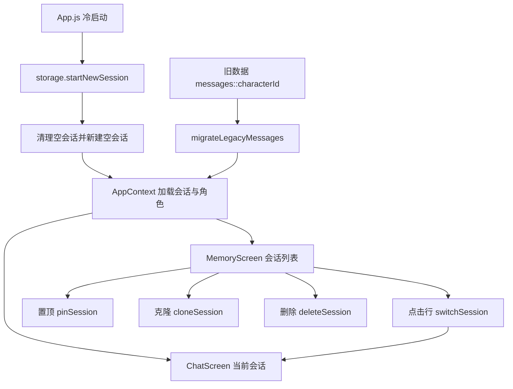

# 会话记忆 技术设计

Feature Name: conversation-memory
Updated: 2026-09-18

## 描述

在「按角色保存单一对话」的模型上引入会话层，一个角色支持多段对话。新增记忆页展示全部非空会话，支持置顶、克隆、删除与点击续聊；聊天界面支持清空消息。应用冷启动创建新会话，旧对话保留在记忆页；旧数据迁移为历史会话。

## 架构



冷启动在 `App.js` 挂载时执行一次；记忆页与聊天页共用 `AppContext` 的会话状态。

## 组件与接口

### `src/storage.js`

- `getSessions()`：读取 `@easychat2_sessions`，返回会话数组，缺失时返回空数组。
- `saveSessions(sessions)`：写入会话数组，失败向上抛错。
- `getActiveSessionId()` / `setActiveSessionId(id)`：读写 `@easychat2_active_session`。
- `startNewSession(characterId)`：清理无消息的遗留会话，新建空会话并设为当前，返回新会话。
- `cloneSession(sessionId)`：复制会话元数据与消息，消息标识重新生成，更新时间取当前时刻，返回副本。
- `deleteSession(sessionId)`：移除会话元数据与消息；若删除的是当前会话，新建空会话并设为当前。
- `getMessagesBySession(sessionId)`：按会话读取消息，过滤 `pending`。
- `saveMessagesBySession(sessionId, messages)`：按会话写入消息，过滤 `pending`。
- `migrateLegacyMessages(characters)`：将旧键数据迁移为历史会话，幂等。

### `src/context/AppContext.js`

在角色状态上扩展：`sessions`、`activeSessionId`、`loaded`、`switchSession(id)`、`pinSession(id)`、`cloneSession(id)`、`deleteSession(id)`、`refreshSessions()`、`ensureCharacterSession(characterId)`。沿用 `characterRef`/`loadedRef` 模式，写入前校验加载完成，失败回滚并抛出，由 `MemoryScreen` 捕获后 `Alert`。其中 `ensureCharacterSession` 用于切换角色时激活该角色最近更新的会话，没有会话时新建空会话，使角色切换与记忆页指定会话切换互不干扰。

### `src/ChatScreen.js`

- 消息读取与写入由 `characterId` 改为 `activeSessionId`（现有 `src/ChatScreen.js:593`、`:623` 改为按会话）。
- 保留 `pending` 不落盘、迟到回复丢弃与 `activeCharacterIdRef` 守卫，新增 `activeSessionIdRef` 会话维度的过期判断；切换角色时中断进行中的请求并由 `ensureCharacterSession` 激活目标角色的会话。
- 顶部或输入区保留「清空」，语义为清空当前会话消息、保留会话（`src/ChatScreen.js:647` 的 `onClear` 改为仅置空消息）。

### `src/MemoryScreen.js`（新增）

会话行：头像、角色名、摘要、更新时间、右侧置顶/克隆/删除按钮。点击行调用 `switchSession` 后切换到聊天 Tab。删除与克隆失败时 `Alert` 提示。

### `App.js`

`TAB_ICONS` 与 `Tab.Screen` 增加「记忆」，启动时调用 `startNewSession` 与 `migrateLegacyMessages`。

## 数据模型

```text
@easychat2_sessions              -> [{ id, characterId, preview, pinned, createdAt, updatedAt }]
@easychat2_active_session        -> "<sessionId>"
@easychat2_messages::<sessionId> -> [ message ]
```

message 沿用现有 `{ id, role, text, pending?, waitingForResponse?, detail? }`；列表显示日期使用会话 `updatedAt`。

旧键 `@easychat2_messages::<characterId>` 与默认角色回退键 `@easychat2_messages` 仅用于迁移读取，迁移后不再写入。

## 正确性属性

1. 空会话不出现在记忆页；列表始终至少有一条非空会话或显示空状态。
2. 克隆的副本与原会话互相独立，修改一方不影响另一方。
3. 删除当前会话后，当前会话始终指向一个存在的会话。
4. `pending` 消息不写入存储。
5. 会话切换后，旧会话的迟到回复与错误不写入新会话。
6. 迁移幂等：同一角色旧消息只生成一条历史会话。
7. 置顶与更新时间排序稳定：置顶优先，其次按更新时间从新到旧。

## 错误处理

- 存储读写失败：沿用 `Alert` 提示与状态回滚，不吞错。
- 迁移失败：保留旧键数据，不删除原记录，下次启动重试。
- 克隆或删除失败：提示用户并保持原列表。
- 启动阶段失败：不阻塞进入应用，下次启动重试。

## 测试策略

- 新增 storage 专项：会话增删改、克隆独立性、删除当前会话后新建、迁移幂等、空会话隐藏、旧键兼容。
- 新增 MemoryScreen 渲染脚本：排序、置顶切换、副本标识、按钮回调、空状态。
- 扩展 ChatScreen 生命周期脚本：按会话读写、清空保留会话、会话切换丢弃迟到回复。
- 复用现有回归脚本，全部退出码为零。
- 每阶段执行 `npx expo export --platform android` 验证打包。

## 分期

1. 第一阶段：storage 会话模型、迁移与专项脚本。
2. 第二阶段：ChatScreen 改为会话维度并回归。
3. 第三阶段：MemoryScreen、底部导航与冷启动接线。
4. 第四阶段：置顶、克隆、删除、清空细化与真机验收。

## 参考

[^1]: (src/storage.js#L43) - 消息键构造
[^2]: (src/storage.js#L345) - 现有消息读取
[^3]: (src/ChatScreen.js#L593) - 现有按角色加载消息
[^4]: (src/ChatScreen.js#L647) - 现有清空流程
[^5]: (App.js#L107) - 底部导航配置