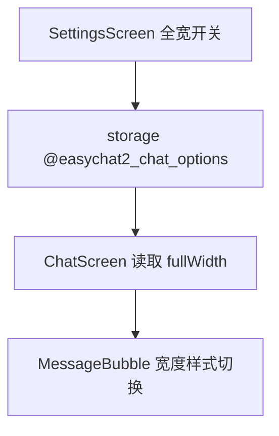

# 全宽对话 技术设计

Feature Name: full-width-chat
Updated: 2026-09-18

## 描述

为聊天页消息气泡增加宽度模式。设置开启时把气泡最大宽度从百分比限宽改为占满可用宽度。设置与「流式输出」共用 `@easychat2_chat_options` 键。

## 架构



## 组件与接口

### `src/storage.js`

- 复用 `@easychat2_chat_options`：`{ streaming: boolean, fullWidth: boolean }`，默认 `fullWidth: false`。

### `src/ChatScreen.js`

- 加载设置后把 `fullWidth` 传入 `MessageBubble` 与 `ErrorBubble`。
- 新增样式：

| 样式名 | 说明 |
|--------|------|
| `bubbleFullWidth` | `maxWidth: '100%'`、`alignSelf: 'stretch'`，用于全宽模式 |
| `bubbleBounded` | 保持现有 `maxWidth: '95%'`，用于默认模式 |

- 使用方式：`style={[styles.bubble, fullWidth ? styles.bubbleFullWidth : styles.bubbleBounded, ...]}`。
- 用户消息容器保持右对齐（`alignItems: 'flex-end'`），助手消息保持左对齐，仅改最大宽度，不改对齐。
- 消息列表横向内边距保持不变，确保全宽仍留出屏幕边距。
- 配图容器、引用块与操作行使用 `width: '100%'` 随气泡自适应。

### `src/SettingsScreen.js`

- 与「流式输出」同横档内新增「全宽对话」开关，写入 `fullWidth` 字段。

## 数据模型

```text
@easychat2_chat_options -> { streaming: boolean, fullWidth: boolean }
```

## 正确性属性

1. 默认关闭时布局与当前版本一致。
2. 开启后气泡占满聊天区域可用宽度，左右对齐关系不变。
3. 错误气泡、引用块、配图与操作行随宽度自适应。
4. 切换开关即时生效，无需重启。
5. 与 `appearance-themes` 的样式工厂改造兼容：宽度差异以独立样式令牌表达，不覆盖主题色。

## 错误处理

无网络与存储写入失败以外无特殊错误；设置读取失败回退默认。

## 测试策略

- 脚本：`getChatOptions` 对 `fullWidth` 缺失与非法值的回退。
- 静态检查：全宽与限宽两种样式令牌均存在且互斥使用。
- 打包验证与手动验证（含 Markdown 表格、代码块、配图、错误气泡）。

## 参考

[^1]: (src/ChatScreen.js#L2387) - `bubble` 现有最大宽度
[^2]: (.monkeycode/specs/2026-09-18-streaming-toggle/design.md) - 共用设置键
