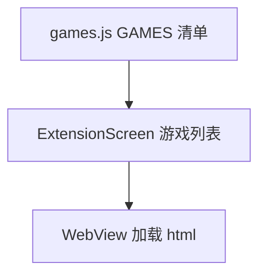

# 小游戏修复与新增 技术设计

Feature Name: games-fixes-and-new
Updated: 2026-09-18

## 描述

修复 `src/games/games.js` 中贪吃蛇方向键布局与图标定位；按用户提供的代码替换打砖块并新增雷霆战机与贪吃蛇大作战。所有游戏仍为内嵌 HTML 字符串、无网络请求。

## 架构



## 组件与接口

### `src/games/games.js`

- 贪吃蛇方向键：把当前两列布局改为 3×3 网格（上排中间「上」，中排左右「左」「右」，下排中间「下」），按钮使用等宽等高与 `alignItems/justifyContent: center`，图标用文字箭头或内联 SVG 保证居中。
- 打砖块：替换为用户提供的最新实现。
- 新增条目：

```text
{ id: 'thunder-fighter', name: '雷霆战机', description: '...', html: THUNDER_FIGHTER_HTML }
{ id: 'snake-battle', name: '贪吃蛇大作战', description: '...', html: SNAKE_BATTLE_HTML }
```

- 每条 HTML 保持自包含：内联样式与脚本、`viewport` 适配、触摸与键盘双通道。

### 等待用户提供

- 打砖块替换代码
- 雷霆战机 HTML
- 贪吃蛇大作战 HTML

在收到代码前，本 spec 仅完成贪吃蛇方向键修复；其余三项标记为待提供。

## 数据模型

无持久化。

## 正确性属性

1. 方向键为规整十字且图标居中。
2. 新条目结构符合 `{ id, name, description, html }`。
3. HTML 无外链与网络请求。
4. 新增游戏不改变既有游戏行为。

## 错误处理

- WebView 加载失败由 `ExtensionScreen` 既有重试处理。

## 测试策略

- 脚本：`GAMES` 结构、id 唯一、HTML 完整且无网络依赖（扩展现有 `run-games` 断言包含新游戏）。
- 手动验证：方向键布局与三种操作方式。
- 打包验证。

## 参考

[^1]: (src/games/games.js) - 现有游戏
[^2]: (src/ExtensionScreen.js) - WebView 承载
