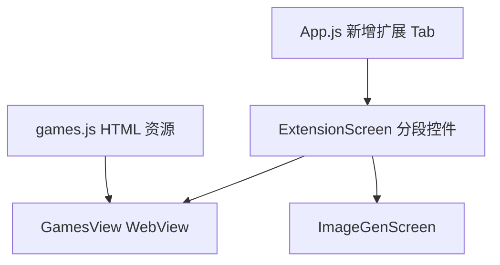

# 游戏与生图扩展页 技术设计

Feature Name: games-tab
Updated: 2026-09-18

## 描述

在底部导航新增扩展页，页内以分段控件切换「游戏」与「生图」。游戏用 WebView 运行内嵌 HTML；生图复用 `image-generation` 规格的模块。

## 架构

## 组件与接口

### `App.js`

- `TAB_ICONS` 与 `Tab.Navigator` 在「角色」与「设置」之间新增标签页「扩展」，组件为 `ExtensionScreen`。

### `src/ExtensionScreen.js`（新增）

- 顶部分段控件切换「游戏」「生图」。
- 游戏：展示游戏列表；选中后用 `react-native-webview` 的 `WebView` 加载对应 HTML，顶部提供返回按钮。
- 生图：内联渲染生图模块界面（`image-generation` 规格）。

### `src/games/`（新增）

- `games.js`：游戏清单 `[{ id, name, description, html }]`，HTML 以字符串常量内嵌，避免额外资源打包问题。
- 内置至少 3 个：猜数字、2048（简化）、贪吃蛇（简化）或打砖块；纯前端、无网络依赖。

### 依赖

- 新增 `react-native-webview`（Expo SDK 50 兼容版本），需验证 Metro 打包与 Android 原生依赖。

## 数据模型

无持久化（游戏内状态在 WebView 内维护）。生图设置见 `image-generation`。

## 正确性属性

1. 新增标签页不影响既有页面。
2. 游戏 HTML 完全内嵌，无网络请求。
3. 分段切换不丢失生图已填写内容（组件保持挂载或状态提升）。
4. WebView 错误时展示回退提示而非白屏。

## 错误处理

- WebView 加载失败：展示「加载失败」提示与重试。
- `react-native-webview` 不可用：隐藏游戏入口并提示。

## 测试策略

- 脚本：游戏清单结构、HTML 非空。
- 界面脚本：分段切换、游戏进入与返回、生图入口。
- 打包验证（重点验证 WebView 原生依赖）。

## 分期

1. 依赖安装与 WebView 打包验证。
2. 扩展页与分段控件。
3. 内置小游戏与生图接入。
4. 回归与打包验证。

## 参考

[^1]: (App.js) - 底部导航配置
[^2]: (src/image-generation 规格) - 生图模块
