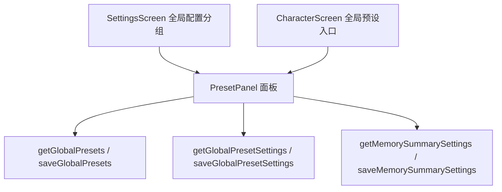

# 全局预设入口与内置项 技术设计

Feature Name: global-preset-entry
Updated: 2026-09-18

## 描述

把现有「对话预设」卡片折叠为「全局配置 > 全局预设」二级入口，设置页与角色编辑页共用同一面板。新增内置「角色状态」预设，并在面板中承载「记忆总结」开关与阈值。

## 架构



## 组件与接口

- `src/SettingsScreen.js`：移除内联预设列表，新增「全局配置」卡片与入口行。
- `src/CharacterScreen.js`：在基本信息卡片附近新增「全局预设」入口，打开同一面板。
- `src/PresetPanel.js`（新增）：props `{ visible, onClose }`，内部读取与保存预设；列表之外渲染「记忆总结」开关与阈值输入。
- `src/presets.js`：内置预设数组增加「角色状态」条目。
- `src/storage.js`：新增 `getMemorySummarySettings()` / `saveMemorySummarySettings({ enabled, threshold })`。

## 数据模型

```text
@easychat2_preset_list     -> [{ id, name, description, prompt }]
@easychat2_global_presets  -> { "<presetId>": true }
@easychat2_memory_summary  -> { enabled: boolean, threshold: number }
```

「角色状态」内置预设 id 为 `character-state`，提示词示例：

```text
每次回复的末尾用一行附上角色的当前状态，格式为：[心情: ...][好感度: 0-100][内心想法: ...]。
心情用一个词概括，好感度随互动合理变化，内心想法控制在 30 字以内。
```

## 正确性属性

1. 开关切换即时保存，并影响后续请求的预设选择。
2. 删除预设同时移除其开关记录。
3. 记忆总结阈值只接受大于 0 的整数，非法输入回退为 40。
4. 面板关闭后，角色编辑页未保存的表单内容保持不变。

## 错误处理

读取或保存失败时 `Alert` 提示并回滚界面状态。阈值输入非法时即时纠正并提示。

## 测试策略

- 预设面板渲染与交互脚本：列表、开关、增删改、记忆总结开关与阈值。
- 角色页入口脚本：点击打开面板、关闭后表单不变。
- 内置预设校验：`character-state` 存在且提示词包含三项状态。
- 复用 `preset-quality-check`、`preset-verify` 回归，Android 导出验证。

## 分期

1. 入口迁移与面板骨架（含角色页入口）。
2. 内置角色状态预设与记忆总结开关、阈值。
3. 回归与打包验证。

## 参考

[^1]: (src/SettingsScreen.js#L706) - 现有对话预设卡片
[^2]: (src/CharacterScreen.js#L762) - 角色页结构
[^3]: (src/presets.js#L1) - 内置预设定义