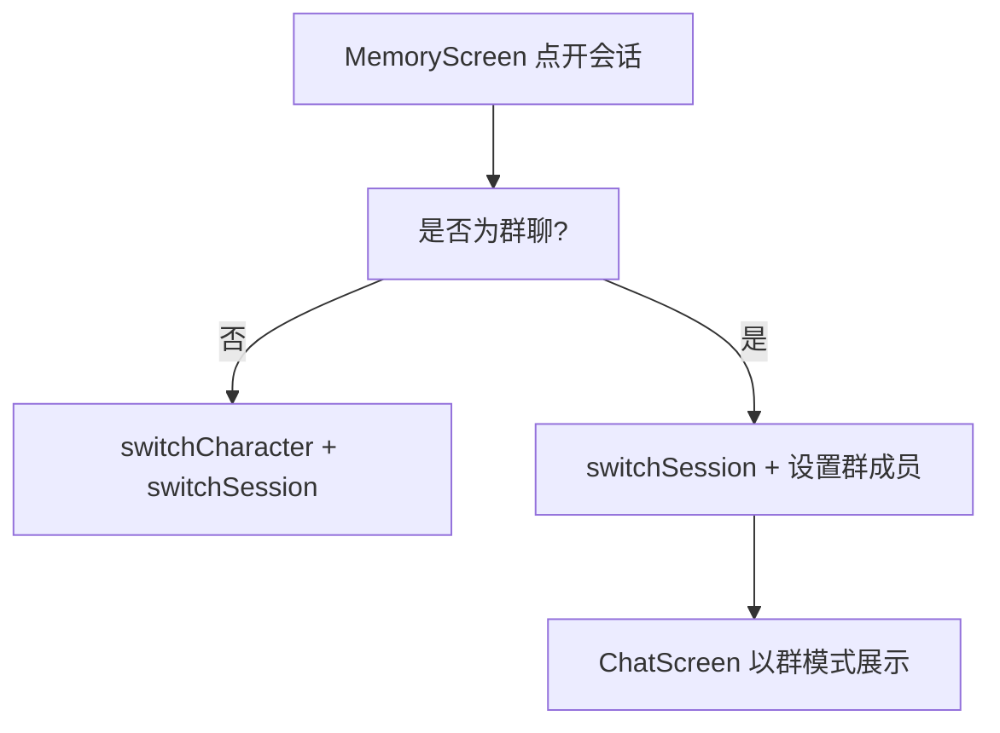

# 群聊修复与创建面板样式 技术设计

Feature Name: group-chat-fixes
Updated: 2026-09-18

## 描述

记忆页打开群聊会话时先 `switchCharacter(session.characterId)`。群聊会话的 `characterId` 指向基础角色，若该角色已被删除，`switchCharacter` 抛「角色不存在」，用户看到「打开失败」。修复方式：群聊会话直接切换会话并同步群成员，不依赖基础角色存在。

## 架构



## 组件与接口

### `src/MemoryScreen.js`

- `onOpen` 与 `onOpenResult` 改为：

```text
if (session.type === 'group') {
  ensureGroupSession(session)  // 设置群成员（members），切换会话
} else {
  await switchCharacter(session.characterId);
  await switchSession(session.id);
}
```

- 群聊分支不再调用 `switchCharacter`，因此基础角色缺失也能打开。
- 错误提示区分原因：会话不存在、存储失败。

### `src/context/AppContext.js`

- 新增 `activateSession(sessionId)`：

```text
1. 读取目标会话
2. 若为群聊：从 session.members 解析角色列表（过滤已删除角色），applyGroupCharacters 后 applyActiveSessionId
3. 若为单聊：switchCharacter(characterId) 后 applyActiveSessionId
4. 持久化活动会话指针
```

- 群成员解析：`members` 中角色已删除时跳过；全部删除时以空成员展示并给出说明。

### `src/ChatScreen.js`

- 群会话识别已基于 `session.type === 'group'` 与会话 `members`，无需改动；确保 `groupCharacters` 来自目标会话而非上一条会话。

### 创建面板样式

- 定位群聊创建面板（`CharacterScreen` 的「群聊」选择面板）：
  - 按钮 `minHeight` 提升到 44，`paddingHorizontal` 增大。
  - 「创建」使用 `theme.colors.primary` 底 + `theme.colors.primaryContrast` 文字。
  - 「取消」使用 `theme.colors.surface` 底 + `theme.colors.text` 文字 + `theme.colors.surfaceBorder` 边框。
  - 禁用态 `opacity: 0.45` 且不可点。

## 数据模型

```text
session.type: 'single' | 'group'
session.members?: string[]   // 群聊角色 id 列表
```

## 正确性属性

1. 群聊会话在基础角色缺失时仍可打开。
2. 打开群聊后 `groupCharacters` 属于该会话成员。
3. 单聊打开仍然切换角色。
4. 按钮对比度满足可读性，随主题变化。

## 错误处理

- 会话不存在：提示「会话不存在或已删除」。
- 成员全部缺失：以空成员展示并允许删除该会话。
- 存储失败：提示「请检查存储空间或权限」。

## 测试策略

- 脚本：`activateSession` 在单聊、群聊、基础角色缺失、全部成员缺失四种输入下的活动会话与模式。
- 打包验证与手动验证：删除群聊基础角色后打开；创建面板按钮。
- 参考 `virtual-moments` 与 `group-chat` 既有测试脚本。

## 参考

[^1]: (src/MemoryScreen.js#L84) - 打开失败来源
[^2]: (src/context/AppContext.js#L148) - `switchCharacter` 抛错点
[^3]: (.monkeycode/specs/2026-09-18-group-chat/) - 群聊既有设计
