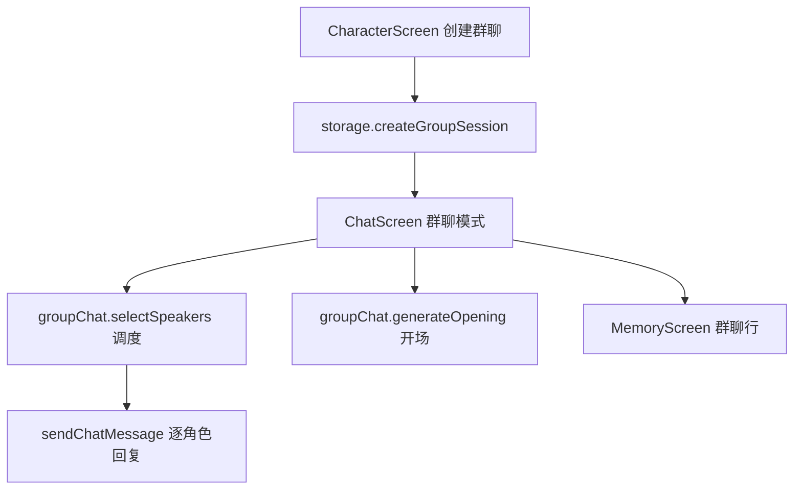

# 群聊 技术设计

Feature Name: group-chat
Updated: 2026-09-18

## 描述

在会话模型上扩展群聊类型，成员为多个角色。每轮用户消息先由 LLM 调度选出发言角色，再依次以各自角色卡设定生成回复；支持 `@角色名` 指定。群聊纳入记忆页与会话管理。

## 架构



## 组件与接口

- `src/storage.js`：会话扩展 `type`（`single` | `group`）、`members`、`name`；新增 `createGroupSession(members, name)`。
- `src/groupChat.js`（新增）：
  - `parseMentions(text, characters)`：解析 `@角色名`。
  - `selectSpeakers({ characters, history, userText, mentions })`：调用 LLM 返回发言角色 id 列表，限制 1-3 个，失败回退本地规则。
  - `generateOpening({ characters })`：生成群场景开场白与首位发言角色。
  - `buildGroupRequest({ speaker, characters, history, userText, userProfile, globalPresets })`：以发言角色的卡设定构造请求。
- `src/ChatScreen.js`：识别群聊会话，渲染带发言者的消息，处理调度与多次回复。
- `src/CharacterScreen.js`：创建群聊按钮与多选面板。
- `src/MemoryScreen.js`：群聊行叠放成员头像。

## 数据模型

```text
session: { id, type, characterId|null, members, name, preview, pinned, createdAt, updatedAt }
群聊 assistant 消息: { id, role, text, speakerId, speakerName }
```

## 正确性属性

1. 单轮发言角色数量为 1 到 3 且不重复。
2. 被 `@` 的角色必定进入发言列表。
3. 调度失败必有本地回退，用户消息不被阻塞。
4. 切换会话或退出后，迟到的群聊回复不写入当前会话。
5. 每个发言角色使用自己的 systemPrompt、worldInfo 与 regexScripts。

## 错误处理

- 调度失败：回退本地规则选 1 个角色。
- 某个角色回复失败：为该角色生成错误气泡，其余角色继续。
- 成员不足 2 个或超过 8 个：创建时阻止并提示。

## 测试策略

- 调度脚本：`@` 命中、上限 3、解析失败回退、本地规则。
- 群聊渲染脚本：发言者头像与名字、逐角色追加、错误气泡。
- storage 脚本：群聊会话创建、克隆、删除、记忆页排序。
- Android 导出验证。

## 分期

1. 会话模型扩展与群聊创建（不接入调度，先手动选发言角色）。
2. 群聊界面与逐角色回复。
3. LLM 调度与 `@` 指定。
4. 开场生成、记忆页展示与整体回归。

## 参考

[^1]: (src/chatPipeline.js#L50) - 现有请求构造
[^2]: (src/ChatScreen.js#L668) - 现有单角色回复流程
[^3]: (src/storage.js#L345) - 现有消息读写