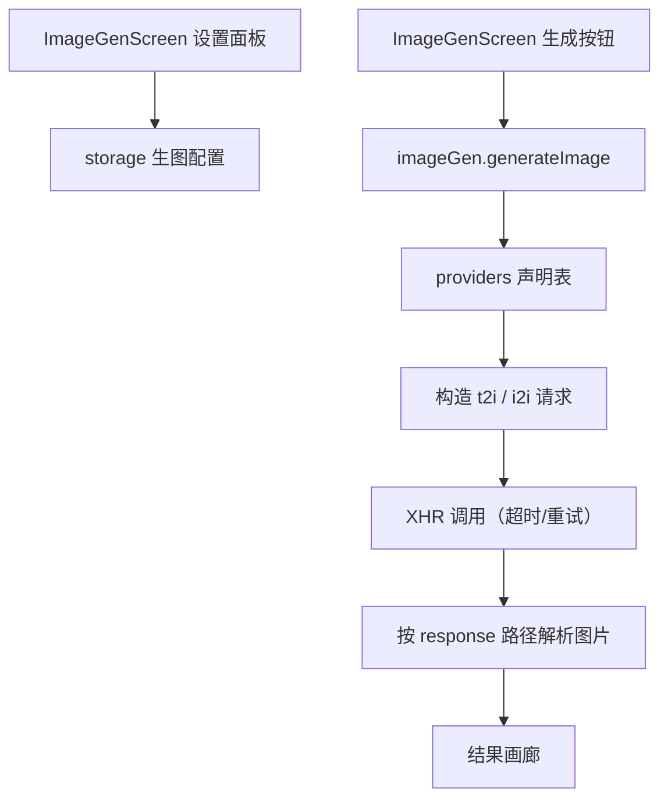

# 生图模块 技术设计

Feature Name: image-generation
Updated: 2026-09-18

## 描述

新增声明式生图 Provider 配置与统一适配层，并提供设置面板与生成界面。结构与 `plugins/providers.js` 同构，密钥由应用内填写。

## 架构



## 组件与接口

### `src/imageGen/providers.js`（新增）

每个 Provider 声明：

```text
{
  id, label,
  baseUrl,               // 或完整 endpoint
  method,                // GET | POST
  auth: { type: 'header'|'body'|'query', keyName, prefix? },
  modelField,            // 模型字段名
  promptField,           // prompt 字段名
  negativePromptField,
  params: { size, width, height, steps, guidance, seed },  // 参数名映射
  t2i: { template },     // 文生图请求模板（可编辑 JSON）
  i2i: {
    mode: 'multipart' | 'base64' | 'url',
    template
  },
  response: {
    path,                // 图片数组或对象路径
    urlField, base64Field
  },
  timeoutMs, retries,
  extraDefaults
}
```

内置 `z-image`、`wan-image`、`qwen-image`、`FLUX.2-klein-4B`、`GLM-Image`；无标准接口者按 OpenAI 兼容占位，允许用户覆盖模板。

### `src/imageGen/index.js`（新增）

- `generateImage({ provider, prompt, imageFile?, imageUrl?, model?, size?, seed?, extra? })` → `Promise<{ images: [{ url?, base64? }], raw }>`
- 流程：取 Provider 声明、放密钥、按模板与参数映射构造请求（GET 查询参数 `encodeURIComponent`）、文生图/图生图分支、超时与重试、按响应路径解析、统一错误。
- `getByPath` 复用点号取值；`multipart` 用 `FormData`，`base64`/`url` 走 JSON。
- 错误映射：401 → 「密钥无效或未授权」；429 → 「请求过于频繁，请稍后重试」；其他非 2xx → 「生成失败（HTTP xxx）」。

### `src/storage.js`

- 新增 `getImageGenSettings()` / `saveImageGenSettings(settings)`，键 `@easychat2_image_gen`：
  `{ activeProvider, providers: { [id]: { apiKey, baseUrl, model, extra } } }`。

### `src/ImageGenScreen.js`（新增）

- 顶部：provider 下拉、模型下拉、设置按钮。
- 中部：prompt 输入、上传图片（预览）、生成按钮与加载态。
- 底部：结果画廊（图片网格，点击下载/复制）。
- 设置面板：填写 API 地址、密钥、模型、额外参数（JSON）。

## 数据模型

```text
@easychat2_image_gen -> {
  activeProvider: string,
  providers: { [id]: { apiKey, baseUrl, model, extra } }
}
```

## 正确性属性

1. 密钥只存本机，不进入请求提示词或文档。
2. 未填密钥或地址时不发起请求并提示。
3. 响应解析兼容 URL、base64、`b64_json`、`data[].url`、`images[].url`。
4. 图生图必须携带图片（文件或 URL）。
5. 429/401 返回可读提示，超时与网络错误不崩溃。
6. 参数映射缺失时不发送该参数。

## 错误处理

- 401/429/其他非 2xx：转换为友好中文提示。
- 超时：`生成超时，请稍后重试`；超时后按 `retries` 重试。
- 解析不到图片：`未从响应中解析到图片`，并在调试信息中保留脱敏原文。

## 测试策略

- 脚本：请求构造（三种 auth、GET/POST、multipart/base64/url）、参数映射、响应解析各路径、错误码映射。
- 界面脚本：provider/模型切换、上传预览、加载态、画廊。
- 打包验证。

## 分期

1. Provider 声明表与 `generateImage`（含解析与错误）。
2. 设置存储与设置面板。
3. 生成界面与画廊。
4. 内置五个 Provider 模板与回归。

## 参考

[^1]: (src/plugins/providers.js) - 声明式 Provider 先例
[^2]: (src/plugins/webSearch.js) - 通用请求器先例
[^3]: (expo-file-system) - 文件读取
