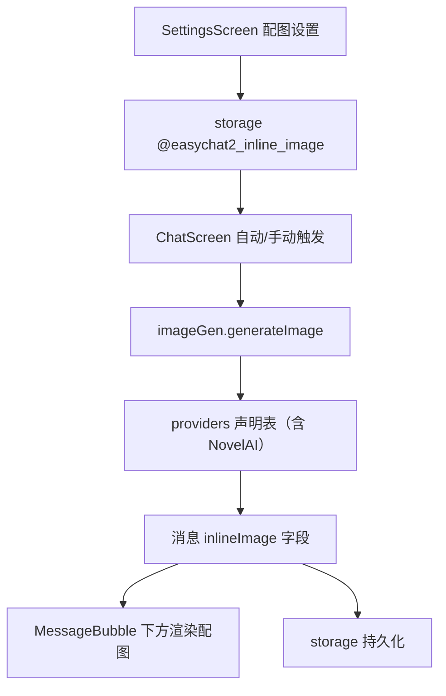

# 对话配图 技术设计

Feature Name: inline-image-gen
Updated: 2026-09-18

## 描述

复用 `src/imageGen` 模块为助手回复生成配图。消息新增可选 `inlineImage` 字段，聊天页在助手气泡下方渲染配图、加载态与失败重试。新增 NovelAI Provider 声明；配图行为由 `@easychat2_inline_image` 设置控制。

## 架构



## 组件与接口

### `src/imageGen/providers.js`

新增 `novelai` Provider：

```text
{
  id: 'novelai',
  label: 'NovelAI',
  baseUrl: 'https://image.novelai.net/ai/generate-image',
  method: 'POST',
  auth: { type: 'header', keyName: 'Authorization', prefix: 'Bearer ' },
  modelField: 'model',
  promptField: 'input',
  negativePromptField: 'negative_prompt',
  params: {
    size: 'size', steps: 'steps', guidance: 'scale', seed: 'seed',
  },
  t2i: {
    template: {
      input: '{prompt}',
      model: 'nai-diffusion-3',
      action: 'generate',
      parameters: {
        width: 832, height: 1216, scale: 5, sampler: 'k_euler',
        steps: 28, n_samples: 1, ucPreset: 0, qualityToggle: true,
      },
    },
  },
  i2i: {
    mode: 'base64',
    imageField: 'parameters.image',
    template: {
      input: '{prompt}',
      model: 'nai-diffusion-3',
      action: 'img2img',
      parameters: { image: '{image}', strength: 0.7, width: 832, height: 1216, steps: 28 },
    },
  },
  response: { mode: 'base64', path: 'images.0', base64Field: '' },
  timeoutMs: 120000,
  retries: 1,
  extraDefaults: {},
}
```

- NovelAI 标准接口返回 JSON（`images[0]` 为 base64 字符串），`parseImages` 已兼容字符串元素。
- `response.mode` 字段用于区分「响应体为 JSON」与「响应体为音频或图片二进制」，在 `imageGen/index.js` 的解析中扩展：当 `response.mode === 'binary'` 且响应非 JSON 时，把原始响应编码为 base64 返回。该扩展同时服务 TTS 模块不涉及此处。
- 尺寸参数映射：当 `size` 形如 `宽*高` 时，`params.size` 拆分为 `parameters.width` 与 `parameters.height`。通过 `sizeSplit: { width: 'parameters.width', height: 'parameters.height' }` 声明实现，避免为 NovelAI 写死分支。

### `src/imageGen/index.js`

- `parseImages` 增强：

```text
1. 若 provider.response.mode === 'binary' → 把原始响应文本按 base64 包装为一个图片项
2. 否则按现有 path 与 urlField/base64Field 解析
3. 字符串元素若以 data:image 或 http 开头 → url；否则 → base64
```

- `buildRequest` 支持 `sizeSplit` 声明。

### `src/storage.js`

- 新增 `getInlineImageSettings()` / `saveInlineImageSettings(settings)`，键 `@easychat2_inline_image`：

```text
{
  enabled: boolean,          // 自动配图
  providerId: string,        // 复用 imageGen settings 的 provider id
  stylePrefix: string,       // 追加到提示词语境
  size: string,              // '宽*高'
  maxPromptChars: number,    // 默认 400
}
```

### `src/ChatScreen.js`

- 助手消息占位新增 `inlineImage: null` 字段，取值：

```text
null | { status: 'loading' } | { status: 'done', url?, base64? } | { status: 'error', message }
```

- 自动配图：单聊助手回复完成且 `enabled` 为真时调用；群聊按设计中默认仅手动触发，避免群聊批量生图。
- 手动配图：助手气泡下方按钮触发。
- 并发控制：模块级 `Map` 按会话 id 限制同时最多 1 个配图请求，超出时提示稍后重试。
- 持久化：`status: 'done'` 的配图写入消息；`loading` 与 `error` 不持久化（与 `pending` 占位同一原则）。
- `MessageBubble` 下方渲染配图、加载态与失败重试按钮。

### `src/SettingsScreen.js`

- 复用生图 Provider 选择（来自 `imageGen` 设置），新增「对话配图」横档：自动配图开关、提示词风格前缀、尺寸、最大提示词长度。

## 数据模型

```text
message.inlineImage?: { url?: string, base64?: string }
@easychat2_inline_image -> { enabled, providerId, stylePrefix, size, maxPromptChars }
```

## 正确性属性

1. 未配置生图服务时不发起请求并给出提示。
2. 同一条消息不重复生成配图。
3. `loading` 与 `error` 状态不写入持久化。
4. 配图失败不影响消息文本状态与后续对话。
5. NovelAI 与既有 Provider 走同一调用路径，无 NovelAI 专属分支。
6. 提示词长度受 `maxPromptChars` 限制。

## 错误处理

- 生图失败：气泡下方展示「配图生成失败」与重试按钮。
- 并发超限：提示「配图生成中，请稍后」。
- 解析失败：提示「未获取到图片」。

## 测试策略

- 脚本：NovelAI Provider 请求构造（模型、prompt、参数映射、尺寸拆分）。
- 脚本：`parseImages` 对 `mode: 'binary'`、字符串 base64、`images[0]` 的解析。
- 脚本：提示词截断与风格前缀拼接。
- 脚本：配图状态机（loading → done / error）与不持久化规则。
- 打包验证与手动验证（手动与自动两种模式）。

## 参考

[^1]: (src/imageGen/providers.js) - Provider 声明先例
[^2]: (src/imageGen/index.js) - 统一适配层
[^3]: (.monkeycode/specs/2026-09-18-image-generation/design.md) - 生图模块设计
