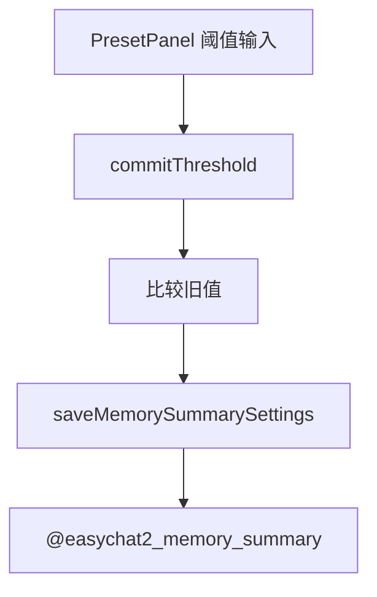

# 记忆总结默认与阈值修复 技术设计

Feature Name: memory-summary-defaults
Updated: 2026-09-18

## 描述

两个改动：把 `DEFAULT_MEMORY_SUMMARY.enabled` 改为 `true`；修复 `PresetPanel.commitThreshold` 中因先改写 `threshold` 再比较导致永不保存的逻辑错误。提示词与关键词部分先留扩展点，等待用户提供文案后填入。

## 架构



## 组件与接口

### `src/storage.js`

```text
const DEFAULT_MEMORY_SUMMARY = { enabled: true, threshold: 40 };
```

- 仅默认值变化；`normalizeMemorySummary` 逻辑不变，用户已保存的 `enabled: false` 继续生效。

### `src/PresetPanel.js`

- 修复 `commitThreshold`：

```text
const previous = Number(threshold);
const parsed = Math.trunc(Number(String(threshold).trim()));
const value = Number.isFinite(parsed) && parsed > 0 ? parsed : THRESHOLD_FALLBACK;
// 先比较旧值，再更新输入框
if (previous !== value) {
  setThreshold(String(value));
  persistMemory(memoryEnabled, value);
} else {
  setThreshold(String(value));
}
```

- 关键点：读取 `previous` 必须在 `setThreshold` 之前，避免自比较。
- 非法值仍提示「阈值无效」并回退 `THRESHOLD_FALLBACK`。

### 扩展点（等待用户文案）

- `src/memorySummary.js`：把硬编码提示词抽为模块常量 `SUMMARY_PROMPT_TEMPLATE`，便于后续替换。
- 世界书关键词增强**仅作用于记忆总结自动写入的条目**：在 `memorySummary.js` 生成条目的位置定义 `SUMMARY_KEYWORDS` 常量数组与对应 `weight`，写条目时一并写入 `keys` 与重要性；用户手写条目不受影响。
- 等待用户提供：具体关键词清单与重要性数值。

## 数据模型

```text
@easychat2_memory_summary -> { enabled: boolean, threshold: number }
默认 { enabled: true, threshold: 40 }
```

## 正确性属性

1. 未保存过设置时 `enabled` 为 `true`。
2. 已保存 `enabled: false` 的用户不被强制开启。
3. 阈值从 A 改到 B 必定写入一次。
4. 阈值未变化不写入。
5. 非法阈值回退并提示。

## 错误处理

- 保存失败：`Alert` 提示，输入框回退到保存前值（由 `persistMemory` 的失败分支保持不变，需将回退逻辑补上）。

## 测试策略

- 脚本：`normalizeMemorySummary` 默认值（缺省/部分字段/非法 threshold）。
- 脚本：阈值变更判定逻辑（A→B 写入、A→A 不写入、非法回退）。
- 打包验证与手动验证。

## 参考

[^1]: (src/storage.js#L793) - 默认值与规范化
[^2]: (src/PresetPanel.js#L173) - 缺陷位置
[^3]: (src/memorySummary.js) - 提示词扩展点
