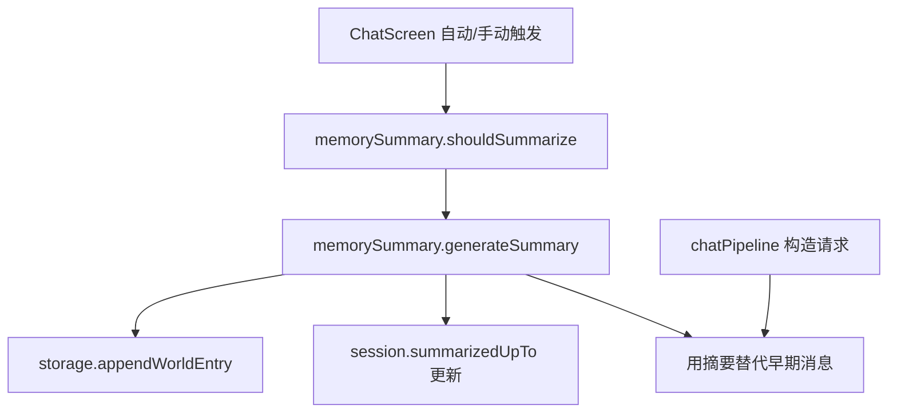

# 记忆总结 技术设计

Feature Name: memory-summary
Updated: 2026-09-18

## 描述

为长对话提供摘要压缩：达到阈值或手动触发时，调用 LLM 总结较早消息，把摘要与关键词写入当前角色世界书；发送请求时用摘要替代被总结的早期消息。

## 架构



## 组件与接口

- `src/memorySummary.js`（新增）：
  - `shouldSummarize(session, messages, settings)`：判断是否达到阈值与存在可总结消息。
  - `selectSummarizable(messages, summarizedUpTo, keepRecent)`：返回可总结区间。
  - `generateSummary({ character, messages })`：调用 LLM，返回 `{ summary, keywords }`。
  - `applySummary({ sessionId, characterId, messages })`：写世界书、更新边界。
- `src/storage.js`：新增 `getMemorySummarySettings()` / `saveMemorySummarySettings`；会话增加 `summarizedUpTo` 字段；提供更新会话的方法。
- `src/chatPipeline.js`：当传入摘要信息时，用一条 `system` 摘要消息替代边界之前的历史。
- `src/ChatScreen.js`：自动触发、手动「总结记忆」按钮、进行中互斥、失败提示。
- 世界书写入复用 `character.worldInfo` 与 `updateCharacter`。

## 数据模型

```text
@easychat2_memory_summary -> { enabled: boolean, threshold: number }
session.summarizedUpTo    -> "<messageId>" | null
worldInfo 条目（摘要）:
  { id, comment: "记忆总结 1", keys: [...], content: "<摘要>", constant: false, enabled: true, ... }
```

## 正确性属性

1. 总结边界单调前移，已总结消息不重复总结。
2. 请求压缩后，最近若干条消息始终保留。
3. 摘要条目权限与普通世界书条目一致，可编辑与删除。
4. 总结失败时消息、边界与已有关键词条目均不变。
5. 同一会话在总结进行中不重复触发。

## 错误处理

- LLM 调用失败或返回非 JSON：保留原状并提示「记忆总结失败」。
- 关键词解析为空：使用固定关键词兜底并记入条目。
- 世界书写入失败：不更新边界，下次可重试。

## 测试策略

- 单元脚本：阈值判断、边界选择、关键词兜底、非法 JSON 处理。
- 请求压缩脚本：有/无边界时的消息序列对比。
- 世界书写入脚本：累积多条、可编辑删除、失败不更新边界。
- Android 导出验证。

## 分期

1. 设置存储与手动总结（写世界书）。
2. 请求压缩与边界记录。
3. 自动触发、互斥与失败提示。
4. 回归与打包验证。

## 参考

[^1]: (src/chatPipeline.js#L50) - 请求构造
[^2]: (src/lorebook.js#L1) - 世界书注入逻辑
[^3]: (src/storage.js#L345) - 消息读写