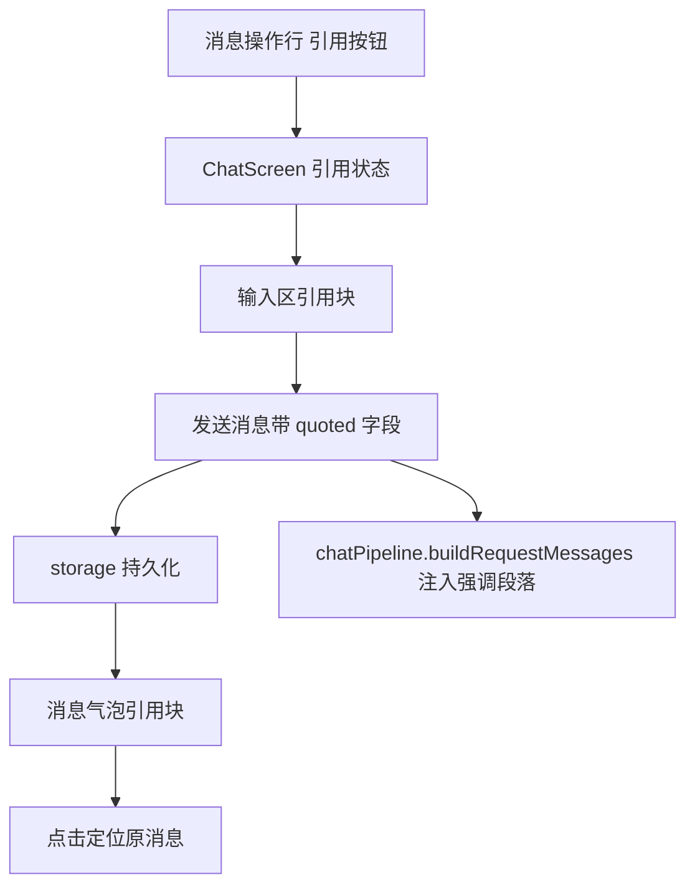

# 消息引用 技术设计

Feature Name: message-quote
Updated: 2026-09-18

## 描述

为消息增加可选 `quoted` 字段，记录被引消息的发送者、文本摘要与消息标识。聊天页支持长按引用、输入区展示引用块、消息气泡展示引用块并支持跳转定位，组装请求时把被引内容以强调段落写入用户消息。

## 架构



## 组件与接口

### 消息模型扩展

```text
message.quoted = {
  id: string,        // 被引消息 id
  name: string,      // 发送者名称（用户人设名或角色名）
  role: string,      // 'user' | 'assistant'
  text: string,      // 文本摘要，最长 QUOTE_TEXT_MAX 字
}
```

- `QUOTE_TEXT_MAX` 建议 200，超出以省略号截断。
- 图片或附件消息的摘要取该消息的 `text`，为空时取「[图片]」或「[附件]」。

### `src/ChatScreen.js`

- 新增状态 `quoteTarget`（当前引用目标消息）与输入区引用块渲染。
- 消息操作行新增「引用」按钮，回调写入 `quoteTarget`。
- 发送时把 `quoted` 附加到用户消息对象；发送成功后清空 `quoteTarget`。
- `MessageBubble` 增加 `quoted` 渲染与 `onPressQuote` 回调；点击时通过消息列表的定位机制滚动到原消息。
- 原消息不存在时引用块展示占位文案。

### `src/chatPipeline.js`

`buildRequestMessages` 新增可选参数 `quote`（或从最后一条用户消息的 `quoted` 读取），在用户消息文本前追加：

```text
[引用 <name> 的消息] <text>
```

- 已存在其他前缀段落时按既有顺序拼接，引用段置于最前。
- 群聊路径复用同一逻辑。

### 定位复用

- 复用现有会话内搜索的定位机制（`ScrollScrubber` 与搜索定位目标），将目标消息 id 传入即可滚动并对目标做高亮。

## 数据模型

```text
@easychat2_messages::<sessionId> -> [
  { id, role, content, ..., quoted?: { id, name, role, text } }
]
```

## 正确性属性

1. `quoted` 为可选字段，缺失时渲染与请求组装均与现状一致。
2. 引用块文本长度受限，不因超长内容破坏布局。
3. 引用注入只影响当前用户消息，不改动历史消息。
4. 克隆会话、批量删除、搜索等既有操作保留 `quoted` 字段。

## 错误处理

- 引用目标已删除：气泡内展示「原消息已删除」，点击不跳转。
- 定位失败：静默忽略，不弹出错误。

## 测试策略

- 脚本：`buildRequestMessages` 在有/无引用时的输出对比；群聊路径一致；截断长度。
- 脚本：消息克隆与删除后 `quoted` 字段保留。
- 打包验证与手动交互验证。

## 参考

[^1]: (src/chatPipeline.js) - 请求组装
[^2]: (src/ChatScreen.js#L474) - 消息操作行
[^3]: (src/ScrollScrubber.js) - 会话内定位机制
