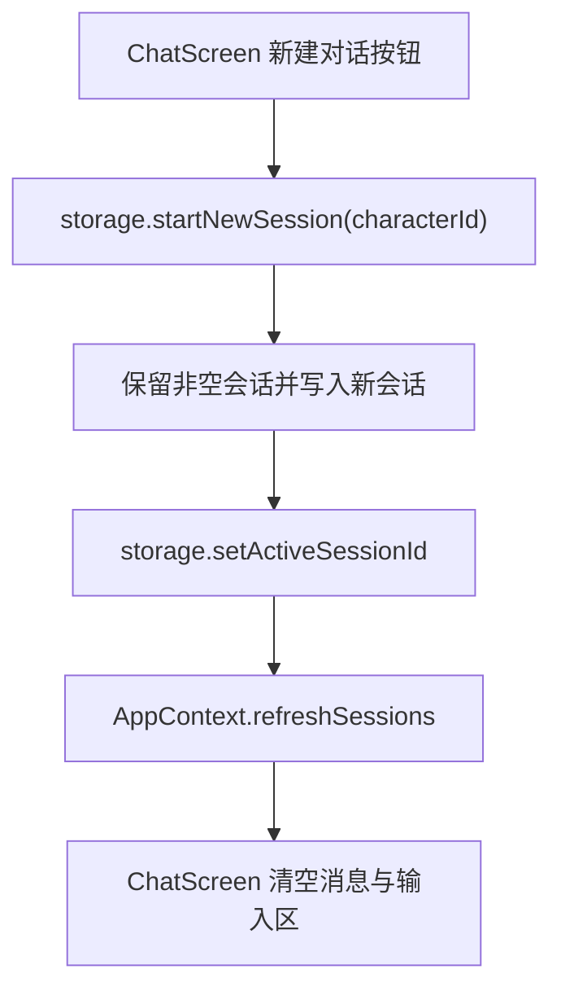

# 新建对话 技术设计

Feature Name: new-chat-session
Updated: 2026-09-18

## 描述

聊天页新增「新建对话」按钮，复用 `storage.startNewSession` 为当前角色开启新会话并切换，随后刷新会话列表。原会话保留在记忆页。

## 架构



## 组件与接口

### `src/ChatScreen.js`

- 顶部栏新增「新建对话」按钮（`Ionicons` 的 `add-circle-outline` 或 `create-outline`）。
- 处理流程：

```text
1. 若当前会话消息为空 → Alert 提示「当前对话还没有内容」并返回
2. 若存在进行中的请求 → 中止并置空 abort 引用
3. await startNewSession(characterId)
4. await refreshSessions()
5. 清空本地 messages、input、attachments、quoteTarget；重置会话内搜索与定位状态
6. 调用 tts.stop()（若已启用播报）
```

- 群聊场景：`startNewSession` 需要角色 id。群聊会话的基础角色取 `activeId`（当前激活角色），并复用既有群聊创建入口；若当前为群聊且存在 `members`，设计中采用与「发起群聊」相同的成员集合创建新群聊会话。

### `src/storage.js`

- 复用 `startNewSession(characterId)` 与现有 `createGroupSession(members, name)`，不新增持久化键。
- 如需为群聊提供「按成员新建」，在 `sessionLibrary` 中复用 `buildGroupSession`。

### `src/context/AppContext.js`

- 复用 `refreshSessions`；不新增状态。

## 数据模型

无新增字段；沿用会话元数据的 `id`、`characterId`、`members`、`createdAt`、`updatedAt`。

## 正确性属性

1. 点击后旧会话消息不丢失，新会话初始为空。
2. 空会话点击不产生多个空会话。
3. 迟到的助手回复不写入新会话（由既有 `activeCharacterIdRef` 与会话 `id` 守卫保证）。
4. 全局设置（模型、思考、插件、播报）不受影响。

## 错误处理

- 创建失败：`Alert` 提示「新建对话失败，请重试」，保持当前会话。
- 空会话：`Alert` 提示「当前对话还没有内容」。
- 中止请求失败：静默忽略。

## 测试策略

- 脚本：`startNewSession` 在「存在空会话」「存在非空会话」「无会话」三种输入下的输出与 active 切换。
- 脚本：新建后原会话仍在会话列表中。
- 打包验证与手动验证（含群聊）。

## 参考

[^1]: (src/storage.js#L835) - `startNewSession`
[^2]: (src/context/AppContext.js) - `refreshSessions`
