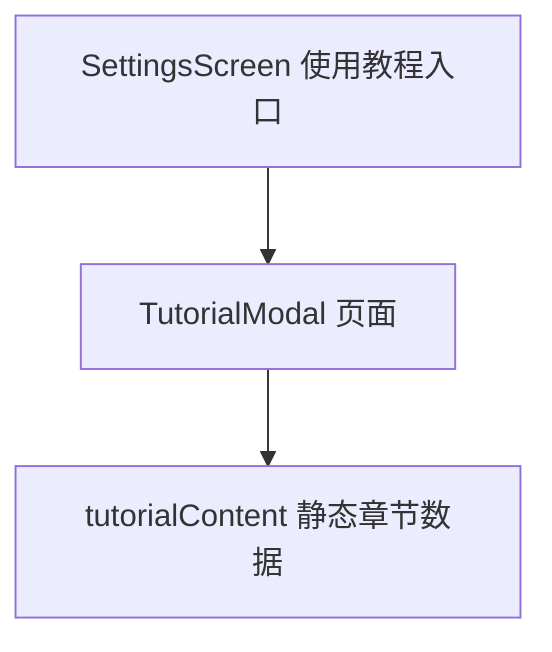

# 新手教学 技术设计

Feature Name: onboarding-tutorial
Updated: 2026-09-18

## 描述

设置页新增「使用教程」入口，打开全屏教程页面。内容为静态数据，按四章展示按钮位置与用法，不触碰业务状态。

## 架构

## 组件与接口

- `src/tutorialContent.js`（新增）：导出章节数组，结构为 `{ id, title, icon, intro, items: [{ name, where, usage }] }`。
- `src/TutorialModal.js`（新增）：props `{ visible, onClose }`，全屏 `Modal` + `ScrollView`，按章节渲染。
- `src/SettingsScreen.js`：在「全局配置」附近新增「使用教程」入口行。

## 数据模型

静态常量，无持久化。

## 正确性属性

1. 四个章节均存在且条目非空。
2. 教程只读，打开与关闭不修改任何存储。
3. 关闭后设置页滚动位置与状态不变。

## 错误处理

无外部依赖，无需网络；章节数据缺失时隐藏对应区块。

## 测试策略

- 脚本校验章节覆盖四类界面且每条目含位置与用法字段。
- 渲染脚本校验入口打开与关闭回调。
- Android 导出验证。

## 分期

1. 教程内容数据与页面组件。
2. 设置页入口接线与回归。

## 参考

[^1]: (src/SettingsScreen.js#L523) - 设置页结构
[^2]: (src/disclaimer.js#L1) - 现有弹窗组件样式参考