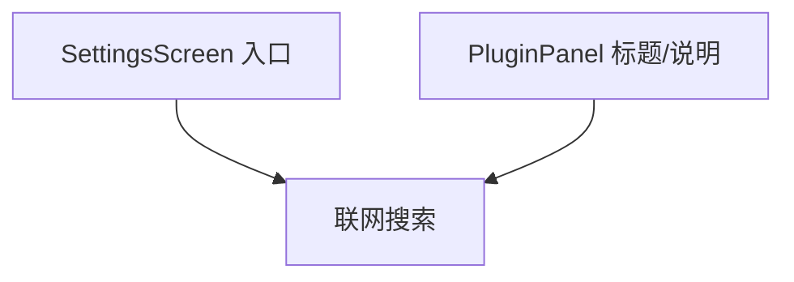

# 插件更名为联网搜索 技术设计

Feature Name: plugin-rename
Updated: 2026-09-18

## 描述

仅调整展示文案，不改数据结构与逻辑。涉及 `SettingsScreen` 入口行、`PluginPanel` 标题与说明，以及文档中的相关表述。

## 架构

## 组件与接口

### `src/SettingsScreen.js`

- 入口行文案「插件」→「联网搜索」，图标可沿用或改为 `search-outline`。

### `src/PluginPanel.js`

- 面板标题「插件」→「联网搜索」。
- 说明文案中的「插件」改为「联网搜索」，语义不变。

### 其他界面

- 全局搜索界面文案中的「插件」并替换为「联网搜索」；仅内部模块名 `plugins/`、存储键 `@easychat2_plugins` 保持不变。

### 文档

- `INTERFACES.md`、`模块/界面层.md` 中「插件」入口描述同步更名（保留「插件」作为内部模块名说明）。

## 数据模型

无变化：`@easychat2_plugins` 与插件对象结构不变。

## 正确性属性

1. 更名不改变存储键与配置结构。
2. 既有启用状态与密钥配置继续生效。
3. 面板内功能与联动不变。

## 错误处理

无新增错误路径。

## 测试策略

- 静态检查：界面文案不含旧称（内部模块名除外）。
- 手动验证：入口与面板文案。
- 打包验证。

## 参考

[^1]: (src/SettingsScreen.js) - 入口
[^2]: (src/PluginPanel.js) - 面板文案
