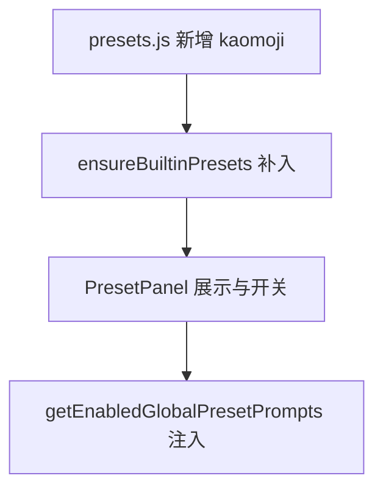

# 颜文字预设 技术设计

Feature Name: preset-kaomoji
Updated: 2026-09-18

## 描述

在 `src/presets.js` 的 `GLOBAL_PRESETS` 数组末尾追加一项内置预设，默认关闭（沿用 `@easychat2_global_presets` 的缺省逻辑：未显式开启即为关闭）。

## 架构



## 组件与接口

### `src/presets.js`

```text
{
  id: 'kaomoji',
  name: '颜文字',
  description: '允许角色在回复中适度使用颜文字与表情符号。',
  prompt: '可以在回复中适度使用颜文字或表情符号来表达情绪，保持自然、不堆砌、不影响原意；严肃或悲伤的语境下克制使用。',
}
```

- 追加到数组末尾，不改动既有项。
- 若存在 `ensureBuiltinPresets` 之类的补全逻辑，会自动补入缺失项。

### `src/storage.js`

- 无需新增键；沿用 `@easychat2_preset_list`（用户可编辑列表）与 `@easychat2_global_presets`（开关映射）。
- 确认内置项补全逻辑会把新预设加入已存在的用户列表。

### `src/chatPipeline.js`

- 无需改动：已开启预设经 `getEnabledGlobalPresetPrompts` 注入 `[全局预设]` 段。

## 数据模型

```text
GLOBAL_PRESETS 新增一项；开关沿用 @easychat2_global_presets[kaomoji]（默认未设置 = 关闭）
```

## 正确性属性

1. 新预设默认关闭。
2. 开启后注入、关闭后不注入。
3. 既有预设顺序与内容不变。
4. 已保存过预设列表的用户会自动补入该内置项。

## 错误处理

无新增错误路径。

## 测试策略

- 脚本：`GLOBAL_PRESETS` 包含 `kaomoji` 且字段完整；`normalizePresetList` 对缺失内置项的补入。
- 打包验证与手动验证开关注入。

## 参考

[^1]: (src/presets.js) - 预设清单
[^2]: (src/storage.js) - 预设列表与补全
[^3]: (.monkeycode/specs/2026-09-18-global-preset-entry/) - 预设入口
