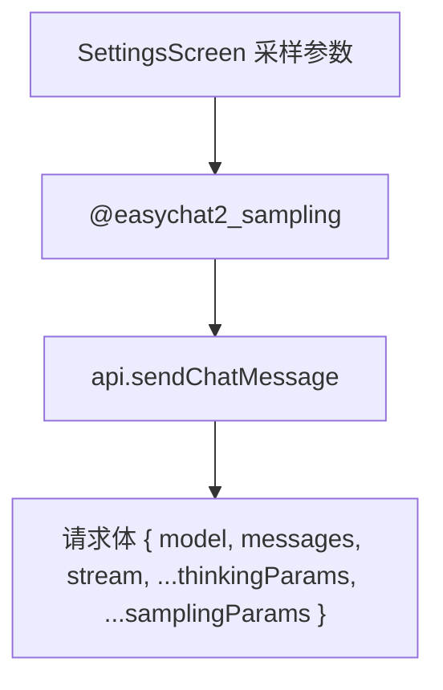

# 生成采样参数设置 技术设计

Feature Name: sampling-settings
Updated: 2026-09-18

## 描述

新增 `@easychat2_sampling` 设置（四项独立开关 + 数值），并在 `sendChatMessage` 请求体中按开关注入。参数与既有思考参数共存，统一在请求体最后合并。

## 架构



## 组件与接口

### `src/storage.js`

```text
@easychat2_sampling -> {
  maxTokens:  { enabled: boolean, value: number },   // 1 - 128000，默认 8024
  temperature:{ enabled: boolean, value: number },   // 0 - 2，默认 1
  topP:       { enabled: boolean, value: number },   // 0 - 1，默认 1
  topK:       { enabled: boolean, value: number },   // 0 - 50，默认 0
}
```

- 全部 `enabled` 默认 `false`。
- `normalizeSampling` 夹取范围并按字段类型取整（maxTokens、topK 为整数）。

### `src/api.js`

- 新增 `buildSamplingParams(sampling)`：

```text
{
  ...(maxTokens.enabled ? { max_tokens: value } : {}),
  ...(temperature.enabled ? { temperature: value } : {}),
  ...(topP.enabled ? { top_p: value } : {}),
  ...(topK.enabled ? { top_k: value } : {}),
}
```

- `sendChatMessage` 读取 `getSamplingSettings()` 并合并到请求体，位于 `thinkingParams` 之后（采样参数可覆盖同名字段，符合用户显式设置优先）。

### `src/SettingsScreen.js`

- 新增「生成参数」卡片，每项一行：开关 + `TextInput`（`keyboardType="decimal-pad"` 或 `number-pad`）。
- 输入失焦时校验并夹取，非法提示「数值超出范围，已调整为 n」。
- 复用 `updateChatOption` 式的 ref 基准更新，避免竞态。

## 数据模型

见 `@easychat2_sampling`。

## 正确性属性

1. 全部开关默认关闭，默认不发送任何采样参数。
2. 仅开启的参数被发送。
3. 数值在范围内，越界被夹取。
4. 开关关闭时数值保留。
5. 与思考参数不冲突（不同字段互不影响）。

## 错误处理

- 非法输入：提示并夹取；空字符串回退默认值。
- 读取失败：回退全默认。

## 测试策略

- 脚本：`normalizeSampling` 各字段范围与整数化、非法回退、开关默认。
- 脚本：`buildSamplingParams` 在四种开关组合下的输出。
- 脚本：请求体合并（采样参数与思考参数并存）。
- 打包验证与手动验证。

## 参考

[^1]: (src/api.js) - 请求体构造与 `buildThinkingParams`
[^2]: (src/storage.js) - 设置规范化模式
[^3]: (.monkeycode/specs/2026-09-18-sampling-settings/requirements.md) - 需求来源
