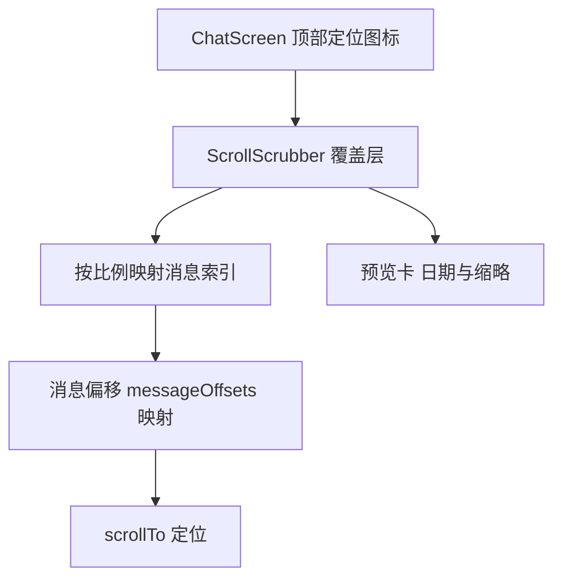

# 快速定位滑动条 技术设计

Feature Name: scroll-scrubber
Updated: 2026-09-18

## 描述

在聊天页增加可拖动的定位滑动条，基于消息索引映射与已记录的布局偏移实现定位，消息极多时显示预览卡。

## 架构



## 组件与接口

- `src/ScrollScrubber.js`（新增）：props `{ visible, onClose, messageCount, offsets, previews, onSeek, onToStart, onToEnd }`。
- `src/ChatScreen.js`：顶部栏定位图标、通过 `onLayout` 记录每条消息偏移、构建预览数据、处理 `onSeek`。
- 与搜索功能共用 `messageOffsetsRef`。

## 数据模型

无持久化：

```text
messageOffsets: number[]        // 每条消息的 y 偏移
previews: [{ label, speaker, text }]
```

## 正确性属性

1. 拖动预览与松手后的跳转位置一致。
2. 映射基于消息索引，超长列表仍能定位到单条消息。
3. 打开与关闭滑动条不修改消息与会话。
4. 偏移缺失时回退为按内容比例滚动。

## 错误处理

- 消息尚未测量出偏移：回退到按比例估算并延迟重试。
- 无消息：隐藏滑动条并提示。

## 测试策略

- 映射函数单元脚本：不同消息数与滑动比例。
- 超长列表脚本：500 条以上映射精度。
- 渲染脚本：覆盖层、上下按钮、预览卡。
- Android 导出验证。

## 分期

1. 滑动条界面与上下按钮。
2. 索引映射与定位。
3. 拖动预览与超长处理。

## 参考

[^1]: (src/ChatScreen.js#L913) - 消息列表 ScrollView
[^2]: (src/ChatScreen.js#L497) - 现有滚动到底部实现