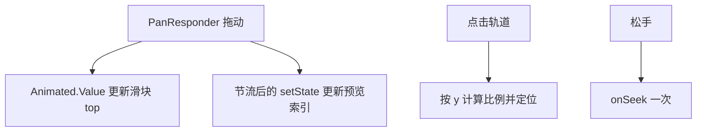

# 定位滑动条优化 技术设计

Feature Name: scrubber-smooth
Updated: 2026-09-18

## 描述

重构 `ScrollScrubber` 的拖动与外观：用 `Animated.Value` + `setValue` 让滑块位置在拖动中直接驱动原生视图偏移，避免每帧 `setState` 引起的重渲染；轨道改为透明，滑块改为细长长椭条，并支持点击轨道跳转。

## 架构



## 组件与接口

### `src/ScrollScrubber.js`

- 拖动位置改用 `useRef(new Animated.Value(0))`：

```text
onPanResponderMove → translateY.setValue(ratio * usable)
拖动中仅更新一个轻量 state（previewIndex）用于预览文本
松手时才调用 onSeek
```

- 预览索引更新做节流：仅当索引变化时 `setState`（对比 `previewIndexRef`），避免每个像素都触发渲染。
- 滑块：

| 属性 | 取值 |
|------|------|
| 形状 | 长椭条，`width: 10`、`height: 44`、`borderRadius: 5` |
| 位置 | `Animated.View` + `transform: [{ translateY }]`，`useNativeDriver: false`（布局位移） |
| 颜色 | `theme.colors.primary`，边缘 `theme.colors.primarySoft` |

- 轨道：`backgroundColor: 'transparent'`，宽度居中，两侧保留「回到开头」「回到最新」按钮。
- 点击轨道：外层 `PanResponder` 记录 `locationY`，调用与拖动相同的比例换算，释放时按映射索引触发 `onSeek` 并更新预览。
- 边界裁剪：`usable = trackHeight - THUMB_HEIGHT`，`translateY` 限制在 `[0, usable]`。

### 性能约束

- 拖动过程中不调用 `onSeek`，不触发消息列表滚动。
- 预览文本仅在索引变化时更新。

## 数据模型

无新增持久化数据。

## 正确性属性

1. 滑块位置与拖动位置一致，无跳变。
2. 拖动过程仅一处轻量 state 更新（预览索引）。
3. 松手仅一次定位回调。
4. 轨道透明，滑块为长椭条。
5. 点击轨道会按点击位置触发一次定位。

## 错误处理

- 轨道高度为 0（未布局完成）时，忽略拖动与点击。
- 消息数量为 0 时，端点按钮禁用。

## 测试策略

- 脚本：`indexFromRatio` 边界（0、1、负值、超界、0 条消息）。
- 手动验证：拖动流畅度、点击轨道、端点跳转、预览对应关系。
- 打包验证。

## 参考

[^1]: (src/ScrollScrubber.js) - 现有实现
[^2]: (.monkeycode/specs/2026-09-18-scrubber-smooth/requirements.md) - 需求来源
