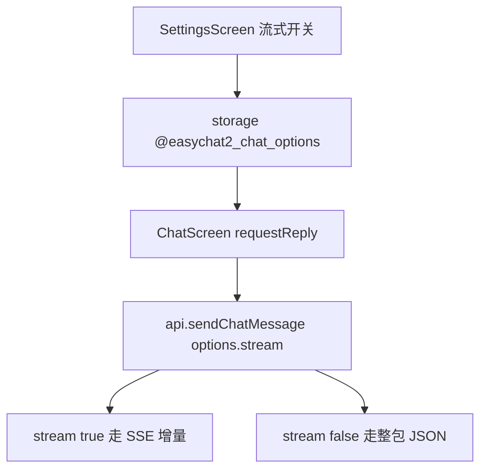

# 流式输出开关 技术设计

Feature Name: streaming-toggle
Updated: 2026-09-18

## 描述

为 `sendChatMessage` 增加 `stream` 选项，默认 `true` 保持现状；关闭时请求体 `stream: false`，走既有整包 JSON 解析分支。设置页新增开关，持久化在 `@easychat2_chat_options`。

## 架构



## 组件与接口

### `src/api.js`

- `sendChatMessage(messages, options)` 新增 `options.stream`（默认 `true`）。
- 请求体改为 `{ model, messages, stream: streamOption, ...thinkingParams }`。
- 当 `streamOption` 为 `false`：

```text
1. 不注册 onprogress 增量解析（或解析到 SSE 仍按既有分支兜底）
2. 依赖 xhr.onload 的整包 JSON 分支取 choices[0].message.content
3. 保留 signal 取消、超时、错误格式化行为
4. 若服务端忽略 stream 参数返回 SSE，既有 sawSse 分支仍可正确解析（兼容不变）
```

- 返回类型仍为 `Promise<string>`，不改签名结构。

### `src/storage.js`

- 新增键 `@easychat2_chat_options`：

```text
{ streaming: boolean, fullWidth: boolean }
```

- 新增 `getChatOptions()` / `saveChatOptions(options)`，读取时校验布尔值，默认 `{ streaming: true, fullWidth: false }`。
- 该键同时承载全宽对话设置（见 `full-width-chat` 设计），避免两个设置页开关各占一个键。

### `src/ChatScreen.js`

- 加载设置后，在 `requestReply` 与 `requestGroupReply` 调用 `sendChatMessage` 时传入 `stream`。
- 关闭流式时，等待期间维持既有「正在思考」占位；收到完整文本后一次性填充。

### `src/SettingsScreen.js`

- 新增「流式输出」开关，写入 `@easychat2_chat_options` 的 `streaming` 字段，并在同一横档内与「全宽对话」并列展示。

## 数据模型

```text
@easychat2_chat_options -> { streaming: boolean, fullWidth: boolean }
```

## 正确性属性

1. 默认 `streaming: true` 时行为与当前版本完全一致。
2. 关闭流式时请求体 `stream` 为 `false`。
3. 关闭流式仍可取消、仍触发超时、错误提示一致。
4. 服务端返回 SSE 时两种模式均能正确解析。
5. 开关变更只影响后续请求。

## 错误处理

- 非流式响应解析失败：沿用「接口返回了无法解析的内容。」
- 空响应：`没有收到回复。`
- 设置读取失败：回退默认值，静默处理。

## 测试策略

- 脚本：`sendChatMessage` 请求体在 `stream` 两种取值下的构造（注入 XHR 桩）。
- 脚本：整包 JSON 分支返回 `choices[0].message.content`。
- 脚本：`getChatOptions` 对缺失与非法值的默认回退。
- 打包验证与手动验证（关闭流式后发送一条消息）。

## 参考

[^1]: (src/api.js#L261) - 请求体构造位置
[^2]: (src/api.js#L247) - 整包 JSON 解析分支
