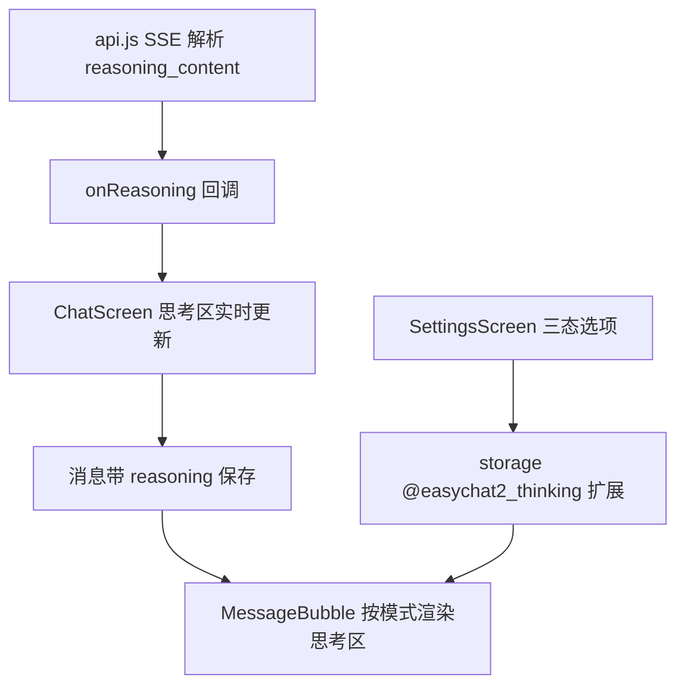

# 思考内容展示 技术设计

Feature Name: thinking-display
Updated: 2026-09-18

## 描述

在 `api.js` 解析流式思考增量并回调，在消息模型新增可选 `reasoning` 字段持久化。聊天页按设置的三态模式展示思考区；设置页提供三态选项并按当前来源能力给出说明。

## 架构



## 组件与接口

### `src/api.js`

- 新增 `extractReasoningDelta(payload)`：取 `choices[0].delta.reasoning_content`，兼容 `choices[0].message.reasoning_content`。
- `sendChatMessage(messages, options)` 新增 `options.onReasoning(fullReasoning: string)` 回调；内部累计 `fullReasoning`，每收到增量时回调。
- 非流式整包分支同样解析 `reasoning_content`，并在返回前回调一次。
- 导出 `sendChatMessage` 的返回结构保持为字符串；思考内容通过回调交付，避免破坏既有调用。

### `src/storage.js`

- `@easychat2_thinking` 扩展为：

```text
{
  enabled: boolean,          // 既有：是否启用思考参数
  level: 'low'|'medium'|'high',
  display: 'open' | 'fold' | 'off'   // 新增，默认 'fold'
}
```

- `normalizeThinking` 校验 `display` 取值，非法回退 `'fold'`。

### `src/ChatScreen.js`

- 生成助手占位消息时新增 `reasoning: ''`；`onReasoning` 回调更新当前占位消息的 `reasoning` 与派生展示。
- 消息持久化时保留 `reasoning`；`pending` 占位仍不落盘。
- `MessageBubble` 新增思考区渲染：

| 模式 | 行为 |
|------|------|
| `open` | 常驻展开，展示完整思考文本 |
| `fold` | 默认折叠，显示一行摘要与「展开/收起」 |
| `off` | 不渲染思考区 |

- 折叠态占位高度固定一行，展开后随内容增高。
- 思考区与正式回复之间以细分隔线区分，样式弱于正文。

### `src/SettingsScreen.js`

- 在模型能力区或独立横档中提供三态选择；当 `selected.supportsThinking` 为假时展示说明“当前来源未标记支持思考”。

## 数据模型

```text
message.reasoning?: string
@easychat2_thinking -> { enabled, level, display }
```

## 正确性属性

1. 无思考字段的响应不产生思考区。
2. 思考内容与正式回复分别累计，互不污染。
3. `display: 'off'` 时思考文本不进入渲染树。
4. 思考字段随消息持久化，克隆会话保留。
5. 既有 `enabled` 与 `level` 语义不变，仅新增 `display`。

## 错误处理

- 思考解析失败：忽略该增量，不影响正式回复累计。
- 设置读取失败：回退 `fold`。

## 测试策略

- 脚本：`extractReasoningDelta` 对 `delta` 与 `message` 两种形态；缺失字段返回空。
- 脚本：`normalizeThinking` 对非法 `display` 回退。
- 脚本：思考与正文累计互不干扰（用桩 payload 序列驱动解析函数）。
- 打包验证与手动验证三种模式的显示效果。

## 参考

[^1]: (src/api.js#L139) - SSE 行处理
[^2]: (src/storage.js#L296) - 思考设置规范化
