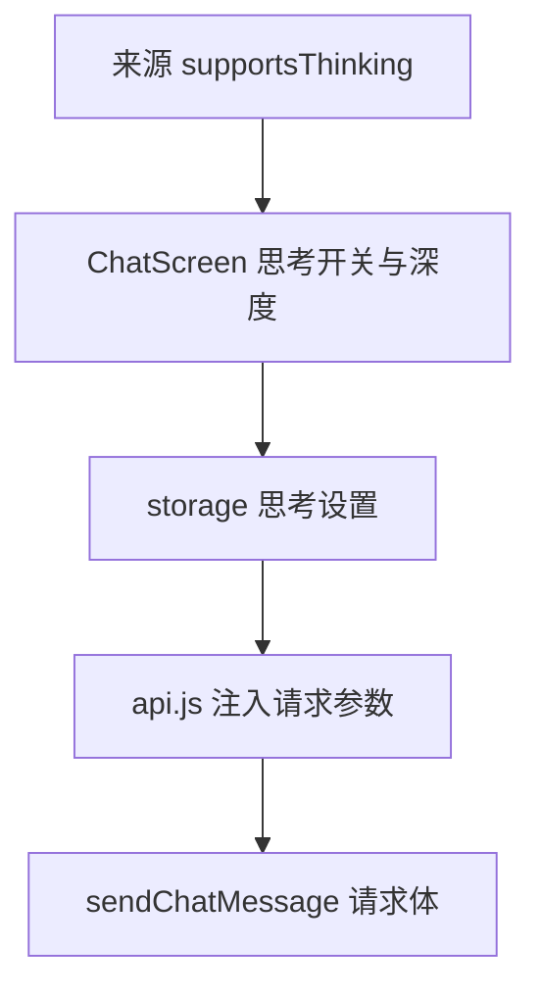

# 思考开关与深度 技术设计

Feature Name: thinking-toggle
Updated: 2026-09-18

## 描述

在聊天页增加思考开关与深度选择，按来源声明的参数名注入请求体；依赖 `api-multi-model` 的能力标记。

## 架构



## 组件与接口

### `src/storage.js`

- 新增 `getThinkingSettings()` / `saveThinkingSettings({ enabled, level })`，键 `@easychat2_thinking`；默认 `{ enabled: false, level: 'medium' }`，`level` 取值 `low | medium | high`。
- `ApiConfig` 增加可选 `thinking` 声明：`{ field: string, levels: { low, medium, high }, format: 'effort' | 'boolean' | 'object' }`，缺省按 OpenAI 兼容 `reasoning_effort`。

### `src/api.js`

- `sendChatMessage` 读取思考设置与当前来源声明，构造请求体参数：
  - `format: 'effort'` → `{ [field]: level }`
  - `format: 'boolean'` → `{ [field]: true }`
  - `format: 'object'` → `{ [field]: { type: 'enabled', depth: level } }`
- 未开启时不注入任何思考参数。

### `src/ChatScreen.js`

- 顶部栏新增「思考」入口：开启/关闭开关，开启后选择深度（低/中/高）。
- 当前来源 `supportsThinking` 为假时禁用并提示。

## 数据模型

```text
@easychat2_thinking -> { enabled: boolean, level: 'low' | 'medium' | 'high' }
```

## 正确性属性

1. 未开启思考时请求体不含思考字段。
2. 开启后字段名取自来源声明，缺省 `reasoning_effort`。
3. 来源不支持思考时开关不可用。
4. 开关与深度持久化并在重启后保留。

## 错误处理

- 保存设置失败：`Alert` 提示并回滚界面。
- 来源未声明思考字段：使用默认 `reasoning_effort`。

## 测试策略

- 脚本：三种 format 的请求体构造、未开启时不注入。
- 界面脚本：禁用态、深度选择、持久化。
- 打包验证。

## 分期

1. 设置存储与请求注入。
2. 聊天页开关与深度 UI。
3. 回归与打包验证。

## 参考

[^1]: (src/api.js#L58) - 请求体构造
[^2]: (src/storage.js#L257) - API 配置归一化
