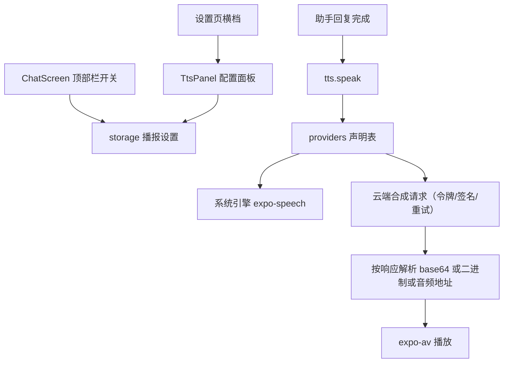

# 语音播报 技术设计

Feature Name: tts-broadcast
Updated: 2026-09-18

## 描述

新增声明式 TTS 模块与播报开关。结构与 `plugins/providers.js`、`imageGen/providers.js` 同构：Provider 声明表 + 统一请求器 + 音频输出。系统引擎走 `expo-speech`，云端音频走 `expo-av` 播放；设置页新增横档入口，聊天页顶部栏新增常驻开关。

## 架构



## 组件与接口

### 依赖（新增）

- `expo-speech` - 系统引擎朗读，SDK 50 兼容版本
- `expo-av` - 播放云端返回的音频数据，SDK 50 兼容版本

### `src/tts/providers.js`（新增）

每个 Provider 声明：

```text
{
  id, label,
  baseUrl,
  method,                     // GET | POST
  auth: {
    type: 'header' | 'query' | 'body' | 'token',
    keyName, prefix?,         // header/query/body 直接注入
    tokenUrl?, tokenFields?, tokenPath?, tokenTtlSec?  // type = 'token' 时先兑换令牌
  },
  signer,                     // 'none' | 'iflytek' | 'tencent' | 'volcano'，声明式选择签名实现
  textField, voiceField, speedField, formatField,
  response: { mode: 'base64' | 'binary' | 'url', path?, format? },
  voices,                     // 可选音色清单
  timeoutMs, retries,
  custom                      // 允许覆盖 baseUrl
}
```

内置 Provider：`system`、`xiaomi-mimo`、`siliconflow`、`iflytek-spark`、`stepfun`、`tencent-cloud`、`aliyun`、`baidu`、`volcano`、`minimax`。无法公开稳定的接口按可编辑模板给出占位，并允许用户覆盖地址与字段。

### `src/tts/index.js`（新增）

- `listVoices(provider, config)` → `Promise<Voice[]>`（系统引擎走 `Speech.getAvailableVoicesAsync()`）
- `synthesize({ provider, config, text })` → `Promise<{ mode, data?, uri?, mime? }>`
- `speak({ provider, config, text, onDone?, onError? })` → `Promise<void>`
- `stop()` → `Promise<void>`
- 流程：取 Provider 声明 → 必要时兑换并缓存令牌 → 应用签名 → 构造请求 → 超时与重试 → 按 `response.mode` 解析为音频数据或地址 → 交给 `expo-av` 播放；系统引擎直接调 `expo-speech`。
- 令牌缓存按 `Provider id` 维度保存在内存，超过 `tokenTtlSec` 重新兑换。
- 文本按 `MAX_SPEAK_CHARS`（建议 800）截断。

### 签名实现

- `signer: 'iflytek'` - 讯飞 WebSocket 鉴权串（`APPID + APIKey + APISecret` 的 HMAC-SHA1）
- `signer: 'tencent'` - 腾讯云 TC3-HMAC-SHA256
- `signer: 'volcano'` - 火山引擎 HMAC 签名
- 签名需要的摘要能力通过现有 `buffer` 与纯 JS 实现，避免新增加密依赖；若某签名方式在 RN 环境验证不通过，则在配置中提供「预生成令牌」字段作为回退。

### `src/storage.js`

- 新增 `getTtsSettings()` / `saveTtsSettings(settings)`，键 `@easychat2_tts`：

```text
{
  enabled: boolean,                 // 聊天页常驻开关
  activeProvider: string,           // 'system' | ...
  providers: {
    [id]: {
      apiKey, secretKey, appId, appSecretKey, region,
      baseUrl, voice, speed, format, model, extra
    }
  }
}
```

- 默认 `enabled: false`、`activeProvider: 'system'`。

### `src/TtsPanel.js`（新增，或在 `SettingsScreen.js` 内实现）

- 设置页「语音播报」横档，展开后选择播报源并填写该源字段；字段清单由 `providers.js` 的 `fields` 声明驱动，避免逐家写死界面。

### `src/ChatScreen.js`

- 顶部栏新增播报开关按钮（`Ionicons` 的 `volume-high-outline` / `volume-mute-outline`）。
- 助手回复完成后，若 `enabled` 为真则调用 `speak`；发送新消息前调用 `stop`。
- 助手消息长按或气泡内按钮支持手动重播该条。

## 数据模型

```text
@easychat2_tts -> {
  enabled: boolean,
  activeProvider: string,
  providers: { [id]: { apiKey, secretKey, appId, appSecretKey, region, baseUrl, voice, speed, format, model, extra } }
}
```

## 正确性属性

1. 密钥只存本机，不进入聊天请求、提示词或文档。
2. 播报开关关闭时不发起任何 TTS 请求。
3. 未配置必填字段时不发起请求并给出可读提示。
4. 播报不阻塞消息发送与接收；播报失败不影响消息状态。
5. 新回复开始时停止上一段播报，避免叠音。
6. 文本截断后仍为可朗读的完整前缀，不出现半句乱码。

## 错误处理

- 网络失败与超时：`播报失败，请稍后重试`，按 `retries` 重试一次。
- 401/403：`密钥无效或未授权`；429：`请求过于频繁，请稍后重试`。
- 系统引擎不可用：`当前设备不支持系统语音合成`，并引导切换云端播报源。
- 音频解析失败：`未获取到音频数据`。
- 所有错误通过 `Alert` 提示，不写入消息记录。

## 测试策略

- 脚本：播报设置规范化与默认值；Provider 声明完整性；文本截断；请求构造（header/query/body/token）；错误码映射；令牌缓存过期逻辑（注入时间源）。
- 脚本：签名函数对固定输入的确定性输出（讯飞、腾讯云、火山各一组向量）。
- 打包验证：新增 `expo-speech`、`expo-av` 后重新执行 `npx expo export --platform android`。
- 手动验证：系统引擎在安卓设备朗读；切换云端源并点击重播。

## 参考

[^1]: (src/imageGen/index.js) - 声明式 Provider 与统一请求器先例
[^2]: (src/plugins/providers.js) - Provider 声明表先例
[^3]: (expo-speech) - 系统语音合成
[^4]: (expo-av) - 音频播放
